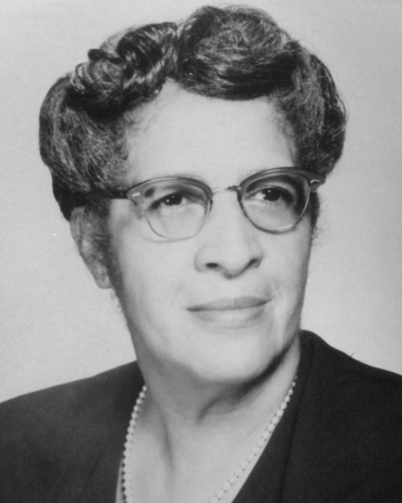
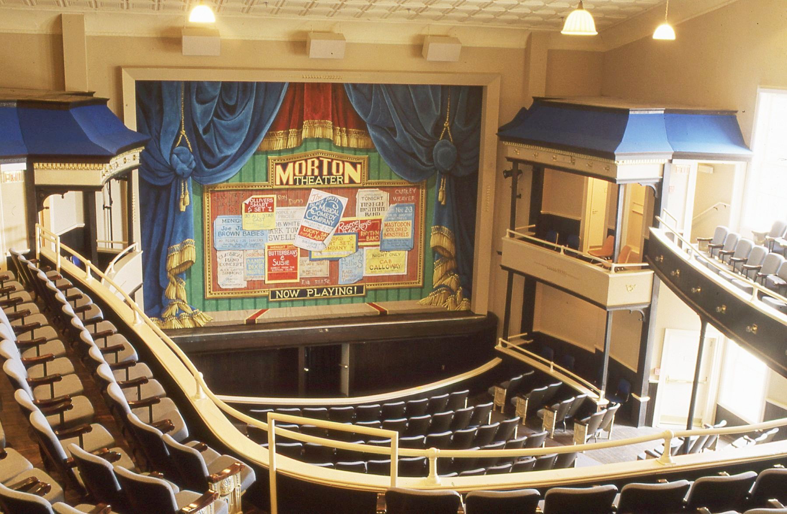
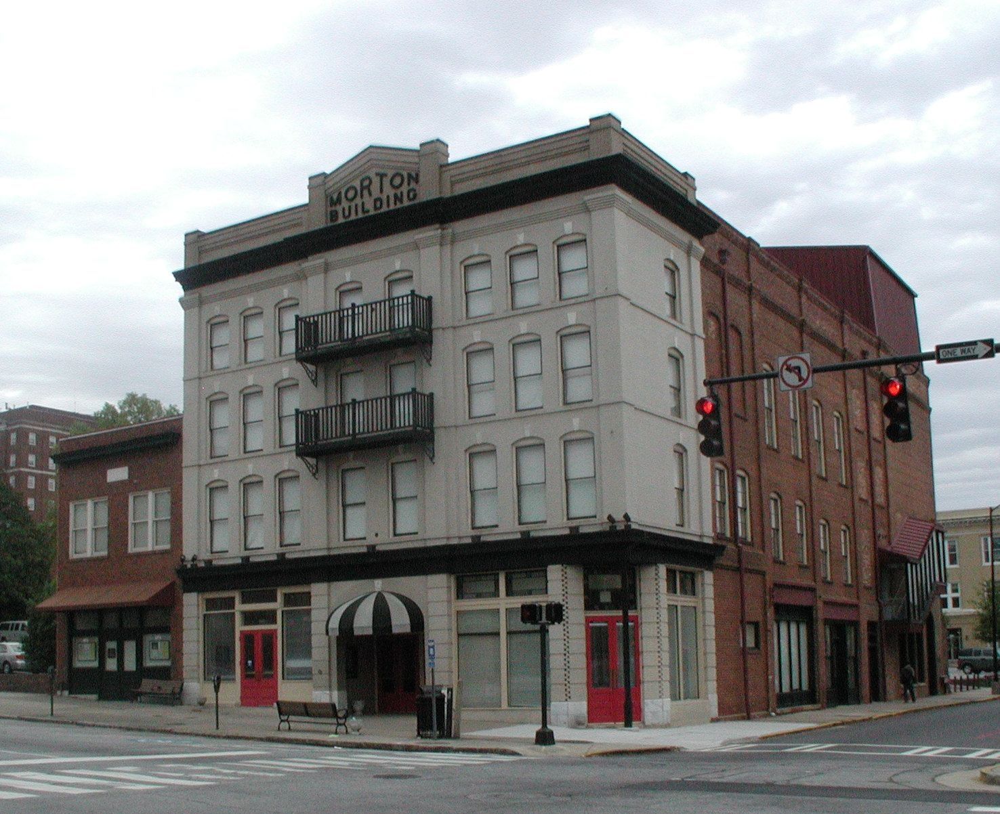

The road taken

For a band traveling from Greensboro to Atlanta in June 1958, the
primary artery is **U.S. Route 29**, known as the "Main Street of the
South." In the era before the I-85 interstate was completed, this
two-lane blacktop was a gauntlet of vibrant Black-owned businesses
interspersed with "Sundown Towns" where a flat tire could mean a
life-threatening encounter.

To minimize risk and maximize their performance schedule, the caravan
follows a strategic path.

### **Segment 1: Greensboro to Charlotte (approx. 90 miles)**

- **The Road:** **U.S. Route 29 South / U.S. 70.**

- **The Caution Zone:** **Salisbury, NC.** While not a strict Sundown
  Town, it was known for aggressive police surveillance of
  "out-of-state" or flashy cars like Tim’s Chrysler.

- **Green Book Stop:** **The Magnolia House (Greensboro)** is their
  starting point, but their first major rest stop is **The Travelers’
  Inn** in Charlotte.

- Passing through the **Trading Ford** on the Yadkin River

- **Eating Location:** **Cedar Street Social Club (Charlotte).** A
  high-end spot where they can get a steak and talk shop with local
  musicians.

- **The Split:**

  - **The Main Force:** Tim takes the Chrysler straight down Route 29
    through High Point and Salisbury.

  - **The By-Pass:** Barry takes the support van (likely a less
    conspicuous Ford or Chevy) via **NC Highway 150**, cutting west
    through Mooresville to avoid the "speed traps" and racial profiling
    common on the main highway near China Grove.

### **Stop 1: Charlotte, North Carolina**

- **The Performance:** **The Excelsior Club.** Founded in 1944, this was
  the premier Black social club in the Southeast. In 1958, it was *the*
  place to play for a sophisticated Black audience.

- **The History:** Charlotte was the site of the **Dorothy Counts**
  integration crisis in 1957. As your band rolls in, the image of a
  15-year-old girl being spat on by a mob while walking to Harding High
  would still be fresh in everyone's mind.

### **Segment 2: Charlotte to Columbia (approx. 95 miles)**

- **The Road:** **U.S. Route 21 South.**

- **The Caution Zone:** **Rock Hill, SC.** In 1958, Rock Hill was a
  flashpoint for "Massive Resistance." The band travels through here
  with the windows up and the radio low.

- **Green Book Stop:** **The Harriet Cornwell Tourist Home (Columbia).**
  A stately house on Wayne Street where Civil Rights leaders often
  stayed.

- **Eating Location:** **The Ritz Cafe (Columbia).** Located in the
  "Washington Street" business district, the heart of Black Columbia.

- **The Split:**

  - **The Main Force:** Continues on U.S. 21.

  - **The By-Pass:** A smaller group might take **S.C. Highway 322**
    toward McConnells to avoid the heavy police presence at the state
    line, meeting back up in Chester, SC.

### **Stop 2: Columbia, South Carolina**

- **The Performance:** **The Township Auditorium.** This was a major
  stop for the "Package Tours" (like the ones James Brown or Ray Charles
  headlined). It was one of the few places where a large Black audience
  could gather in a "white" part of town under heavy police
  surveillance.

- **The History:** Columbia was the home of **Modjeska Monteith
  Simkins**, the "matriarch" of SC Civil Rights. In 1958, the city was a
  legal battleground for the NAACP. The tension between the "Old South"
  state capital and the rising student movement at Benedict College
  would be palpable.

## **Modjeska Monteith Simkins: The Matriarch of Resistance**

If Dorothy was the soldier, Modjeska was the General. Based in
**Columbia, South Carolina**, she was perhaps the most influential woman
in the Southern Civil Rights movement of the 1940s and
50s.

### **Background**

- **The Powerhouse:** A teacher and public health worker, she was the
  Secretary of the South Carolina NAACP. She was instrumental in
  *Briggs v. Elliott*, the South Carolina case that was eventually
  folded into *Brown v. Board of Education*.

- **The "Motel Beat":** Her home in Columbia was a "safe house" for
  Thurgood Marshall and other top Civil Rights lawyers because white
  hotels wouldn't take them.

### **What she was doing in June 1958**

In June 1958, Modjeska was at the height of her "dangerous" reputation
in the eyes of the white establishment.

- **The Fight for the Vote:** She was heavily involved in the **South
  Carolina Progressive Democratic Party**, working to register Black
  voters and challenge the "Dixiecrats" who controlled the state.

- **The "Red-Baiting":** In early 1958, the South Carolina government
  was actively trying to brand her as a communist to discredit her work.
  In June, she would have been navigating a minefield of state
  surveillance while organizing grassroots meetings.

- **The Atmosphere:** If your band stops in Columbia, they might hear
  that "Miss Modjeska" is holding a meeting at the **Victory Savings
  Bank** (a Black-owned bank she helped run). She was known for her
  sharp tongue and her "take no prisoners" approach to white supremacy.

### **Segment 3: Columbia to Greenville (approx. 100 miles)**

- **The Road:** **U.S. Route 176** to **U.S. Route 25.**

- **The Caution Zone:** **Newberry, SC.** A notorious "Sundown"
  environment where Black travelers were warned never to let the sun set
  on them. The band times their departure from Columbia to ensure they
  pass Newberry at high noon.

- **Green Book Stop:** **The Sunlight Hotel (Greenville).** A legendary
  spot on East Broad Street.

- **Eating Location:** **The Chicken Shack (Greenville).** Famous for
  its late-night atmosphere and the "Chitlin' Circuit" performers who
  frequented it.

- **The Split:**

  - **The Main Force:** Stays on the more direct U.S. 176.

  - **The By-Pass:** Tim might lead the Chrysler onto **U.S. Route 76**
    through Clinton, using the car’s superior speed to outpace any
    "tail" before reconnecting with the group in Greenville.

**Stop 3: Greenville, South Carolina**

- **The Performance:** **The Phyllis Wheatley Center.** In the 50s, this
  was the cultural heart of Greenville’s Black community, hosting
  everything from dances to political meetings.

- **The History:** Just months before your story (late 1957), a young
  **Jesse Jackson** was famously denied a book at the Greenville Public
  Library, sparking local "read-ins." The city was also a textile giant,
  meaning the audience would be a mix of "lint-heads" (mill workers) and
  activists.

### **Greenville, SC to Athens, GA (approx. 100 miles)**

- **The Road:** **U.S. Route 29 South.** \* **The Crossing:** They cross
  the Savannah River into Georgia via the **Hartwell Dam** area. In
  1958, this state line was a major psychological barrier; Georgia’s
  "license plate hunters" (police looking for out-of-state Black
  travelers) were legendary.

- **The Caution Zone:** **Royston, GA.** The hometown of baseball legend
  Ty Cobb, Royston was a deeply segregated "speed trap" town. The
  caravan uses their **"Chauffeur Pose"** here, keeping the Chrysler at
  a steady 35 mph.

- **Green Book Stop:** **The Morton Building (Athens).** While they
  perform in Dudley Park, they congregate at the Morton Building on "Hot
  Corner" for safety and networking.

- **Eating Location:** **The Manhattan Café (Athens).** A Black-owned
  staple near Hot Corner where musicians could get a "meat and three"
  and hear the latest gossip from the Atlanta circuit.

- **The Split:**

  - **The Main Force:** Tim takes the Chrysler through **Hartwell** and
    **Royston** on U.S. 29.

  - **The By-Pass:** Barry takes the van through **Anderson, SC** and
    crosses into Georgia further south via **SR 181**, meeting Tim in
    the "Bottoms" neighborhood of Athens to avoid being seen as a
    "caravan."

  <!-- -->

  - 

### **Athens, Georgia**

- **The Performance:** **The Morton Theatre.** Built in 1910, it was one
  of the first vaudeville theaters in the US owned and operated by a
  Black man (Monroe Morton). By 1958, it was a storied stop for blues
  and R&B legends.

- **The History:** Athens provides a unique vibe: the intersection of a
  "University Town" (University of Georgia) and deep-seated segregation.
  In 1958, the campus was an all-white fortress, while blocks away at
  the Morton, the most progressive music in the world was being played.

### **Dudley Park Click to open side panel for more information**

This is arguably the most historically fitting choice for your
narrative. Located right next to the "Hot Corner" and "The Bottoms" (a
historically Black neighborhood), Dudley Park has the grassy, rolling
terrain that falls naturally toward the Oconee River. In 1958, it was a
vital open space for the local Black community, providing a sense of
sanctuary that the segregated University grounds did not.

- **Topography:** Features 24 acres of tranquil woods and fields with
  natural slopes that act as a makeshift amphitheater.

- **Performance Aspect:** While it didn't have a permanent "grand stage"
  in the 50s, its proximity to the railroad line made it a frequent
  gathering spot where flatbed trucks were often used as mobile stages
  for rallies and music.

- **Civil Rights Connection:** Its location near the historic Morton
  Theatre and the Trail Creek area makes it a perfect spot for a
  "guerilla" show that could easily draw 1,500 people from the
  surrounding neighborhoods.

### **1. The "Guerilla Stage" (The Flatbed Truck)**

In the 1950s, Black organizers couldn't simply "rent" a city-owned stage
in a public park. Instead, they used the tools of industry.

- **The Reference:** Historically, organizers in the **"Hot Corner"**
  district would borrow a flatbed from a local Black-owned business
  (like a coal yard or a construction company) and back it into the
  natural bowl of Dudley Park.

- **The Logistics:** The truck would be parked at the bottom of the
  slope near the **Railroad Trestle**. This trestle (famously featured
  on the back of R.E.M.'s *Murmur* decades later) provided a massive
  brick-and-iron backdrop that acted as a natural soundboard for the
  choir.

### **Segment 5: Athens to Atlanta (approx. 70 miles)**

- **The Road:** **U.S. Route 29 / U.S. 78.**

- **The Caution Zone:** **Monroe, GA.** Just 20 miles outside Athens,
  Monroe was the site of the horrific Moore's Ford lynching in 1946. In
  1958, the "vibe" in Monroe is ice-cold. The band does not stop here
  for gas or water; they "push" straight through.

- **Green Book Stop:** **Paschal’s Motor Hotel (Atlanta).** Their final
  destination and the "Soul of the South."

- **The Split:**

  - **The Main Force:** Stays on U.S. 29 through Lawrenceville.

  - **The By-Pass:** Tim might take the Chrysler onto **Georgia SR 138**
    toward Conyers to loop into Atlanta from the southeast, avoiding the
    heavy traffic and potential police "checkpoints" on the main
    Lawrenceville Highway.
