A

Chapter 7 beatmap

Todos 7

Radio insert opening: talking about the atlanta riot, a month earlier

Road chase scene where the caravan surrounds the bus to protect it

Chapter 6 Beatmap

#  Chapter 6 Betamax

- 3 tact play in which love is discovered to be a stronger drug than the
  usual rocknroll drug

- The Love acts as an enhancer of teen spirit: less fear, need to move,
  to rock.

  - The caravan breaks the segregation in the stadium not just because
    they don’t agree with the band’s choice, but because the Love drives
    them to act

- The kama-sutra character of the steam pillars fan:

  - Soft with the world and eager to cooperate

  - Restless, individualistic, eager to do and make

  - Egoless and self-assured, eager to work with others

- The science fiction engine is that this group character creates the
  superorganism of the flock

Leftover stuff

- Following the battle of the bands, new caravan members change the
  character of the caravan, while being introduced to it - drag racing.

- They creatively interpret the Green Book to find locations to stay -
  for the big caravan before Atlanta this will be the cliffs National
  Park. Later in chapter 7 we’ll see Indian reserves and mennonite
  farms.

- Tim writes love poems on phone booths for alice (would later become
  the songs)

\
-

## Beatmap

Tact 1

- Eleanore is loud, talking about the activism

- Insert: radio report of elvis’s death asks who will be the king now

- Stealing into the drive-in, mid show. Jailhouse Rock!

- Everybody in wonderland is still crying and hugging and praising the
  dead. “Look how handsome he looks in the movie.”

- We see the UR bribe the personnel.

- Alice tries to press her palm to his and he moves away. She asks
  what’s with him. He presses his hands to his face and finds traces of
  tears.

- Flashback:

  - “At first i was unable to talk…”

  - cars gathered around the sign saying “turn on the radio”. We’re in
    the ford, a dead place with dead acoustics, and every time someone
    tries to speak their words are swallowed. Every time a new car comes
    by, they hear the news and we see their reaction: apathy to full on
    grief.

  - Tim ruminates that the bigger the circle of mourners grows the
    better he feels.

  - Needing touch, Tim teaches alice the hand-touching

  - Veronika plants seeds for elvis, starting the tradition

  - Alice teaches the thing to everyone else while praising tim. It goes
    through the group like a wave.

  - Tim is unhappy.

  - Cindy and FSG go on a motorcycle ride

  - Barry, unhappy about the hand thing, grumbles “so that’s the way
    it’s gonna be, huh”.

- Alice: what do you mean it doesnt work anymore Tim: this was like, the
  hand pressing, our thing. Alice: didn’t you feel better once it
  spread? It gets stronger when you share it. That’s the secret.

- 

- Tim and Alice sneak between the cars and מזנון,
  trying to find a place to kiss. They’re constantly interrupted by fans
  really anticipating the kuntz.

  - One of the interruptors is eleanore, who demands
    the bear-gineer since she doesn’t have someone to hug

  - They tell people they have formed a fan club and some people tell
    them they did, too. They all have fantastic names. One of them wants
    to join another fan club, and they decide it’s not catholic.

  - Another is cindy

  - Anothe is Eddie enlists them to enlist those only who dance, give
    them the matchbook, mentions mama wants control

- During the jailhouse rock scene, the band takes over the pa, playing
  their psychedelic version.

- Caravan members dance and others join, creating a chain reaction
  spanning all of the drivein

- Everyone outside their cars, dancing, shouting

- The vigilanties are trying to stop the show - they turn out to be
  deputized, on the authorities’ side. The crowd honks at them. Cindy
  says she’ll go talk to them. Vilma, in her first diva moment, asks if
  they want the movie, or rock-n-roll, the crowd shouts “rock-n-roll!”.
  The bikers are seen talking to Cindy and BLHfrom afar.

- The band does Elvis’s last hit, Great Balls of Fire, and Heath shines
  for the first time.

- Mucho breaks a string, looking for Eddie, Alice and Tim about to kiss,
  Alice says to Tim “I bet you can change that string”, and Tim helps
  him. We see how geeky he is with guitars.

- Shirely and her fanclub are drawing on people’s cars

- The show ends with everybody cheering. Tim thinks he saw some vision
  for a fleeting moment, but isn’t sure.

- Alice and Elenore compete who is more worried about Cindy

- They look for Cindy and find her despondent at the back seat of
  Emerson’s car. Emerson is demanding Barry and Cindy return. Barry gets
  into character,telling Emerson they are actually here on a top secret
  mission for Buzz Music, the new enterprise Barry just made up.

  - “Let my sister go!”

- After the show the pillars invite tim to ride with
  them. He looks back to see a long car-snake.

- Ruminating Tim says this is the moment the pillars
  exploded, mentioning Atlanta. ״there was no stopping after
  that”.

Tact 2

- Fan clubs expand as new people join

- The feeling of love and intimacy in the caravan remains

- Eleanore is loud, talking about the activism, trying to join the ur

- Morning gorgeous spreads - don’t overdo it

- Grafitti

- Language

- Charlotte, NC

  - In the show ( **The Excelsior Club**)

    - Very dense, hot and sweaty, lots of unknown people/ music is also
      dense and hot

    - Density causes greater effect: love, visions (not for tim though)

    - Meeting and greeting greenhorns

    - Eddie summons tim backstage

    - Tim & Alice

    - Cindy FSG Eleanore

    - Barry & Rosetta

  - Backstage

    - They offer him to be the roadie, after testing him in a way he
      doesn’t like very much

    - Jo is against him, which is sad because she has a crush on him

    - Mucho laughs about sleeping in the same bed with Baba,Jo reminds
      them that thanks to the UR they have hotel rooms and don’t need to
      sleep in a basement, vilma is “just happy to have a bed”

- Greenville, SC

  - Tim is in the truck with the band. It’s the middle of the night,
    some days later. They are running away but laughing about it

  - They mention the green book

  - Flashback

    - In the kundas, they spot the vigilanties. Cindy & FSG

    - In the show, vigilanties bring local branch & police and they blow
      up the show. It’s violent but kind of funny.

    - The band escapes by the skin of their teeth

  - There are five cars with them. They use the green book to escape
    police stop

  - They accidentally enter a “sunset town”. They are surrounded -
    locals and police

  - They escape by the theeth of their skin

  - They talk about needing to adhere to the green book more

<!-- -->

- Columbia, SC (Consider merging with the next city)

  - Fancy hotel, rest time as vilma recovers

  - rehearsal that devolves into drug doing

  - They are stuck in columbia for the week because vilma

  - The caravan needs to wait till the next show, so they volunteer -
    maybe in a black college experiment farm \<- this is where the fan
    clubs become flocks, are called flocks by eleanore, and the Flocking
    is officially here.

  - Modjeska Monteith Simkins (the ur banker)

  - Wonderland discusses who are the flock members, and decide Eddie is
    a flock member, even if he isn't always there.

  - Jam session with famous lips in the Good Sam hospital with vilma

    - Johnny Terry heard that Vilma is in the hospital and came from
      Athens to visit, bringing drugs

    - the famous flames ask who decides who plays what. Babatunde shows
      them a laid back approach the music.

    - The famous flames complain about the way James Brown treats them,
      and someone (Alice?) suggests they’ll demand better terms. Someone
      is very upset and wants to do something about it.

    - We see a prank between mucho and baba

    - A new person hits on tim because he’s with the
      band

    - Monologue in the green room by a new fan who’s
      eating the head of stoned babatunde

  - While picking apples

    - Tim tells eleanore about the way jb treats the ff and she decides
      they should do something – a prank.

  - Nightly Pony Tail 1 (before the flockening)

    - A park with hiking area, night rest, Tim moving between fun clubs
      and groups to deliver a message. They are crafting: signs,
      drawings, patches on clothing

    - Tim wants to pull a prank on JB, but almost everybody is too busy
      with the fan clubs: painting signs, making clothes, learning a new
      dance and of course: painting on cars.

    - There’s a mascot fever going round, and they decide to make the
      bear-gineer their mascot

  - Nightly pony tail 2 (after the flockening)

    - Same park but now everybody is busy with flock stuff

    - Eleanore as the philosopher

  - 

  - On line to the James Brown show

    - SP and JB fans talk to each other. Some more lore of the bands

      - The kama-sutra character of the steam pillars fan:

        - Soft with the world and eager to cooperate

        - Restless, individualistic, eager to do and make

        - Egoless and self-assured, eager to work with others

    - Tim and his gang spread rumors, hand “Canceled” signs, and confuse
      the audience.

    - The SP put up a truck-top street performance, causing interest in
      JB fans who are now looking for alternatives.

    - Then, the caravan is a caravan, getting people to get in, be on
      the roof, on the trunk… like indian train-goers.

    - Barry Sr. Appears!

      - He came to scold them, but Cindy charms him just like she charms
        everybody,

      - Barry convinces him - there’s money in there! - to go to the
        show with them

  - The expended Steam Pillars show

    - 

    - Barry Sr is impressed to see the show, \$\$ in his eyes, he sees
      the JB fans mixing in

    - Fan clubs make an appearance

    - Hand pressing

    - “Objectivly, it was the worst Steam Pillars show ever .... but
      about 10K people see it, and another 100K would swear they have
      been to it.”

  - In the alley after the show

  - Barry senior leaves with them, his mind expanded by Love. he looks
    weird, stoned.

  - James, along with a couple of thugs, accosts them and it turns into
    a fight, including Barry senior, who is discovered to be a tough
    motherfucker.

  - JB calls uncle. He shakes hands with Barry Senior.

Tact 3

- Tim ruminates again: “...which leads us to atlanta, two weeks later…”

- On the road to atlanta

  - Mama upgrades the band’s ride to a fancy bus - competition with Buzz
    Music. She says it’s all yours but that they have to return it like
    new.

  - We learn through conversation that the UR is a massive, secretive
    organization, with glorious history and supporters everywhere, that
    can mobilize resources, and acts to advance civil rights .

  - 

  - Eddie is convincing Mama that it is the right next step for the
    cause. She goes with the flow though she has her doubts

  - Vilma acts as a prima-donna, demanding a fancy hotel room from mama,
    who has to agree

  - Tim shows his playing skills

  - Heath is sitting alone. Tim tries to talk to him, not for the first
    time, but this time it works

  - The flock surrounds the bus and paints it, to mama’s chagrin.

  - The wonderland flock meets a state cop asking them if they heared
    about this band called "cloud pillars" , Barry innocently sends them
    the wrong way, with Eddie playing a support role

- closing scene in the stadium, a moment before they break

  - The Love acts as an enhancer of teenspirit: less fear, need to move,
    to rock. The caravan breaks the segregation in the stadium not just
    because they don’t agree with the band’s choice, but because the
    Love drives them to act

  - “Every king is a slave to his people”

Todos 6

- Trading Ford

Chapter 5 beatmap

- Tim is internally insulted when Alice gives more attention to Cindy
  and then to Shirly

- Elenore mocks Tim for his feelings

- Someone hits on Tim but he doesn’t notice

- Tim gallantly offers his shades, Alice is flattered.

- A lot of blushing on Alice

- Tim laughs to hard to a funny comment Alice makes

- Tim observes how Alice eats

**\### Day 1 - June 14th \###**

1.  In the car

    1.  Tim falls in love with Alice in the car at dawn, tells us about
        last night’s drive…

        1.  Barry talks about this being fun but they have to go home at
            some point. Tim isn’t listening: he’s busy staring at
            sleeping Alice.

        2.  Tim and Barry discuss what to do, barry lectures tim about
            taking care of number one and climbing the ladder. Tim
            argues for freedom. It ends with barry saying “one more show
            and then we go home”

        3.  WE MEET SHIRLEY AND HER FLOCK

            1.  Three friends from college, Shirley is **Capre Deim**,
                Veronica is the spiritual flower girl, Patty is the can
                do girl

            2.  They drive alongside each other on a dark road. Patty
                tries to pick up tim. He thinks shirley notices he’s too
                hooked on alice to care.

            3.  Shriley talks about the effect of the show (not naming
                it LOVE yet)

    2.  The girls wake up - the **morning, gorgeous** ritual happens for
        the first time

    3.  They talk about the show. Tim tries to get Alice's attention,
        but she is not focused, he slips in his speech just like she did
        in episode 1.

    4.  They talk about the visions. Only alice got them, but shirley
        confirms from the other car. Barry says he didn’t see anything
        either.

    5.  Barry reluctantly reveals he saw something after Eleanore probes
        him: the dodo he painted on the hood of the car.

    6.  Barry says they do one show and go home. Tim agrees: he says he
        has business to attend to. Cindy wants to join the caravan.
        Alice wants to go where cindy goes. Eleanore is on the fence…

    7.  *The schoolbus overtakes them, The drive opens the door, saying
        we are going to the Dan river.. They see Pete in the bus.They
        decide to go*

2.  Paradise -

    1.  Arriving to Dan River- all 12 car, including the band's pickup.
        Softness remains, they’re still high.

    2.  There’s an apple tree and tim picks an apple.

    3.  Shirley’s flock is discovered to be their welcoming committee.

        1.  Veronica is ceremonially planting seeds inside notes

    4.  Nude bathing, not forced, an option to bath separately is
        offered.

    5.  The girls decide to bathe separately, after tim encourages them
        to (saying seeing her naked would hurt too much)

    6.  we learn about their intimacy-they touch palms under water Then
        they dance. Tim tries to tell barry he’s in love with alice.

    7.  The steam pillars start getting out of the water, to their
        instruments, start playing a jam session. Other people with
        instruments join in

    8.  Meeting caravan people in the water, including Pete, Jimmy,
        Busman . Talking about the show and dancing. The term”Love”
        appears first. Someone is apologetic about needing to leave, and
        is replied “Maybe we’ll dance again later”. Fan clubs are
        discussed “where are you from?” “we’re from charleston”

    9.  Tim tells Barry he’s in love with alice and ask for advice…
        barry says she likes charleston chews.

    10. 

    11. A car is spotted up and away, it may be watching us. The UR
        urges to fold and leave.

    12. "Let's reconvene in Greensboro"

3.  The chasing game

    1.  Meeting heath

    2.  Cindy peeks outside the window,her head band flies off to the
        road.

    3.  As she mourns it , the cyclists appear and surround the car… A
        mysterious car honks and the bikers disappear

    4.  Tim recognizes the car as the same that was watching them.
        Chase, heath is worried sick, the car disappears

    5.  Meeting the schoolbus on the road, information swapping while
        driving: pete tells them he thinks it’s an undercover cop.
        Mentions the green book. They talk about someone they saw seeing
        alice with the joneses. They talk about splitting up to fool the
        pursuers. Creaming esso - gas station

    6.  They meet the cyclist at the gas
        station. The head cyclist returns cindy’s headband, cindy
        charms him, they warn them of dangerous folks going by

    7.  The jonses drive by and alice is not with them. Say she never
        was with them. Barry wonders what happened to alice. The group
        escalates it, tim is worried, they all decide to go find her.
        Joneses say she might have been in shirley’s car. Heath moves to
        joneses’ car

4.  Finding alice

    1.  Joneses and wonderland drive together. Speak
        of fan clubs again. They look for shirley’s car. They convene on
        the road with two other cars, one of them is rosetta and jimmy.
        Everybody joins the cause of finding alice. Jimmy says she might
        be in the magnolia where they’re heading and mentions the green
        book again. Says wonderland must buy a copy. They find a phone
        booth.

    2.  Tim goes to call and sees alice’s message:
        bird doodle and i saw it too. Cindy says its alice’s
        handwriting.jimmy says if they went through here, they must be
        in the church…

    3.  Entering greensboro at dusk, reaching the
        church, talk about clandestine parking of the cars. Jimmy has
        tarpaulin.

    4.  Tim knocks on the reverend’s house next to
        the church. The landlady hesitates but alice says they’re with
        her and they’re invited in, dinner is just served. inside they
        find the reverend and his wife, with alice, eddie, mama, joe,
        rosetta, jimmy. We kind-of learn that there’s an actual
        underground (ur) that’s bigger than who we see in church... tim,
        trying to impress alice, convinces the secretive ur people to
        include them in the conversation after the ur hesitate… **the
        landlady warns them of the consequences - philosophy:
        clandestine action vs protesting**.

    5.  Veronica plants a seed in the church’s
        graveyard. They go sleepy.

**1 meeting the ur at the pipeworks**

**2 the upheaval**

**3 emerson on the way**

**4 turn on the radio**

**\### Day 2 - June 15th \###**

1.  Eddie pushes the wonderland into the bus, telling them he’ll
    convenience mama to let them join. Mama gives them one last
    briefing. Dressing in Sunday bests in the church bus from the church
    stash. Heith is with them in the bus. Heith is giving them a good
    mood.

2.  Upheaval:

    1.  Wonderland- Barry arriving at the Jefferson square, seeing the
        band performs “He’s got the whole world in his hands” as a blind
        choir with washboard, washtub bass and a tambourine on stairs in
        Jefferson Building

    2.  When there is a critical mass, the band transitions to "Up Above
        My Head" by Sister Rosetta Tharpe. They leverage their good mood
        and start spreading it

    3.  Tim & Alice are dancing in front as if they are innocent
        bystanders, inciting others to do the same. Cindy and Elenore
        are also there dancing and singing! The boy Elenore is dancing
        with will turn out to be the son of a gun

    4.  A Traffic Policeman yells at them from his elevated booth to go
        away

    5.  They feel the “Love” and beam it around.

    6.  They walk down market street still singing, with people that
        just came out of the church, mostly young but not all, following
        them and clapping, blocking the road

    7.  They arrive at the boundary of East Market St black area

    8.  the black part of the caravan is there in the outskirts of the
        Ghetto. A piano on the curb or sidewalk, seemingly left there,
        reveals Heith playing

    9.  A big party starts, with dancing not exactly mixed but mirroring
        across the invisible line. They keep on singing and clapping.

    10. Mama

    11. The policemen on scene call for backup using the police box

    12. “Respectable citizens” led by the honorable cyclist intervene,
        creating a human block between white and blacks, tension is up.
        The cyclist sees his son in the dancing crowd and is furious,
        dragging him out. Elenore slips an invite

    13. Cindy identifies the charming cyclists and approaches him while
        Tim, Alice, Eddie and some other guy circle Villma and take her
        to Barry’s car, the rest of the band disperse one by one while
        the music continues

    14. Arriving to Barry, who is waiting steaming in the car, and he,
        Villma and Eddie are driving away, with police whistles and
        cacophony of sounds behind them

3.  In the car with Villma. Tall tales, Elenore is talking about the sun
    of a gun. Getting to know Villma as a little good girl, ambitious
    but open, with a sweet voice. She asks if they are part of the
    caravan, Barry reveals that Tim plans to return home after tonight.

4.  In the pipeworks, right as the show ends, as they are handing out
    bracelets. Seeing Elenore with the new guy. Alice & Tim in a corner,
    she convinces him to stay

5.  Someone rushes in to tell them Elvis is dead.

What is missing:

- Matchbook effect and new people

- Beargineer

6.  Tim and Alice are walking to Magnolia, he asks to
    kiss her and she replies with “I already did, silly”.

7.  Reconvening with the others and the car in the
    Magnolia House.

    1.  When Tim and Alice arrive, Barry, Eddie and
        Villma are seated in the corner of the lobby. A polite but alert
        waiter serves drinks. Elenore and Cindy walk in and join The
        group is very excited - Elenore in the lead.

    2.  Cindy tells them how she convinced the man to
        not let anyone get hurt today, and how she took charge with
        Elenore on calming things down and getting everyone out of
        there.

    3.  Tim feels he can see the group through
        Alice’s eyes, like secret agents

    4.  Babatunde enters to get Eddie and Vilma, and
        gives compliments to our guys. He offers Tim to join the van.
        Tim takes the offer

8.  Driving to the pipeworks, wondering how people
    will decipher the message, will there be new faces there?

9.  Tim Thinks he sees Emerson waiting in the shadows
    for Wonderland. He wants to warn them but they are far.

10. In the pipeworks

    1.  Tim stands in everyone’s way as they unload
        the van and set up for performance.

    2.  Mucho is tuning his bass, a string
        raptures,he is looking for Eddie to help him, but Tim
        volunteers. Mucho is reluctant but Jo tells him to give the boy
        a chance. Tim struggles but manages to replace under their
        scrutiny, which makes him a future roadie

    3.  Tim wanders outside hoping to find Wonderland
        and show them in. Sees many cars in the parking lot, worried for
        them, maybe Emerson arrested them. Sees their car
        approaching.

    4.  Getting back in with Wonderland. Offering
        Alice to join him backstage - she wants to stay in front. Tim
        gives alice the candy he took from mucho. Alice laughs: haven’t
        eaten those since middle school.

    5.  Seeing a song from the backstage -”Nobody’s
        fault” -

    6.  Elenore and the new boy from the
        kundas.

    7.  Tim sees Alice dancing with Shirley under a
        pillar of steam , with all the crowd around in a trance and is
        envious.

    8.  Bracelets at the end of the show again. Tim
        puts Alice’s bracelet on her wrist.

11. Exiting the show

    1.  Someone say they are leaving, and is greeted
        with “Maybe we’ll dance again”

    2.  Alice chooses to ride with Shirley

    3.  Barry mentions unconvincingly they were
        supposed to go home, and they all laugh . Cindy tells him he
        must drive after Shirley, he can’t leave Alice behind. Everyone
        are in Love

    4.  Tim is upset, and Eddie looks at him and say
        ”It’s never gonna happen”

**Insert: mentioning Calipso**

1.  Sherif Emerson overtakes them, stopping them,
    demanding Barry follow him home.

2.  Tim is driving, they start to follow but they are
    upset.

3.  The sheriff crosses a railway intersection, they
    hold, the train arrives and they run off

4.  “I’m so full of Love I need a malted” Barry takes
    them to a soda fountain

5.  alice shares a milkshake / malted with two
    straws. they look each other in the eyes. alice says "i wish you
    wouldn't leave". tim decides to stay.

6.  In the Clock Drive-In , policeman are talking
    about the kundas and rumors of the second show

7.  they post postcards to their families. There they
    decide they want a fan club too. Alice names it wonderland.

8.  They talk about Elvis in the car, then Tim sings
    with the radio “Love me tender”,

9.  Barry has a reason not to turn on the radio
    (after effect from the show?)

10. Someone tells them to turn on the Radio. It’s the
    end of the world

leftovers

11. On the road,

    1.  Tim offers Pete to travel with them. Pete agrees only if he is
        driving. Someone black gives barry a hat: “you’ll need this
        later”

    2.  tim and pete expand the lore of underground tobacco shows: (xxx)
        they have a background in being in shows like this together…
        eleanore is curious and tim answers so alice would be impressed

    3.  Pete tells them to buy a Green book "If you want to travel with
        black people you have to travel like black people".

    4.  At a traffic stop, realizing why Pete needs to be the driver,
        “quick, what’s your last name”

12. Wanting a midnight restroom stop, Pete can’t go in, tells them to
    continue to Esso.

13. In Esso - payphone on the wall, seeing a message -Shirley’s car
    drives in, Alice returns, missing Cindy

14. Stopping at a gas station to buy map - Esso

    1.  They see someone who might be Emerson., they can't do anything,
        just feel paranoid

    2.  Tim buys alice candy. Barry buys map. Eleanore finds the green
        book.

    3.  Elenore starts reading from the book.

15. With a black car, finding a gas station and the
    owner doesn’t want to serve them. Wonderland share their
    gasoline…

16. 

Todos 5

- Add beargineer

- Tim bought Moonpie - give it to Alice

- “I saw it too” grafitti

- Music inserts during the kiss

- Emerson at the end

- Make the show in the pipeworks thicker

- Mention of Dr Player in Greensboro - eleanore

- Show the beginning of romance between Cindy and FSG

- Helping greenhorns find the show (FSG?)

The Steam Pillars

\#unfinished \#places \![\[Pasted image 20250922160747.png\]\]

## about the band in side 2

The band is a fluid group, people can join in or leave, but the band
remains. They are a diverse group that acts and reacts differently to
new situations. The band sees a huge success, and then a downfall
starting to experience luxury, reacting differently to it. Initially it
comes as being in the center - people who tend to your every need - the
UR and the caravan. The UR here is playing the role of a record company,
but we will later see how Calipso is much better at it. The different
motives of UR and Calipso to "spoil" the band will be apparent. We want
to see the SP from new angles: writing a song, practice/jam including
friction, on the road, in the hotel room meeting their entourage,
complaining about conditions, how they see a performance. We want to see
a show from the stage or back of the stage. The band starts as part of
the Caravan, intimate and same level, but slowly gets separated,
elevated.

## Personnel

### Percussion: \[\[Babatunde\]\]

**The music he brings:** african traditional music, jazz **His A-Team
power:** knows how to use drumming to sync the crowd; excellent
crowd-reading abilities **Instrument:** an collection of big and small
traditional drums. Every show, he picks up different drums. *Who he is:*
prankster and philosopher. He gave up the royal status of his birth to
come to america and play music. He shuns fanciness, but enjoys the
physical pleasures (he loves food, and he loves mind-expanding drugs.)
His main drive is joy, but he also believes in the cause of the UR and
his way to help is his pranks. He thought of the idea of disruptions as
promotions to the shows. He's the musical leader of the steam pillars,
and we suggest it's his percussion that causes

*Who he is:* prankster and philosopher. He gave up the royal status of
his birth to come to america and play music. He shuns fanciness, but
enjoys the physical pleasures (he loves food, and he loves
mind-expanding drugs.) His main drive is joy, but he also believes in
the cause of the UR and his way to help is his pranks. He thought of the
idea of disruptions as promotions to the shows. He's the musical leader
of the steam pillars, and we suggest it's his percussion that causes

### Lead Guitarist: \[\[Jo\]\]

**The music she brings:** rock’n’roll **Her A-Team power:** her
distorted guitar shocks and creates a “spicy” pleasure, causes extacy
**Instrument:** a 1955 Fender Broadcaster in goldtop finish; an
overdriven 1957 Fender Bassman

### Lead singer: \[\[Vilma\]\]

**The music she brings:** gospel **Her A-Team power:** her clear,
beautiful voice is a stark contrast to Jo’s distorted guitar: it charms
and causes delight. Her vocal range, expressionism and her huge voice
boost the emotional effect of the lyrics. **Instrument:** sexy thighs
**Voice:** a
[<u>contralto</u>](https://youtu.be/EeoHO8uHi1A?si=YCm4Cq3Xk6RfADIn). A
low, warm voice, like honey, able to be small or huge (think Shirley
Bassy, Nina Simone, Peggy Lee, Tracy Chapman, [<u>Nora
Jones</u>](https://youtu.be/2HhvrO2umu0?si=rlG9Q2Cbg1K8UdbY) or [<u>Etta
James</u>](https://youtu.be/uZt1xKtPbUQ?si=EA9D8ank1vPrLJ6x)
[<u>more</u>](https://youtu.be/YPwI9ig5W24?si=e36PNO3_sI_My80X) She has
a clear, clean voice of a young woman with the power and low register of
an old woman. Talks in a higher register, a voice like a girl’s.

### Bassist: \[\[Besame Mucho\]\]

**The music he brings: he invents funk by listening to Babatunde.**
**His bass playing**: Mucho is a slap-bass player. His powerful hands on
the strings cause the bass to be heard loudly, an effect he later
amplifies by turning up his electric bass amp to the overdriven range,
making his playing both loud and aggressive-sounding. He’s strong, but
also incredibly agile, playing swift filler and ghost notes, making the
bassline feel light and the people who hear it feel incredibly motivated
to dance. “Making it look easy is the name of the game, baby”. He plays
powerful, repetetive lines that dance with Babatunde’s heavy drumming.
**Voice:** Mucho sings in a very high voice (even though his talking
register is extremely low). His vocal range offsets his instrument
range. He likes to sing along to his own bass line, creating a harmony
between man and machine. **Instrument:** an upright bass; later, a 1957
Fender Precision bass.

### Pianist, later lead singer: Heath Walker Cain (Actually \[\[Jerry Lee Lewis\]\])

**The music he brings:** gospel, country and boogie woogie. In depth
analysis: \[\[Jerry Lee Lewis’s Musical Style\]\] **His A-Team
Superpower:** he’s exciting. He adds a fun, exhilirating tone.
**Instrument:** any upright piano to be found. Sometimes: vodka and a
matchbook (Buzz Brand, of course.)

### Band manager: \[\[Betye W. Davis\]\]

### Conductor, special effects: Edwardo Del’Alfonzi (\[\[Eddie\]\])

### Conductor: Jimmy

### Conductor: \[\[Rosetta\]\]

## Musicality

They are a supergroup of excellent musicians who play well together.
They make instantly engaging, powerful music that brings the crowd to an
extatic phase. They are so powerful thousands decide to follow them
around.

They blend several musical styles and voices to create an effect on the
crowd:

- Vilma’s smooth voice is personal and emotive, pleasent to hear; that
  causes a lure and an emotional connection;

- Jo’s distorted guitar is a contrast to Vilma’s voice, shocking and
  exciting;

- Heath Walker Cain’s piano playing is fun, quick, very rythmic, and at
  times jarring and exciting like Jo’s guitar. When he sings, his
  singing will be acidic and piercing, a contrast to Vilma’s voice;

- Babatunde’s drumming syncs the crowd’s breathing and heartbeats and
  creates a feeling of togetherness;

- Besame Mucho’s bass playing (loud, intricate) creates a music that, in
  combination with Babatunde’s drumming, is impossible not to move to;

- The men’s choir (Johnny Bass, Mucho high Alto, Heath high baritone,
  Mucho bass baritone) are a powerful call-and-response dynamic in the
  music which sways to crowd to sing along. The choir sometimes sings
  pleasent, close harmonies, and sometimes jarring harmonies that create
  a clash between the call and the response (call sweet; response
  acidic).

Personally they think of themselves as pupeteers: controlling the crowd
through their playing. They’re not here to make art, or money: they want
to see the crowd moving together. “It’s all about the dancing.”

They prefer to cover old standards in their own interpretation, rather
than write new ones. Indicates music’s ability to be shared and
collaborated on.

## Theatericality

- No separation between band and crowd. They often leave the stage to be
  with the audience, and often invite conductors / crowd members / guest
  musicians (@EVR horn sections!) to sing and dance with them.

- Audience participation: call and response makes audiences sing along;
  they ask the audience to make some of the music (stomping, bracelet
  rattling, singing a refrain, wandering microphone, the first rows turn
  around and sing to the rest)

- They never leave room for applause between songs. All songs melt into
  the next ones.

- At the end of the last song they leave, leaving the crowd to sing and
  dance until the effect ebbs out.

## Their Effect on Crowds

- Makes you dance wether you want to or not (drums, bass)

- Drowns you in the rythm, causes a feeling of being transported into a
  different time (drums, repetitions)

- Exhilarating and liberating (guitar, piano)

- Makes you feel together with everybody (drums, singing, audience
  participation)

## Activism

Soft approach: they entice people to join by playing music that’s fun,
exciting and relatable.

Breaking down racial barriers: they ask white and black people to dance
and sing together, and later appear with a white performer (Heath /
Jerry Lee).

Recruitment: they use public shows, which have a tendency to blow up
before they end because of segragation laws, and actively find people
who would come for a full, secret show. The people who come to those
shows become the flock.

## Backstory

**Betty’s plan:**

Who is Tim

**Tim’s traits**

1.  **Highly Sensitive Person**

2.  **Reflective narrator**

3.  **More internally focused than Alice - observing his own mental and
    emotional state**

4.  **Doubt ridden**

5.  **Wants to belive**

6.  **A boy in love**

**Tim’s PoV of Alice**

1.  Funny

2.  Sheltered

3.  Young and inexperienced

4.  Stubborn

5.  Free and liberated

6.  Beautiful nymph

7.  Passionate

8.  Loving

9.  Influences others by being inviting, intimate and inclusive.

10. Visceral

11. Untheatrical

12. Sincere

13. Moral compass

14. Trust-first world view

15. Follows rather than initiate

16. Avoids confrontation

17. Chooses proximity over clarity

18. Prefers Experience over safety

hungry for her attention and never gets enough

🪙 Payphones

# **Roadside payphone writing system (Jim Crow South, 1958)**

## **1) What “payphones on the road” are actually like in 1958**

**Payphones are common enough to build a traveling communication habit
around them**, but the *form factor* varies by stop. The Bell System
reaches **~1,000,000 payphones by 1960**, implying dense placement in
towns, commercial strips, and major routes by 1958 (not “every back
road,” but frequent at predictable commerce points). ([<u>Los Angeles
Times</u>](https://www.latimes.com/archives/la-xpm-1989-04-25-fi-1697-story.html?utm_source=chatgpt.com))

### **A) Outdoor glass/aluminum booths (mid-1950s modern look)**

These are the iconic roadside “fishbowl” booths: aluminum frame, glass
walls, a red **TELEPHONE** header panel, and interior lighting. A
documented Airlight example includes an **aluminum shelf**, a
**swiveling directory holder**, and a **fluorescent ceiling fixture**.
([<u>Wikipedia</u>](https://en.wikipedia.org/wiki/Prairie_Grove_Airlight_Outdoor_Telephone_Booth?utm_source=chatgpt.com))\
Bell technical docs for outdoor booths describe a **directory rack** and
**writing shelves** (literally built for people to write while standing
there). ([<u>Telephone
Collectors</u>](https://www.telephonecollectors.info/index.php/browse/bsps-bell-system/most-popular/c-series-i-m-sets/c39-coin-stations/12526-c39-702-i2-jan59-booths-outdoor-ks-14611-no9-id-tci-ocr-jp/file?utm_source=chatgpt.com))

**What it feels like:** bright at night (bug-magnet), exposed in
daylight, no privacy from passersby, but you can plausibly be “looking
up a number” while you write.

### **B) Walk-up payphone mounted on an outside wall (most useful for your premise)**

Common at service stations, motels, diners: the phone is mounted on the
exterior (often under an awning/overhang), sometimes with a **PUBLIC
TELEPHONE** sign meant for outside display. AT&T had standard specs for
these public-telephone signs. ([<u>Bell System
Memorial</u>](https://memorial.bellsystem.com/pdf/bsp/ATTSpec4455_pub_tel_signs_tl.pdf?utm_source=chatgpt.com))

**What it feels like:** you’re not trapped in glass; you can step back,
pretend you’re waiting for a line to open, write “while thinking.” Also:
the best “wall next to the phone” is automatically there.

### **C) Indoor payphone in a business (diner/drugstore/lobby), sometimes with an alcove or booth**

Same coin phone hardware, but the *space* is controlled. If the phone is
inside, you’re under staff eyes and local social rules.

**What it feels like:** higher scrutiny, more “why are you writing on my
wall,” faster escalation.

## **2) How to do it (writing-based, roadside-first)**

This is not encryption; it’s *tradecraft that looks like normal payphone
behavior*.

### **Surfaces (where the writing goes)**

Your best targets are **painted, slightly porous surfaces** adjacent to
the phone:

- the painted exterior wall right beside the handset

- the painted mounting board/panel area if present

- inside booths: the **writing shelf** edge/underside and nearby painted
  surfaces (not the glass) ([<u>Telephone
  Collectors</u>](https://www.telephonecollectors.info/index.php/browse/bsps-bell-system/most-popular/c-series-i-m-sets/c39-coin-stations/12526-c39-702-i2-jan59-booths-outdoor-ks-14611-no9-id-tci-ocr-jp/file?utm_source=chatgpt.com))

Avoid glass for ballpoint writing unless you want it to look
faint/skippy. Booths already give you “made-to-write” shelves.
([<u>Telephone
Collectors</u>](https://www.telephonecollectors.info/index.php/browse/bsps-bell-system/most-popular/c-series-i-m-sets/c39-coin-stations/12526-c39-702-i2-jan59-booths-outdoor-ks-14611-no9-id-tci-ocr-jp/file?utm_source=chatgpt.com))

### **Tool (you want ballpoints)**

Ballpoints are solidly period-correct by 1958; BIC’s Cristal is launched
in **1950** and becomes a mass-market object in the 1950s.
([<u>BIC</u>](https://mea.bic.com/en-za/ballpoint-history?utm_source=chatgpt.com))

**What ballpoint writing looks like in-scene:** heavier pressure, quick
strokes, slightly indented paper feel—except you’re doing it on painted
wall, so it’s a firm, deliberate hand.

### **Behavior (how they don’t look like they’re “leaving messages”)**

They should *act like payphone users*:

- Step up, open a small notebook / stare at the directory, then write “a
  number” on the wall margin (your message).

- Hold coins in hand; fumble the coin return; dial, hang up, write
  again.

- Keep it under ~10 seconds of obvious writing.

### **Message style (to survive being seen)**

If they write full sentences, it reads as vandalism + conspiracy. Make
it **short, casual-looking, and deniable**:

- looks like a phone number + name + town

- looks like “IOU” math, time, or directions

- looks like lover-drama scrawl

You still communicate real instructions—just disguised as ordinary
scribble.

### **Persistence (weather + cleaning)**

- Exterior walls under overhangs last longer; open-wall exposure will
  fade faster.

- Businesses repaint and scrub—so assume messages are **semi-ephemeral**
  (hours to days), not weeks.

## **3) Risk profile (how dangerous is this?)**

### **Baseline risk (everyone)**

- You are defacing private property. Even if the “damage” is small, it’s
  an excuse for confrontation: owner, clerk, local police.

### **Risk multiplier: Jim Crow enforcement**

Segregation wasn’t just signs; it was maintained by **law enforcement
and violence** (including vigilantes). ([<u>The Library of
Congress</u>](https://www.loc.gov/classroom-materials/jim-crow-segregation/?utm_source=chatgpt.com))\
That means: getting “caught” doing something suspicious is *not*
symmetrical across race.

### **Segregation-specific risk around payphones**

Payphones don’t automatically solve segregation; access depends on
*where the phone is*.

- **Indoor phones in white-controlled spaces** (lobbies, diners,
  depots): a Black character lingering and writing is high-risk because
  the entire space may be policed by custom or law.
  ([<u>nmaahc.si.edu</u>](https://nmaahc.si.edu/explore/stories/traveling-through-jim-crow-america?utm_source=chatgpt.com))

- **Exterior wall phones / outdoor booths on the road:** comparatively
  safer *because you don’t have to enter a controlled interior*, but
  you’re still visible and potentially challenged.

There’s also precedent for phone facilities being explicitly segregated
in at least some places: Oklahoma law required separate telephone booths
for “white and colored” use (1915).
([<u>learn.k20center.ou.edu</u>](https://learn.k20center.ou.edu/lesson/359/Jim%20Crow%20Laws%20in%20Oklahoma%25E2%2580%2594Oklahoma%20and%20Segregation.pdf?rev=20612&utm_source=chatgpt.com))\
You don’t need that statute in your specific setting to make the point:
the idea of policing who uses which phone was culturally available.

## **4) What each payphone type “wants” you to write (scene-level specifics)**

### **Outdoor booth**

- **Pros:** built-in writing shelf; plausible directory-checking; lit at
  night. ([<u>Telephone
  Collectors</u>](https://www.telephonecollectors.info/index.php/browse/bsps-bell-system/most-popular/c-series-i-m-sets/c39-coin-stations/12526-c39-702-i2-jan59-booths-outdoor-ks-14611-no9-id-tci-ocr-jp/file?utm_source=chatgpt.com))

- **Cons:** you’re on display through glass; the light makes you
  readable; the booth can feel like a trap if someone approaches.

**Good visual detail:** the directory rack between writing shelves is
practically an invitation to scribble. ([<u>Telephone
Collectors</u>](https://www.telephonecollectors.info/index.php/browse/bsps-bell-system/most-popular/c-series-i-m-sets/c39-coin-stations/12526-c39-702-i2-jan59-booths-outdoor-ks-14611-no9-id-tci-ocr-jp/file?utm_source=chatgpt.com))

### **Exterior wall phone (roadside best-fit)**

- **Pros:** perfect adjacent wall; easiest to look casual; easiest to
  bail out if someone clocks you. Public-telephone signage was
  standardized. ([<u>Bell System
  Memorial</u>](https://memorial.bellsystem.com/pdf/bsp/ATTSpec4455_pub_tel_signs_tl.pdf?utm_source=chatgpt.com))

- **Cons:** often in direct view of the counter/pumps; owners treat the
  wall as “theirs.”

### **Indoor phone (use when you want tension)**

- **Pros:** sheltered; writing lasts longer; less weather.

- **Cons:** highest social enforcement; most likely to draw “what are
  you doing” attention.

## **5) How risky should it feel on the page?**

If you want it to read true: **routine for white flockers; conditional
for Black flockers; always slightly illicit for everyone.** That’s
consistent with how Jim Crow was enforced in practice (law + custom +
threat). ([<u>The Library of
Congress</u>](https://www.loc.gov/classroom-materials/jim-crow-segregation/?utm_source=chatgpt.com))

If you want additional reference images (specifically: an exterior-wall
phone under a gas-station awning with period signage), say so and I’ll
pull a tighter set.

In 1958, making a call from a phone booth in Eden (then known as
**Leaksville, Spray, or Draper**) to Greensboro was a deliberate,
mechanical process. It was less about "dialing" and more about
"requesting."

### **1. The Booth: Will there be a phonebook?**

**Yes.** In 1958, a public phone booth was almost certain to have a
thick, paper directory.

- **The Look:** It would be bound in a heavy black or blue plastic
  binder, **chained to the metal shelf** beneath the phone to prevent
  theft.

- **The Content:** In a town like Leaksville (Eden), the book would be
  small—likely a combined "White and Yellow Pages" for the entire
  Rockingham County area.

- **The Condition:** As a teenager, you'd likely find the edges curled
  from humidity, and if you were unlucky, the specific page you needed
  for "Greensboro" might have been torn out by a previous traveler.

### **2. The Connection: Lift and Talk?**

If you were calling across the street, you would dial. But to call from
Eden to Greensboro (about 30 miles away), you were making a **Long
Distance** (or "Toll") call.

- **Step 1:** You lift the receiver (that heavy black Bakelite piece).
  You’d hear the steady hum of a dial tone.

- **Step 2:** You would likely dial **"0"** to reach the local operator.

- **Step 3:** You would hear a voice—usually a woman’s—say, *"Operator,
  may I help you?"*

- **Step 4:** You would say: *"I’d like to place a station-to-station
  call to Greensboro, please. The number is **BRoadway 2-6133**"* (or
  whatever the exchange was).

### **3. The Greensboro Number: Exchange Names**

In 1958, you didn't just say numbers. Greensboro used the **2L+5N**
system (two letters, five numbers). The most prominent exchange names
for Greensboro in that era were:

- **BRoadway** (e.g., BR 2-XXXX)

- **CYpress** (e.g., CY 9-XXXX)

If you were calling the **Magnolia House**, you would provide the
operator with the exchange name. She would then "plug you through" to
the Greensboro trunk line.

### **4. The "Pay" in Payphone**

Once the Greensboro operator signaled that the line was ready, your
local operator would come back on:

> *"Please deposit **thirty-five cents** for the first three minutes."*

You would then drop your coins into the slots at the top.

- **The Sound:** A nickel made a single **"ding,"** a dime made a
  **"ring-ring,"** and a quarter made a deep, metallic **"thunk-gong."**
  The operator could actually tell what you were depositing by the
  specific tones the coins made as they hit the internal bells.

### **The "Safe Home" Detail**

Since you are calling the **Magnolia House** (the famous Green Book safe
haven), the operator—if she were white—might pause for a second when she
heard the address or the name. In 1958, even the telephone lines were a
site of surveillance. The connection wasn't just electrical; it was
social.

> *"The receiver felt cold against Tim's ear. He dropped the
> quarter—thunk-gong—and waited. He could hear the faint, ghostly static
> of the long-distance lines, a thousand other voices humming in the
> wires like bees, before the Greensboro operator finally clicked in."*

To make your scene 100% authentic for 1958, Tim would be calling the
**Magnolia House** at **442 Gorrell Street** in Greensboro.

Based on historical Greensboro telephone directories from the late
1950s, the phone number used the **BRoadway** exchange. To reach the
Gist family at the Magnolia House, Tim would tell the operator:

### **"Operator, give me Greensboro, BRoadway 2-6133."**

*(Note: In the 1950s, the "BR" stood for the numbers 2 and 7 on the
dial, so the numerical version was **272-6133**.)*

### **The Mechanics of the Call**

Since Tim is calling from a payphone in Eden (Leaksville), here is
exactly how that mechanical interaction would play out:

1.  **The Coins:** He’d need to have a handful of change ready on the
    metal shelf of the booth. A long-distance call within North Carolina
    usually cost around **30 to 45 cents** for the first three minutes.

2.  **The "Tones":** As he drops the coins, the operator listens for the
    distinctive bells:

    - **Quarter:** A deep, resonant *GONG*.

    - **Dime:** Two sharp *RING-RINGs*.

    - **Nickel:** A single high-pitched *DING*.

3.  **The Wait:** After the money drops, there is a series of clicks and
    a distant, hollow "shushing" sound on the line—the sound of the
    long-distance trunk lines connecting.

4.  **The Answer:** Mrs. Louise Gist or her husband Arthur would answer.
    In 1958, they wouldn't just say "Hello." They would likely say:
    *"Magnolia House, Mrs. Gist speaking."*

### **A Scene Detail: The Phonebook**

If Tim looks up the number in the chained directory in the booth, he
wouldn't find it under "Hotels." In the 1950s, many Black-owned
establishments were listed in the **"Colored Section"** of the yellow
pages (often printed on different colored paper or at the very back) or
simply under **"Furnished Rooms"** or **"Tourist Homes."**

> *Tim wiped the sweat from his palm before gripping the receiver. He
> dropped a quarter and two nickels—GONG, DING, DING—and waited for the
> static to clear. "Operator," he said, his voice dropping into that
> low, mechanical thrum. "I need Greensboro. BRoadway 2-6133. And tell
> 'em it’s urgent."*

🛣️ Road logistics for black

**How real black bands travelled with their flocks**

In 1958, the relationship between a Black band and their dedicated
followers (the "inner circle" or superfans) was often one of mutual
protection. Because the laws of the land were so hostile, the band’s
tour bus or van became a "mothership," and the cars following them were
its protective fleet.

Here are the specific logistical and narrative details of how that
looked on the road:

1\. The "Advance Man": The Logistical Hero

For a band like James Brown’s or a "package tour" featuring artists like
Ann Cole or The 5 Royales, the most important person wasn't the lead
singer—it was the Advance Man.

\* The Role: This person traveled 24–48 hours ahead
of the tour. Their job was to "socially engineer" the route. They would
visit the Black-owned barbershops and juke joints in the next town to
ask: "Which gas station will let us pump our own gas without trouble?"
or "Is the Sheriff on a tear this week?"

\* Narrative Detail: Fans following the band would
often wait at "handoff" points (like a specific crossroads or a known
Black-owned diner) to get the "all-clear" from the Advance Man
before the main convoy arrived.

2\. The Convoy Strategy: Safety in Numbers

When you see a 1950s sedan following a band’s van on a two-lane highway,
it isn't just about enthusiasm—it’s about visibility.

\* The "Buffer" Car: Musicians often encouraged fans
to drive in a tight line. If a police cruiser saw a lone car with Black
occupants, they were likely to pull it over for "investigation."
If they saw a professional-looking tour van followed by two or three
"civilian" cars, it signaled a "high-status" group that might have legal
backing or a white manager on board, which often (though not always)
deterred casual harassment.

\* The "Silent Shout": Because they couldn't use CB radios,
bands and fans developed a language of hand signals
and horn honks. A specific rhythm of the horn might mean "Don't stop at
this gas station, keep going," or a hand out the window pointing down
meant "Police ahead, slow to the exact limit."

3\. The "Shoebox Lunch" Economy

Since Black travelers couldn't stop at Howard Johnson’s or mainstream
diners, the "Shoebox Lunch" was the primary logistics
of survival.

\* Narrative Detail: These weren't just snacks; they were carefully
engineered meals designed not to spoil in a hot 1958 Chevy.

\* The Menu: Fried chicken (heavily salted to
preserve it), hard-boiled eggs, pound cake, and "hoe cakes."

\* The Trade: Fans following the band often acted as the "catering
crew." They would prepare extra shoeboxes and hand them through the
windows to the musicians during "rolling handoffs" or at stoplights,
ensuring the band didn't have to risk entering a "Whites Only"
establishment.

4\. The "Safe" Venue: The Hippodrome & The Flame

When a tour reached a hub like Richmond, VA (Jackson Ward) or
Greensboro, NC, the logistics shifted from survival to community.

\* Jackson Ward (Richmond): Known as the "Harlem of the South," this was
a logistical sanctuary. A fan following a band here didn't have to worry
about where to sleep. The neighborhood was packed with "Tourist Homes"
where residents would literally put up a sign in the window for touring
performers and their "people."

\* The "Backstage" Pass: In 1958, "backstage" wasn't
a cordoned-off VIP area; it was often just the alleyway behind the
theater (like the Hippodrome). This is where the fans, the drivers, and
the band would mingle, share news from the road, and fix any mechanical
issues on the cars before the next leg of the trip.

A Note for your Narrative:

In 1958, the interior of a car like a Chevy sedan was a sensory world of
its own: the smell of the vinyl seats heating up in the sun, the dust
motes dancing in the sunrise flare through the windshield, and the
constant, rhythmic vibration of a two-lane highway. If a fan was asleep
against the window, they weren't just tired—they were exhausted from the
hyper-vigilance required to navigate the South.

In 1958, without cell phones or internet, communication between cars in
a convoy was a mix of standardized road rules and a specialized
"subculture code" designed for safety in hostile environments.

### **1. Hand Signals: The Code of the Road**

Before electric turn signals became the universal standard, hand signals
were the primary way to communicate intent. In a convoy of Black fans
and musicians, these were often exaggerated or modified to ensure the
car three or four spots back could see them.

- **Standard Turn/Stop Signals:** The driver (or passenger) would extend
  their arm out the window.

  - **Left Turn:** Arm straight out.

  - **Right Turn:** Arm bent upward at a 90-degree angle.

  - **Stop/Slow:** Arm bent downward with the palm facing backward.

- **The "V" or "Peace" Sign:** While often
  associated with the 60s, a two-finger "V" was used earlier as a signal
  for "All Clear" or "Safe to proceed."

- **The Pointing Finger:** A passenger might point directly at a
  specific gas station or landmark that was listed in the **Green
  Book**, signaling to the following cars that this was a planned "Safe
  Zone" stop.

### **2. Light & Sound: The "Midnight Morse"**

At night, hand signals became invisible. Convoys relied on the car’s
electrical and mechanical systems to "speak."

- **High-Beam Flickers:**

  - **One Flash:** "I see you" or "Proceed."

  - **Two Flashes:** "Hazard ahead" (Police, a
    pothole, or a "Sundown Town" sign).

  - **Rapid/Constant Flashing:** "Emergency – Pull
    over immediately."

- **Rhythmic Honking:**

  - A short "Toot-Toot" was often a greeting or confirmation.

  - A long, sustained blast meant a car was being separated from the
    group by traffic or a stoplight.

- **Brake Tap-Dancing:** Tapping the brakes rapidly created a flickering
  red light effect that was much more noticeable than a steady glow,
  used to alert following drivers that the lead car was decelerating for
  an unplanned reason.

### **3. The "Wireless" Frontier: 1958 and the [<u>CB Radio</u>](https://daily.jstor.org/how-black-cb-radio-users-created-an-audible-community/)**

1958 was a pivotal year for technology. The FCC
officially created the **Class D Citizens Band (CB)** radio service that
year. While it would take a decade to become a mainstream craze,
pioneering Black motorists began using it immediately.

- **The Rooster Channel Jumpers:** Founded around
  1959, this was a network of Black CB users who used radios to
  circumvent white-controlled spaces.

- **Narrative Detail:** If your 1958 characters were "tech-forward,"
  they might have had a primitive **multi-tube CB rig**bolted under the
  dash. This allowed them to "shoot skip" (bounce radio signals off the
  atmosphere) to talk to other Black travelers miles away, asking about
  the "vibe" in the next county.

### **4. The "Human Relay" Strategy**

Because radio range was limited and physical signals could be missed,
"handoffs" were the most reliable way to pass complex information.

| **Method** | **How it Worked** | **Narrative Application** |
|----|----|----|
| **The Note Handoff** | At a stoplight, the driver of the lead car would reach out the window and hand a scrap of paper to the car behind them. | Used for changing the destination or identifying a specific "Tourist Home" address. |
| **The Rolling Stop** | The lead van would slow to 5mph, the passenger would jump out, leave a mark (like a piece of colored ribbon or a chalk mark) on a specific tree or post, and jump back in. | Used if the convoy was worried about being followed and needed to "branch off" onto backroads. |
| **The "Silent Shout"** | Passengers in the back of the van would face the rear window and use **lip-reading** or large **hand-lettered signs** held against the glass to talk to the car following them. | Great for intimate or casual communication (e.g., "Alice is awake," "Need gas in 10 miles"). |

Would you like me to describe the **specific visual markings** (like
ribbons, paint, or hood ornaments) that fans used to identify "friend
vs. foe" cars on the highway?

How They Survived on Tour

# **Rock ’n’ Roll Road Fans in the 1950s–60s: How They Survived on Tour**

## **Transportation on the Road**

Early rock fans often became nomads, chasing concerts by any means
available. Hitchhiking emerged as a common mode by the mid-to-late
1960s, when thumbing rides was seen as a “hip” way for restless youth to
travel

history.com

. A generation of young adults took to the highways with their thumbs
out, finding it an adventurous (if unpredictable) way to get from show
to show. For every thrilling free ride, however, there were long
stretches of walking and waiting – hitchhikers recall plenty of nights
sleeping in roadside bushes when no one would stop

sandiegoreader.com

. Traveling in pairs or groups was especially common for young women,
both for safety and company. One trio of 1960s “hippie” girls, for
example, hitched from Vancouver to Mexico and back, camping by the road
at night and sticking together to ward off dangerous rides

sandiegoreader.com

sandiegoreader.com

.Besides hitchhiking, fans utilized buses and shared cars extensively.
In the 1950s, dedicated teenagers might save up for a Greyhound ticket
to follow their idol’s tour. Kentucky teenager Bobbie Ann Mason recalls
her first 16-hour overnight bus ride – chaperoned by her mother – to see
a favorite vocal group perform in Cincinnati

newyorker.com

. The pair later drove their family’s Nash Rambler across multiple
states (Illinois, Arkansas, Missouri and more) to catch shows,
essentially doing regional “road trips” whenever the band toured nearby

newyorker.com

. Not every fan had supportive parents with a car, of course. Many piled
into beat-up cars or vans with friends, splitting gas money to caravan
from gig to gig. By the late ’60s, crisscrossing the country in a VW
microbus full of like-minded music fans was almost a rite of passage for
the rock counterculture. Train-hopping was less common (riding the rails
was an older hobo tradition), but a few resourceful fans might take
cheap local trains if available. Air travel was largely out of reach –
few teens could afford plane tickets, so following a band meant hitting
the road.

## **Sleeping Arrangements**

Stretching a dollar on the road meant getting creative with lodging.
Fans with money (or indulgent parents) could grab a cheap motel room
near the concert venue – the burgeoning postwar motel industry made
roadside rooms relatively affordable. More often, young travelers slept
wherever they could. It was not unusual to spend a night in one’s car at
a rest stop or parking lot. Others unrolled sleeping bags in fields,
parks, or behind gas stations – any spot that felt semi-safe for a few
hours of shuteye. “For every lucky ride,” one hitchhiker noted, there
might be “half a dozen nights spent sleeping in the bushes” when you’re
stranded between towns

sandiegoreader.com

.By the late 1960s, urban music hubs developed informal “crash pads” for
transient youth. In San Francisco’s Haight-Ashbury (epicenter of the
1967 Summer of Love), community activists called the Diggers actually
organized free communal shelters. They “set up crash pads to offer free
shelter” to the influx of young music fans arriving with “no practical
sense of how to survive”

sfchronicle.com

sfchronicle.com

. In these crash houses, dozens of wandering kids might share floors and
couches, grateful for a roof. Elsewhere, fans relied on hospitality
networks: often you could couch-surf with fellow fans or kind strangers.
Fan club connections helped – 1950s fan-magazine presidents sometimes
hosted out-of-town devotees. Mason, for instance, visited fellow fan
club leaders in other cities during her travels (staying with them when
possible)

newyorker.com

.Some die-hards finagled their way into the same hotels as the band. The
most devoted (often young women known as groupies) became masters at
sneaking in. They would scour newspapers for a band’s hotel, then loiter
in lobbies and even “pad around the hotel corridors” hoping to be
invited to a room

time.com

. If successful, a groupie might crash in a star’s suite (or a roadie’s
room) for the night – a free bed as well as bragging rights. Those less
lucky might bed down in a friendly fan’s dorm room or even camp out near
the concert hall. Campgrounds were an option in warm weather; some fans
carried tents or slept under the stars at campsites between shows. The
accommodations were rarely glamorous – one British Invasion-era fan
quipped that following a tour meant learning to “sleep sitting up” in
cars, buses, or whatever shelter one could find

sandiegoreader.com

sandiegoreader.com

. In short, rock devotees made do with motels when they could, and cars,
couches or grass when they couldn’t.

## **Eating on the Go**

Road food for rock fans was a catch-as-catch-can affair. Diners and
truck stops dotted every highway and became default pit stops. A classic
24-hour diner could provide a hot meal and a bottomless cup of coffee
for cheap – heaven after a long drive or an overnight hitchhiking wait
in the rain. Many lived on fast food; as the 1960s progressed, national
chains like McDonald’s and Burger King spread, offering quick calories
to go. One anecdote from 1960s California describes three weary girl
hitchhikers, after a night on the roadside, happily heading into a
Burger King for breakfast once they reached the next town

sandiegoreader.com

. Concert days often meant splurging on junk food at whatever drive-in
was near the venue, or pooling money for pizzas and hamburgers.Skipping
meals was not uncommon either – excitement (or lack of cash) could
suppress appetite. Bobbie Ann Mason recalled being so excited on her
first trip that she “couldn’t eat” at all before the show

newyorker.com

. More budget-conscious travelers packed sustenance from home: loaves of
bread, peanut butter, canned beans, and spam were staples that didn’t
spoil easily. Some carried coolers to picnic on the cheap. In communal
crash pads or group houses, fans often cooked together. A big pot of
stew or spaghetti could feed a dozen hungry drifters for just a few
dollars of ingredients. By late 1966–67, San Francisco’s Diggers took
this to another level by organizing free daily meals. They handed out
flyers announcing “Free food… Bring a bowl and spoon” every afternoon in
the Panhandle park

sfchronicle.com

. Huge vats of donated stew and “Digger bread” were served to hundreds
of young music lovers, no payment needed

sfchronicle.com

sfchronicle.com

. This ethos of communal kitchens spread – improvised “free food” tables
popped up at music festivals and in hippie neighborhoods, ensuring
penniless fans didn’t starve.On the flip side, some better-heeled fans
dined well. A lucky few got taken out by band members after shows –
Mason and her mom, for example, were treated to strawberry sundaes and
cafe hamburgers by the grateful singers they befriended

newyorker.com

newyorker.com

. But those cases were exceptional. Typically, a touring fan’s diet was
heavy on greasy spoon fare and light on nutrition. Hunger was an
ever-present companion if money ran low. Notably, black fans on the road
faced additional challenges in the 1950s–early ’60s: segregation meant
they couldn’t even patronize many restaurants. African American
travelers often had to “feed themselves all the way”, bringing homemade
food in the car rather than risk stopping at whites-only diners

traveler.marriott.com

. Guides like the *Negro Motorist Green Book* listed the rare
black-friendly cafés and lunch counters

traveler.marriott.com

– otherwise, a black fan driving across the South to see, say, Little
Richard might pack a shoebox of fried chicken and biscuits from home.
For white fans at least, highway food was readily accessible; for fans
of color, simply finding a meal without humiliation required extra
planning.

## **Bathing and Laundry**

Keeping clean on a nonstop concert trek was tricky but not impossible.
Resourceful fans found ways to wash up in transit. Gas station restrooms
doubled as makeshift washrooms – a fan could slip into the ladies’ or
men’s room with a washcloth, soap, and maybe dry shampoo to freshen up.
(Many learned the art of a “sink shower,” using the faucet and paper
towels to clean the essentials.) Larger truck stops by the late ’60s
offered coin-operated public showers for long-haul drivers – these
became a godsend for grubby hitchhikers as well. With a few quarters,
one could get a hot shower and towel at an interstate truck plaza. Fans
also availed themselves of YMCA/YWCA facilities in cities; for a modest
fee, YMCAs provided access to showers and sometimes even a cheap bed for
the night, a refuge used by many young travelers of the era.If a fan
scored a night in a motel, they certainly took full advantage of the
private bath. One 30-something drifter described arriving after days on
the road still “neatly groomed” and “smelling of soap,” a hint that he
had managed to scrub up somewhere before catching his next ride

sandiegoreader.com

. Rivers, lakes, and beach fronts also became ad hoc bathtubs – a quick
dip could substitute for a shower in a pinch (a common trick for
festival-goers camping out). Laundry was another challenge: wearing
clothes multiple days was standard, but eventually one had to wash them.
Coin laundromats were booming in mid-century; traveling fans would pop
into a laundromat in whatever town they passed, washing clothes while
grabbing a bite at the diner next door. In a communal crash pad setting,
clothes might be washed in a shared load or simply hand-scrubbed in a
bathtub. Some enterprising young women even traded domestic skills for
hospitality – e.g. doing a load of laundry for a local host in exchange
for use of their shower.For groupies traveling with bands, hygiene could
be both easier and harder. Easier because they had access to hotels (and
hot showers) when tagging along with the crew, harder because life on a
tour bus or crowded motel meant little privacy and irregular hours.
Bands famously didn’t bathe often on tour, and their devoted followers
sometimes adopted the same gritty look. Still, by necessity, fans found
ways to stay semi-clean – even if that meant a sponge bath in a gas
station or using dry shampoo and perfume to mask the road dirt. As one
memoirist put it, “roughing it” was part of the adventure; a bit of
grime was a small price to pay for rock & roll glory.

## **Making Ends Meet: Money and Hustles**

Funding a fan’s wandering lifestyle required hustle, creativity, or
sheer thrift. Some young fans saved up beforehand – working summer jobs,
stashing babysitting money, or skimping on school lunches to build a
concert fund. A frugal teen in 1963 could finance a few bus tickets and
cheap show tickets with enough scrimping. Once on the road, however,
money often ran short, and that’s where ingenuity and grit kicked in.
Many picked up odd jobs along the way. It wasn’t unheard of for a fan to
wash dishes at a diner for a night, do farm work for a day, or busk with
a guitar on a street corner to earn gas money. Handy travelers offered
to pump gas or clean windshields for tips at service stations. In music
towns, some hung around venues and got hired for quick gigs like
stacking chairs or helping roadies load equipment (earning a few dollars
or at least free entry to the show).Others resorted to panhandling –
essentially relying on the kindness of strangers. Especially in the late
’60s hippie era, young people with “Please help, stranded traveler”
signs were a common sight. Many music fans did not shy from asking for
spare change to “get to the next show,” and often fellow fans or kindly
strangers would oblige with small donations. This blurs into scams at
times. One famous ploy involved carrying an empty gas can: as one
hitchhiker noted, motorists who would never pick up a hitchhiker *would*
stop for someone apparently out of gas – and he used this trick to snag
rides across the country

sandiegoreader.com

. Fans short on cash sometimes fibbed or schemed similarly, perhaps
claiming a fictitious emergency to solicit a few bucks. Some became
adept at sneaking into concerts to save money, forging tickets or
sweet-talking their way past doormen. A few bold souls even bribed their
way into better situations; during the groupie heyday, girls would bribe
hotel security guards to let them into band suites

time.com

(not with much money – usually with flirtation or perhaps a shared
joint).Indeed, drugs and sex became currencies of survival on the road.
A number of enterprising fans financed their travels by dealing a little
marijuana or LSD at concerts – rock tours and festivals were fertile
ground for amateur drug sales. Young women in the groupie scene,
especially, leveraged sexual relationships for sustenance. Many groupies
vehemently insisted “we were not prostitutes”

theguardian.com

, because their intimacy with musicians was (in their view) about love
of music and adventure, not cash. Still, the line could blur. A devoted
groupie might not ask for money, but she often received gifts, meals,
even housing from the star or crew she “mused” for. Less romantically,
some drifting young women did engage in occasional sex work – if you
were broke in a strange city, exchanging favors for a place to crash or
for a few dollars could be a last resort. This was by no means every
fan’s story, but it lurked as a harsh reality for some. One infamous
groupie, Cherry Vanilla, later quipped about “heroically” performing
oral sex around the music industry to help her favorite artist’s career

blowoutmagazine.com

– a shockingly candid example of how sex was sometimes treated as a tool
of the trade. In short, survival demanded hustle. As one 33-year-old
former super-groupie bitterly tallied, after years on the road she had
“three kids from three different guys… been busted twice” and little to
show for it

time.com

. The lucky or savvy ones parlayed their adventures into marriages,
memoirs, or music business jobs; others ended up nearly destitute.

## **Who Were These Traveling Fans? (Demographics and Social Gaps)**

In the 1950s and early ’60s, the prototypical roaming rock fan was young
– often very young – and usually female. The mass hysterias of that era
(from Sinatra’s bobby-soxers in the ’40s to Elvis Presley’s screaming
teenyboppers in the ’50s) were overwhelmingly driven by teenage girls

time.com

. Many were middle-class high schoolers intoxicated by the new rock ’n’
roll freedom. Some were so determined that they ran away from home or
convinced their parents to chaperone them to distant shows (as Bobbie
Mason did). By the mid-1960s, with the rise of the term “groupie,” the
age range widened, including college-age women and a smattering of older
“scene chasers.” Frank Zappa observed in 1969 that rock groupies ranged
“all the way from 50…down to ten” years old (the extremes being rare)
and came from essentially any background exposed to rock music

time.com

time.com

. In practice, most were in their late teens or early twenties, with a
few precocious younger teens and a few hangers-on in their thirties.
Notably, gender roles were at play: young women could more easily
integrate themselves into a touring scene (bands welcomed pretty girls),
whereas young men who followed bands tended to do so in support roles
(road crew, aspiring musicians) rather than as “fans” per se. Societal
norms made it tougher for a teenage girl to hitchhike solo or crash in a
strange city – those who did so were often labeled “wild” or delinquent
– yet many did it anyway, forming girl groups for safety. The trio of
hitchhiking girls in 1969 California, for example, explicitly said they
felt safe as three and still “turned down a lot of rides” that felt
sketchy

sandiegoreader.com

. Female fans had to be street-smart and careful, balancing their hunger
for adventure with the ever-present risk of harassment or worse. Male
fans, while less discussed, certainly existed – think of the early rock
“greasers” or rockabilly enthusiasts who might road-trip to see a hot
new guitar picker. But a carload of guys chasing a band drew less notice
(and perhaps less scorn) than the packs of hitchhiking girls who became
emblematic of the era.Race and class hugely affected who could live this
vagabond fan lifestyle. In the 1950s, African American youth loved rock
’n’ roll just as much (the music itself sprang from Black R&B), but
segregation imposed harsh limits on their mobility. A Black fan driving
across Jim Crow America to follow a tour faced hotels and restaurants
that would turn them away due to skin color

traveler.marriott.com

traveler.marriott.com

. Unless they stuck to the “Chitlin’ Circuit” venues and made use of the
Green Book guide (which listed Black-friendly lodgings), Black rock fans
in the South had to travel in groups or with church-sponsored outings,
or not at all. The risk of racist violence in unfamiliar towns was a
powerful deterrent. Meanwhile, white fans – especially those from
working or middle-class families – had far more leeway to roam. Class
determined how comfortably one roamed: kids from solid middle-class
homes might have a car, allowance, or safety net to tap. They could
afford bus tickets, motel rooms, and the occasional restaurant meal.
Many early fan club leaders, like Mason, were small-town or middle-class
girls who could at least manage periodic trips with parental help

newyorker.com

. In contrast, poorer fans or runaway kids traveled on a shoestring:
hitchhiking out of necessity, sleeping rough, and scraping by day to
day. Ironically, a subset of groupies in the late ’60s were actually
quite affluent – the “Super Groupies” were “often well-heeled” young
women from comfortable backgrounds

time.com

. These few could fly to London or L.A. and stay in nice hotels,
essentially glamorous tourists in the rock scene. But they were the
exception. The typical band-following fan had modest means and accepted
discomfort as the price of admission.Gender expectations also meant that
the freedom to drift was unequally distributed. A young man could thumb
cross-country and society might call him a beatnik or adventurer; a
young woman doing the same was more likely to be labeled irresponsible
or “fast.” Still, trailblazing girls defied the norms. Many recall that
in the freewheeling ’60s, being a rock fan on the road was a great
equalizer – sleeping in the same campgrounds, eating the same cheap
food, becoming like a little tribe on the concert trail regardless of
where you came from. That said, by 1970 there was a backlash: even
within the fan scene, a division arose between the so-called “Super
Fans” (who prided themselves on protecting their idols from sexually
aggressive groupies) and the groupies themselves

time.com

. This hinted at a growing stigma around the young women who had been at
the center of the traveling circus.In summary, the fans who followed
rock bands across regions in the ’50s and ’60s were primarily young,
adventurous, and resourceful – often teenage girls or college-aged
dropouts chasing a musical high. They learned to survive on little money
and lots of moxie, hitching rides, crashing wherever, subsisting on
hamburgers and generosity. Those from privileged backgrounds had an
easier ride (and sometimes even attained a measure of insider status),
while those without means lived truly hand-to-mouth. And whereas white
youth could thumb around with relative impunity (aside from the usual
perils of the road), Black youth had to navigate a minefield of
segregation that made such carefree movement perilous

traveler.marriott.com

traveler.marriott.com

. Gender cut both ways: young women were the most visible traveling fans
– the iconic screaming girls and peace-and-love hippie chicks – and they
leveraged their femininity to get closer to the music, yet they also
faced unique dangers on the road that their male counterparts did not.
Despite all these differences, what united this ragtag cohort was an
almost naive passion. Whether it was 15-year-old girls skipping school
to tail Elvis’s tour bus, or a van full of hippies trekking Route 66 to
follow the Rolling Stones, these fans shared a fervor for rock ’n’ roll
that drove them to extraordinary lengths. As one chronicler put it, they
lived on “sex, drugs & rock ’n’ roll” – but also on peanut butter
sandwiches, coin laundries, and the kindness of strangers – all for the
chance to be part of the electric energy of early rock culture.Sources:
Firsthand fan memoirs and oral histories (e.g. Bobbie Ann Mason’s
account of 1950s fan-club travels

newyorker.com

newyorker.com

), contemporary journalism like *Time* and *Rolling Stone* on the 1960s
groupie phenomenon

time.com

time.com

time.com

, as well as archival and scholarly perspectives on youth travel (the
History.com hitchhiking history

history.com

) and community archives (e.g. the Diggers’ Free Food/Free Crash Pads in
1967 San Francisco

sfchronicle.com

sfchronicle.com

). These sources, alongside period interviews and travel guides (the
Green Book for Black travelers

traveler.marriott.com

), paint a detailed picture of how rock’s most devoted fans got by –
sleeping in cars, living on luck and nerve, and forging a new youth
subculture on the open road.

The road taken

The road taken

For a band traveling from Greensboro to Atlanta in June 1958, the
primary artery is **U.S. Route 29**, known as the "Main Street of the
South." In the era before the I-85 interstate was completed, this
two-lane blacktop was a gauntlet of vibrant Black-owned businesses
interspersed with "Sundown Towns" where a flat tire could mean a
life-threatening encounter.

To minimize risk and maximize their performance schedule, the caravan
follows a strategic path.

### **Segment 1: Greensboro to Charlotte (approx. 90 miles)**

- **The Road:** **U.S. Route 29 South / U.S. 70.**

- **The Caution Zone:** **Salisbury, NC.** While not a strict Sundown
  Town, it was known for aggressive police surveillance of
  "out-of-state" or flashy cars like Tim’s Chrysler.

- **Green Book Stop:** **The Magnolia House (Greensboro)** is their
  starting point, but their first major rest stop is **The Travelers’
  Inn** in Charlotte.

- Passing through the **Trading Ford** on the Yadkin River

- **Eating Location:** **Cedar Street Social Club (Charlotte).** A
  high-end spot where they can get a steak and talk shop with local
  musicians.

- **The Split:**

  - **The Main Force:** Tim takes the Chrysler straight down Route 29
    through High Point and Salisbury.

  - **The By-Pass:** Barry takes the support van (likely a less
    conspicuous Ford or Chevy) via **NC Highway 150**, cutting west
    through Mooresville to avoid the "speed traps" and racial profiling
    common on the main highway near China Grove.

### **Stop 1: Charlotte, North Carolina**

- **The Performance:** **The Excelsior Club.** Founded in 1944, this was
  the premier Black social club in the Southeast. In 1958, it was *the*
  place to play for a sophisticated Black audience.

- **The History:** Charlotte was the site of the **Dorothy Counts**
  integration crisis in 1957. As your band rolls in, the image of a
  15-year-old girl being spat on by a mob while walking to Harding High
  would still be fresh in everyone's mind.

### **Segment 2: Charlotte to Columbia (approx. 95 miles)**

- **The Road:** **U.S. Route 21 South.**

- **The Caution Zone:** **Rock Hill, SC.** In 1958, Rock Hill was a
  flashpoint for "Massive Resistance." The band travels through here
  with the windows up and the radio low.

- **Green Book Stop:** **The Harriet Cornwell Tourist Home (Columbia).**
  A stately house on Wayne Street where Civil Rights leaders often
  stayed.

- **Eating Location:** **The Ritz Cafe (Columbia).** Located in the
  "Washington Street" business district, the heart of Black Columbia.

- **The Split:**

  - **The Main Force:** Continues on U.S. 21.

  - **The By-Pass:** A smaller group might take **S.C. Highway 322**
    toward McConnells to avoid the heavy police presence at the state
    line, meeting back up in Chester, SC.

### **Stop 2: Columbia, South Carolina**

- **The Performance:** **The Township Auditorium.** This was a major
  stop for the "Package Tours" (like the ones James Brown or Ray Charles
  headlined). It was one of the few places where a large Black audience
  could gather in a "white" part of town under heavy police
  surveillance.

- **The History:** Columbia was the home of **Modjeska Monteith
  Simkins**, the "matriarch" of SC Civil Rights. In 1958, the city was a
  legal battleground for the NAACP. The tension between the "Old South"
  state capital and the rising student movement at Benedict College
  would be palpable.

## **Modjeska Monteith Simkins: The Matriarch of Resistance**

If Dorothy was the soldier, Modjeska was the General. Based in
**Columbia, South Carolina**, she was perhaps the most influential woman
in the Southern Civil Rights movement of the 1940s and
50s.

### **Background**

- **The Powerhouse:** A teacher and public health worker, she was the
  Secretary of the South Carolina NAACP. She was instrumental in
  *Briggs v. Elliott*, the South Carolina case that was eventually
  folded into *Brown v. Board of Education*.

- **The "Motel Beat":** Her home in Columbia was a "safe house" for
  Thurgood Marshall and other top Civil Rights lawyers because white
  hotels wouldn't take them.

### **What she was doing in June 1958**

In June 1958, Modjeska was at the height of her "dangerous" reputation
in the eyes of the white establishment.

- **The Fight for the Vote:** She was heavily involved in the **South
  Carolina Progressive Democratic Party**, working to register Black
  voters and challenge the "Dixiecrats" who controlled the state.

- **The "Red-Baiting":** In early 1958, the South Carolina government
  was actively trying to brand her as a communist to discredit her work.
  In June, she would have been navigating a minefield of state
  surveillance while organizing grassroots meetings.

- **The Atmosphere:** If your band stops in Columbia, they might hear
  that "Miss Modjeska" is holding a meeting at the **Victory Savings
  Bank** (a Black-owned bank she helped run). She was known for her
  sharp tongue and her "take no prisoners" approach to white supremacy.

### **Segment 3: Columbia to Greenville (approx. 100 miles)**

- **The Road:** **U.S. Route 176** to **U.S. Route 25.**

- **The Caution Zone:** **Newberry, SC.** A notorious "Sundown"
  environment where Black travelers were warned never to let the sun set
  on them. The band times their departure from Columbia to ensure they
  pass Newberry at high noon.

- **Green Book Stop:** **The Sunlight Hotel (Greenville).** A legendary
  spot on East Broad Street.

- **Eating Location:** **The Chicken Shack (Greenville).** Famous for
  its late-night atmosphere and the "Chitlin' Circuit" performers who
  frequented it.

- **The Split:**

  - **The Main Force:** Stays on the more direct U.S. 176.

  - **The By-Pass:** Tim might lead the Chrysler onto **U.S. Route 76**
    through Clinton, using the car’s superior speed to outpace any
    "tail" before reconnecting with the group in Greenville.

**Stop 3: Greenville, South Carolina**

- **The Performance:** **The Phyllis Wheatley Center.** In the 50s, this
  was the cultural heart of Greenville’s Black community, hosting
  everything from dances to political meetings.

- **The History:** Just months before your story (late 1957), a young
  **Jesse Jackson** was famously denied a book at the Greenville Public
  Library, sparking local "read-ins." The city was also a textile giant,
  meaning the audience would be a mix of "lint-heads" (mill workers) and
  activists.

### **Greenville, SC to Athens, GA (approx. 100 miles)**

- **The Road:** **U.S. Route 29 South.** \* **The Crossing:** They cross
  the Savannah River into Georgia via the **Hartwell Dam** area. In
  1958, this state line was a major psychological barrier; Georgia’s
  "license plate hunters" (police looking for out-of-state Black
  travelers) were legendary.

- **The Caution Zone:** **Royston, GA.** The hometown of baseball legend
  Ty Cobb, Royston was a deeply segregated "speed trap" town. The
  caravan uses their **"Chauffeur Pose"** here, keeping the Chrysler at
  a steady 35 mph.

- **Green Book Stop:** **The Morton Building (Athens).** While they
  perform in Dudley Park, they congregate at the Morton Building on "Hot
  Corner" for safety and networking.

- **Eating Location:** **The Manhattan Café (Athens).** A Black-owned
  staple near Hot Corner where musicians could get a "meat and three"
  and hear the latest gossip from the Atlanta circuit.

- **The Split:**

  - **The Main Force:** Tim takes the Chrysler through **Hartwell** and
    **Royston** on U.S. 29.

  - **The By-Pass:** Barry takes the van through **Anderson, SC** and
    crosses into Georgia further south via **SR 181**, meeting Tim in
    the "Bottoms" neighborhood of Athens to avoid being seen as a
    "caravan."

  <!-- -->

  - 

### **Athens, Georgia**

- **The Performance:** **The Morton Theatre.** Built in 1910, it was one
  of the first vaudeville theaters in the US owned and operated by a
  Black man (Monroe Morton). By 1958, it was a storied stop for blues
  and R&B legends.

- **The History:** Athens provides a unique vibe: the intersection of a
  "University Town" (University of Georgia) and deep-seated segregation.
  In 1958, the campus was an all-white fortress, while blocks away at
  the Morton, the most progressive music in the world was being played.

### **Dudley Park Click to open side panel for more information**

This is arguably the most historically fitting choice for your
narrative. Located right next to the "Hot Corner" and "The Bottoms" (a
historically Black neighborhood), Dudley Park has the grassy, rolling
terrain that falls naturally toward the Oconee River. In 1958, it was a
vital open space for the local Black community, providing a sense of
sanctuary that the segregated University grounds did not.

- **Topography:** Features 24 acres of tranquil woods and fields with
  natural slopes that act as a makeshift amphitheater.

- **Performance Aspect:** While it didn't have a permanent "grand stage"
  in the 50s, its proximity to the railroad line made it a frequent
  gathering spot where flatbed trucks were often used as mobile stages
  for rallies and music.

- **Civil Rights Connection:** Its location near the historic Morton
  Theatre and the Trail Creek area makes it a perfect spot for a
  "guerilla" show that could easily draw 1,500 people from the
  surrounding neighborhoods.

### **1. The "Guerilla Stage" (The Flatbed Truck)**

In the 1950s, Black organizers couldn't simply "rent" a city-owned stage
in a public park. Instead, they used the tools of industry.

- **The Reference:** Historically, organizers in the **"Hot Corner"**
  district would borrow a flatbed from a local Black-owned business
  (like a coal yard or a construction company) and back it into the
  natural bowl of Dudley Park.

- **The Logistics:** The truck would be parked at the bottom of the
  slope near the **Railroad Trestle**. This trestle (famously featured
  on the back of R.E.M.'s *Murmur* decades later) provided a massive
  brick-and-iron backdrop that acted as a natural soundboard for the
  choir.

### **Segment 5: Athens to Atlanta (approx. 70 miles)**

- **The Road:** **U.S. Route 29 / U.S. 78.**

- **The Caution Zone:** **Monroe, GA.** Just 20 miles outside Athens,
  Monroe was the site of the horrific Moore's Ford lynching in 1946. In
  1958, the "vibe" in Monroe is ice-cold. The band does not stop here
  for gas or water; they "push" straight through.

- **Green Book Stop:** **Paschal’s Motor Hotel (Atlanta).** Their final
  destination and the "Soul of the South."

- **The Split:**

  - **The Main Force:** Stays on U.S. 29 through Lawrenceville.

  - **The By-Pass:** Tim might take the Chrysler onto **Georgia SR 138**
    toward Conyers to loop into Atlanta from the southeast, avoiding the
    heavy traffic and potential police "checkpoints" on the main
    Lawrenceville Highway.

non-canon

🥼 Black Nerd Rock’n’Roll fanclub

# Black Nerd Rock’n’Roll fanclub 

College life for a Black woman in math or science during the late 1950s
was a study in paradox: it was a world of profound intellectual
discovery and high achievement, yet it was shadowed by the heavy
realities of Jim Crow and systemic exclusion.

Depending on whether she attended a **Historically Black College or
University (HBCU)** or a **Predominantly White Institution (PWI)**, her
daily life would have looked very different, though both paths required
immense resilience.

## **1. The Institutional Divide**

### **Historically Black Colleges and Universities (HBCUs)**

For many, schools like Fisk, Howard, or West Virginia State were
sanctuaries.

- **The Mentorship:** Unlike PWIs, HBCUs offered a supportive
  environment where professors (who were often Black pioneers
  themselves) actively groomed students for excellence. For example,
  Katherine Johnson (of *Hidden Figures* fame) famously had a mentor at
  West Virginia State who created custom advanced math courses
  specifically for her.1

- **Social Life:** On these campuses, Black women were the center of the
  community, participating in sororities, student government, and social
  clubs without the sting of exclusion.

- **The "Uplift" Mission:** Education was viewed as a tool for racial
  "uplift." Studying math or science wasn't just a career choice; it was
  seen as a way to prove the intellectual capabilities of the race.

| **State** | **Institution** | **City** | **Notable Science/Math Context (1950s)** |
|----|----|----|----|
| **Virginia** | **Hampton University** | Hampton | Right next to NACA (NASA) Langley; groomed the "Hidden Figures" mathematicians. |
| **North Carolina** | **Elizabeth City State** | Elizabeth City | A hub for teachers and early scientists in the coastal "Albemarle" region. |
| **South Carolina** | **South Carolina State** | Orangeburg | A powerhouse for Black engineers and home to intense civil rights activism. |
| **Georgia** | **Savannah State** | Savannah | The first public HBCU in Georgia; strong maritime and biological science focus. |
| **Florida** | **Edward Waters** | Jacksonville | The oldest HBCU in Florida; a key stop in a major segregated transportation hub. |
| **Florida** | **Bethune-Cookman** | Daytona Beach | Founded by Mary McLeod Bethune; a frequent stop for Black travelers seeking "Black-owned" beaches. |

### **Predominantly White Institutions (PWIs)**

In the late 50s, a Black woman at a PWI was often the "lonely only."

- **Isolation:** She might be the only Black student—and the only
  woman—in her calculus or chemistry lectures. This often meant being
  ignored by professors or excluded from study groups, which were vital
  for succeeding in STEM.

- **Segregated Living:** Even in the North, many campus dorms remained
  unofficially segregated or hostile. Some Black women were forced to
  live off-campus or in "international" houses because they were not
  welcome in traditional sorority-dominated housing.

- **The "Double Burden":** She faced both racism and sexism. Advisors
  might explicitly tell her that "women don't belong in the lab" or that
  "her people" weren't suited for abstract mathematics.

## **2. Academic Rigor and "Human Computing"**

The late 50s were the dawn of the **Space Race**. Because electronic
computers were still massive, unreliable room-sized machines, "math" as
a major often led to a career as a **Human Computer**.

- **Precision by Hand:** Students spent hours performing complex
  calculations by hand using slide rules and mechanical adding machines.

- **Curriculum:** The focus was heavily on classical physics, celestial
  mechanics, and differential equations.

- **Career Horizon:** For a Black woman in 1958, the most "acceptable"
  career path was teaching. However, the federal government (through the
  NACA, later NASA) began recruiting Black female mathematicians to
  solve the complex flight trajectories that would eventually put a man
  in orbit.2

## **3. The Social and Political Backdrop**

The late 1950s was the era of the **Montgomery Bus Boycott (1955)** and
the **Little Rock Nine (1957)**.

- **Campus Activism:** College students were increasingly involved in
  civil rights. A Black woman studying science might spend her morning
  in a physics lab and her afternoon at a sit-in or a political strategy
  meeting.

- **Appearance and Conduct:** There was often immense pressure to be
  "perfect." To combat negative stereotypes, Black women in college were
  expected to dress formally (dresses, heels, and gloves) and maintain
  impeccable grades.

## **4. Notable Figures of the Era**

| **Name** | **Achievement/Path** |
|----|----|
| **Katherine Johnson** | Graduated early from an HBCU; her math was critical to the Mercury and Apollo missions. |
| **Dr. Gladys West** | Studying math in the 50s; her work later became the mathematical basis for **GPS**. |
| **Evelyn Boyd Granville** | One of the first Black women to earn a PhD in Math (1949); she was a prominent professor in the 50s. |

### **Summary of the Experience**

The experience was one of **"quiet defiance."** To sit in a library and
master tensor calculus while the world outside debated your right to sit
at a lunch counter was a radical act of resistance.

For a Black girl from an upper-middle-class family in the late 1950s,
rebellion wouldn’t just be about teenage angst—it would be a rejection
of the **"Politics of Respectability."** In this era, the Black elite
(often called the "Talented Tenth" legacy) felt a heavy burden to
present an image of perfection—polished, poised, and intellectually
beyond reproach—to counter racist stereotypes. For a math or science
major at an HBCU, the pressure to be a "credit to the race" was immense.

Here is how that pressure could turn her into a rock 'n' roll rebel:

## **1. The Burden of "Ladyhood"**

Upper-middle-class Black families often adhered to strict Victorian-era
codes of conduct. At an HBCU like Spelman or Bennett, "ladyhood" was
part of the curriculum.

- **The Catalyst:** Constant surveillance of her posture, her speech,
  and her dating life.

- **The Rebellion:** Rock 'n' roll was "loud, lewd, and loose" according
  to the older generation. Loving **Little Richard** or **Bo Diddley**
  was an intentional middle finger to the expectation that she should
  only listen to Duke Ellington or classical music.

## **2. Reclaiming the "Rhythm"**

While the white mainstream was busy sanitizing rock 'n' roll (think Pat
Boone), the original sound belonged to Black artists like **Sister
Rosetta Tharpe** (the Godmother of Rock 'n' Roll) and **Big Mama
Thornton**.

- **The Catalyst:** Feeling that her "refined" upbringing was stripping
  away her connection to raw, soulful Black expression.

- **The Rebellion:** By embracing the "primitive" beat that white
  parents feared and Black elite parents found "low-class," she was
  reclaiming a version of Blackness that wasn't designed to please white
  people.

## **3. The Science of Sound**

As a math or science student, she might have a "nerdy" fascination with
the technical shift of the era.

- **The Catalyst:** The transition from the acoustic big-band sound to
  the **electric guitar** and overdriven amplifiers.

- **The Rebellion:** She might see the physics of distortion and the
  "backbeat" as the future. While her peers were focused on traditional
  social structures, she was interested in the technology of the "New
  Sound."

## **4. The "Integration" of the Airwaves**

Rock 'n' roll was the first major cultural space where Black and white
teenagers were consuming the exact same thing at the exact same time.

- **The Catalyst:** The hypocrisy of the "separate but equal" world she
  lived in.

- **The Rebellion:** For an upper-class girl, rock 'n' roll offered a
  "forbidden" crossover. Attending an integrated concert or calling into
  a radio station to request a "race record" was a political act. It was
  a way to participate in a youth culture that felt more modern and
  integrated than the rigid, segregated world of her parents.

### **Her "Rebel" Starter Pack (1958)**

If you were writing this character, here is what her dorm room at the
HBCU might look like:

| **Item** | **Symbolic Meaning** |
|----|----|
| **Hidden Radio** | Tuned to late-night "clear channel" stations playing R&B and Rock. |
| **Leather Jacket** | Worn over her "proper" Sunday dress as soon as she leaves campus. |
| **Slide Rule** | Her tool for math, but also a symbol of her analytical mind. |
| **Chuck Berry 45s** | Hidden under a stack of "respectable" Jazz or Classical LPs. |

### **The Ultimate Conflict**

Her parents might say: *"We didn't work this hard for you to go to
Howard and act like a 'hooligan' listening to that jungle music."* Her
response: *"This music is ours. It’s the sound of the world changing,
and I’m not going to be left in the parlor while the lab is on fire."*

**To see how three young Black women—each likely an aspiring "Human
Computer" or scientist—would form a rock 'n' roll fan club and hit the
road in the late 1950s, we have to look at the intersection of
middle-class privilege and the dangerous reality of the Jim Crow
South.**

**Here is how The "Vector Three" (their hypothetical math-themed fan
club name) would make it happen.**

## **1. The Club: Meeting of the Minds**

**Imagine three girls at a school like Fisk University or Alabama
State:**

- **The Driver (Alice): An upper-middle-class physics major whose father
  is a doctor. She has the resources (the car).**

- **The Navigator (Dorothy): A math genius who calculates fuel
  consumption and travel times with a slide rule.**

- **The Rebel (Ruby): A chemistry student who sneaks a portable
  transistor radio into the lab to catch the latest Chuck Berry or
  Little Richard tracks.**

**They bond over the fact that rock 'n' roll is essentially "applied
physics"—the way the electric guitar distorts sound waves feels like the
future. They decide they *have* to see the "Biggest Show of Stars" tour
featuring Bo Diddley and The Shirelles in a neighboring city.**

## **2. The Car: A Symbol of Status and Safety**

**Alice’s father likely bought her a car to keep her off the segregated
and often dangerous city buses (especially following the 1955-56
Montgomery Bus Boycott).**

- **The Car: A 1957 Chevrolet Bel Air (four-door sedan).**

- **Why this car? It was the ultimate middle-class status symbol. For a
  Black family, a "late-model" car was a shield. It suggested they had
  professional standing, which could *sometimes* (but not always) act as
  a deterrent against petty harassment from police.**

- **The Color: A respectable "Larkspur Blue" or "Imperial Ivory"—nothing
  too flashy that would scream "agitator" to a highway patrolman.**

## **3. The Road: Navigating the "Green Book"**

**In 1958, you didn't just "hit the road." A 100-mile trip required the
precision of a military operation. To survive the Southern roads, they
would use three specific tools:**

### **A. The "Negro Motorist Green Book"**

**They wouldn't be able to stop at a Holiday Inn or a Howard Johnson’s.
They would consult their Green Book to find:**

- **Tourist Homes: Private residences owned by Black families who rented
  out rooms to travelers.**

- **Safe Gas Stations: Specifically looking for Esso (now Exxon)
  stations, which were unique for being more willing to serve Black
  motorists and allow them to use the restrooms.**

### **B. "The Cooler and the Can"**

**Because many roadside diners would refuse them service or force them
to eat in the kitchen, their "fan club" ritual would include:**

- **The Picnic: Packing a metal cooler with fried chicken, rolls, and
  fruit to avoid the humiliation of being turned away from a
  restaurant.**

- **The "Relief" Plan: Because public restrooms were often "Whites
  Only," they would have to plan their hydration or carry a "portable"
  solution (often a coffee can) for emergencies on desolate stretches of
  woods.**

### **C. The Night Shift**

**They would likely leave at 3:00 or 4:00 AM.**

- **The Logic: Driving under the cover of darkness meant less visibility
  to hostile locals. By the time the sun was up, they’d be closer to
  their destination—a larger city with a more established Black
  "Chitlin' Circuit" district where they could disappear into the
  crowd.**

## **4. The Show: The Reward**

**They arrive at a venue like the Royal Peacock in Atlanta or the Howard
Theatre in D.C.**

- **The Experience: Inside, the world changes. They aren't "the only
  Black girls in the physics lab" anymore. They are part of a screaming,
  vibrating mass of teenagers.**

- **The Subversion: While their professors expect them to be the next
  generation of "serious" Black intellectuals, they are in the front
  row, watching Bo Diddley play a rectangular guitar.**

### **The Risks They Took**

**If they were pulled over by a white officer, Alice would have to be
incredibly careful.**

- **The Protocol: No "smart" talk about physics or math. They would have
  to play the role of "deferential college girls" to avoid being
  arrested on "vagrancy" or "reckless driving" charges—common tactics
  used to harass Black drivers who looked "too successful."**

## South Carolina State University expansion: 

South Carolina State University (SC State has a profound legacy in both
the Civil Rights Movement and technical education. Founded in 1896 as a
land-grant institution, it was the only state-funded college for African
Americans in South Carolina for decades, forcing it to become a hub for
black intellectual and political
life.1

### **Civil Rights and the "Orangeburg Massacre"**

The university’s history is inextricably linked to the struggle for
racial equality.2 Orangeburg became
a center for desegregation efforts in South Carolina, largely driven by
the activism of students at SC State and neighboring Claflin University.

- **The 1960 Sit-ins:** In March 1960, over 1,000 SC State students
  marched downtown to protest segregated lunch
  counters.3 They were met with
  tear gas and water hoses, resulting in the arrest of nearly 400
  students—one of the largest mass arrests of the
  movement.4

- +1

- **The Orangeburg Massacre (1968):** This tragic event is the defining
  moment of the campus's civil rights history. Students were protesting
  the "All Star Bowling Lane," which remained segregated despite the
  Civil Rights Act.5 On February 8,
  state highway patrolmen opened fire on a crowd of unarmed students on
  campus.6

- +1

- **The Victims:** Three young men were killed: SC State students Samuel
  Hammond and Henry Smith, and high school student Delano
  Middleton.7 This is widely
  considered the first incident of its kind on an American college
  campus, predating the Kent State shootings.

### **Academic Life in the 1950s and 1960s**

During the "separate but equal" era, the South Carolina legislature
actually increased funding to SC State in the 1950s—not out of altruism,
but to justify maintaining segregation at the white-only University of
South Carolina.8 This led to a
surprising expansion of academic facilities.

- **Engineering and Mechanics:** As a land-grant "A&M" (Agricultural and
  Mechanical) college, the school had a strong focus on technical trades
  and engineering.9 In the 1950s,
  the school was renamed South Carolina State College and saw the
  construction of new laboratories and academic halls like Turner Hall
  (1956).10

- +1

- **ROTC and Leadership:** Military training was mandatory for all male
  students until 1969.11 This
  created a disciplined environment where many student activists were
  also trained leaders in the ROTC, blending technical expertise with
  civil rights organization.

### **Plausible Studies for Three Students**

Given the university's strengths in that era, it is highly plausible for
your three students to have been enrolled in the **College of Science,
Mathematics, and Engineering Technology**. Specifically, they might have
studied:

Electrical Engineering or Applied Physics

The 1950s was the "Golden Age" of the vacuum tube and the beginning of
the transistor revolution. Students in these fields would have focused
on:

- **Vacuum Tube Circuitry:** Learning how to amplify signals for radio
  and public address systems. This is the exact technology used in 1950s
  guitar amplifiers.

- **Signal Distortion & Clipping:** In an academic sense, "distortion"
  was a problem to be solved. Engineers were taught to prevent
  "clipping" (when an amplifier is pushed past its limit, flattening the
  peaks of sound waves).

- **Acoustics and Sound Engineering:** Understanding how electrical
  signals translate into physical sound via speakers, including the
  "warmth" provided by even-order harmonics in tube sets.

### **The Relation to Rock 'n' Roll**

The connection between their studies and rock 'n' roll lies in the
**intentional misuse of technology**. While your students would have
been taught to design "clean" circuits, rock 'n' roll pioneers (like
Link Wray or the Kings of Rhythm) discovered that the "errors" taught in
engineering labs—like overloading a circuit or damaging a
speaker—created the signature "dirty" sound of the era.

If your students were musicians, they could apply their lab knowledge to
"doctor" their equipment. For example, understanding **non-linear signal
processing** would allow them to deliberately overdriven their amps to
achieve the "warm" distortion heard on Chuck Berry’s "Maybellene"
(1955), or use their knowledge of **harmonics** to explain why a pushed
vacuum tube sounded more "musical" than the harsh clipping of newer
solid-state components.

🪽 Additional Flocks

Pete

- Rocknroll: defiant, cool, likes to enjoy himself

- Music and dancing are religiously important

- Charmer: likes to win people over

- Snappy dresser - a man with self respect. Even if he is poor, his
  clothes are clean and not torn.

- I'm not less than any other person around me, including whites. You
  can’t tell me otherwise

- Enjoys conflict

- Tim and Pete know each other from the underground shows, but are not
  close friends. Their friendship starts as a result of that moment in
  the douche, where Tim is happy and surprised to see Pete, but Pete
  protects him from over- involvement. They will become good friends in
  this journey

- Is ego driven, but doesn’t lack compassion

- What he thinks he wants: equal rights and justice

- What he really wants: to be on top. To be seen as alpha-male.(Eddie
  King vibe)

- His arc: from cool guy who just likes to dance into more and more
  daring acts, up to wanting vengeance for Cindy

Jimmy

- Good soldier: loyal, loves mama, believer in a noble cause

- Charmer: well dressed, likes to be liked

- Doesn’t enjoy conflict

- What he thinks he wants: to be an activist

- What he really wants: to be in peace with the world,and the world in
  peace around him

- His arc: moves from being mama’s soldier to a common flocker, but he
  needs to make a choice, and become conflicted.

Shirley

- Black upper class, born privileged within the un-privileged.

- Prestigious college student

- Very talented, her talent creates expectations. She is seen as a
  symbol, and is under pressure to succeed, to behave, to represent

- Free spirit, doesn’t define herself by race

- On a deadline before returning to her set path, she wants to devour
  freedom

- What she thinks she wants: to spend one last summer before pressed
  into a life dictated to her

- What she really wants: to live by her own accord, to lift the
  boundaries set on her

- Her arc: she will find a new alternative, she will be able to live as
  a whole person being a flocker. She will be given the opportunity to
  show her talent, but it will not define her, and no expectations will
  be set that she will only be that.

- Why is she cool: a music show veteran

Rosetta

- Hard worker, self preserving, grew up with a lot of older siblings in
  a working class family.

- Her father left,

- Not innocent, good spirits, from a musical family. She is her own
  woman, individualist

- Member of the UR - Recruited by Babatunde who saw her in a civil
  rights demonstration, shouting and singing. Joined with her friends
  for belonging and adventure, specifically to be sent to BUZZ, so she
  is getting paid

- What she thinks she wants: a fantasy to marry James Brown.

- What she really wants: Being self sufficient

- Her arc: She realizes she doesn’t need personal wealth, her needs and
  wants can be satisfied through community. She becomes popular in the
  caravan, people show their feelings towards her and its a satisfying
  experience.

- Why is she cool: she is fun, she can lift up spirits

Moe

- Grew up in poverty, mixed neighborhood, and immigrants. Was involved
  in petty crime, spent time in juvi or jail. Was paid muscle: boxer/
  bouncer/ enforcer.

- Suffered violence, lost. Complacent with the law, crime and any one he
  worked with.

- Was a believer, his faith was lost at a young age. Mama gave his life
  a meaning by joining the UR, has him working as a bus driver for the
  church

- Adopted a kitten who lives with him on the bus, he shares his food
  with her.

- Brave, short tempered, cynical,grumpy, has hard time matching the
  youth spirit around him.

- What he thinks he wants: Stay out of trouble and serve Jesus

- What he really wants: like a dog who was kicked too many times, he
  wants to be loved but afraid of exposing himself.

- His arc: he will loose his cynicism, and the Love will return him to a
  more child like state. He will find new spirituality, one that does
  not cancel his belief.

Eddie

Babatunde

Heath

Jo

- She is a very talented musician, and an avid activist. She is on the
  spectrum - finds it hard to lighten up, connect with people, but is
  looking deeply at things, searching for root cause: how to get to the
  best music, how to solve social problems. Greta Thrunberg style.

- The world and its injustice is making her irritated, and she finds
  comfort in the music, and tried to find the perfect tune, that will
  serve as the ultimate comfort

- She hates being touched, she hates how boys look at her, she is
  uncomfortable with their attempt to hit on her.

- She hates performing, and has stage fright. She needs Vilma to relax
  her before a show, and decompress her after. She only performs because
  mama convened her its important for the cause

Mucho

Emerson

Mr. MacAllister

The bike gang - leader assemblyman

Son of a gun (eleanore romantic interest)

John Jones & Joan Jones

- running away from a city they don’t like, from a marriage expected of
  them, of a form of life they detested.

- All they really want is to live free, like hippies born too soon

- Will divorce to spite the system, but continue to be together, and
  with others.

Mama

- Great faith in the cause, a producer -its on her, total ownership,
  control freak, micro manager. Elephant Long memory, reads right into
  people, like a superb poker player.

- Dr P is a goddess to her, Dr King wrote the gospel

- temper problem, people are afraid of her - mama because she can spank
  you

- Very convincing, feels like magic, knows which buttons to press and
  will not hesitate to press them. Very manipulative. No sense of humor,
  no relaxation

- What she thinks she wants: break down the walls of segregation through
  cultural intermixing

- What she really wants: to be the one who created the change, and
  acknowledged for it

- Her arc: she created the flocking phenomena inadvertently, while
  betting on the steam pillars as her winning horse for intermixing.
  When the flocking becomes huge, and the UR are drawn in, she resists,
  she jeopardizes, but may eventually join and be accepted.

Vilma

- 

Patty

- She is cool, but less attractive than Shirley, so she is more
  outgoing, hits on boys, being a bit rude and blunt.

- She and Shirley have a friendly competition about how is cooler and
  more loose

Veronica

- Like Elenore, but in spiritual rather than intellectual.

- She is a self-thought dancer, and plants flower to make the world a
  better place

- She is less concerned about being cool, how she is perceived, and more
  about the meaning of all this

- Flower-girl, she creates ceremonies from daily activities (such as the
  hands touching).

Mr Waltz the Calipso agent

## Shirly’s flock - the engineers

3 female college students, from a black upper middle class, studying
math. They are good friends, all with sharp analytical mind and strong
memories of being discriminated against, and fighting for the right to
learn. However, they are also wild and free, ready to rocknroll.

## Pete’s flock - the school choir 

Pete joins a flock made of odd bits, based on the school bus and its
driver.

## Charleston Chew - John and Joanne Jones

Highschool sweethearts with strong harmonies, completing each other’s
sentences, sharing strong opinions. Married for a couple of years.
White, coming from Charleston’s elite.\
\
Coming from the Battery neighborhood . Met in first grade in Charleston
Day school’s first year (37), never separated since,continued to
Memminger high,where they witnessed co-ed., got a house in the neck as a
wedding present from their parents. Never liked the southern way of
thinking, the segregation, and are rebelling against it is part of what
makes their relationship and affection strong.

**The Battery:** Located at the very tip of the peninsula within the
South of Broad area, this was (and is) the most iconic white-dominated
waterfront district.

**The "Neck" and New Suburbs:** As the 1950s progressed, white residents
began a "white flight" to the newly developed suburbs west of the Ashley
River (like **West Ashley**) and north of the city (like **North
Charleston**). These areas were designed as exclusively white enclaves
through restrictive covenants and redlining.

**Charleston Day School (Co-educational)**

Founded in 1937, this was the primary mixed-gender option for "Old
Charleston" families during the 1950s.

- **Location:** In the 1950s, it was located in a historic carriage
  house on **Elliott Street** (near Bedon's Alley), just a few blocks
  north of the Battery.

- **The Atmosphere:** It was a small, intimate school founded by two
  women, Mary Stuart and Emily Tenney. It served children from the first
  through the eighth grade.

- **The Social Status:** It was highly prestigious but often served as a
  "bridge" school. Boys would typically attend Charleston Day for their
  elementary years before moving on to the all-male **Gaud School**,
  while girls might stay longer or move to **Ashley Hall**.

**Memminger Elementary/High School:** Located on St. Philip Street, this
was a prestigious public school for white children. While co-ed, it
maintained a very formal, traditional atmosphere that mirrored the
private academies.

❌ Warnersville, Greensboro

In 1958, a Saturday evening in the Warnersville neighborhood would have
been the vibrant peak of the week, a time when the "Gate City" lived up
to its name for the Black community.

### **Saturday Evening in Warnersville**

On a warm June Saturday, the neighborhood was a bustling, self-contained
world. Because segregation barred Black residents from most downtown
Greensboro entertainment, Warnersville was where the social life of the
city happened.

- **The Sounds:** You would hear a mix of blues and jazz spilling out
  from the "juke joints" and night clubs along Ashe Street, contrasted
  with the faint, rhythmic rehearsal of gospel choirs preparing for
  Sunday service.

- **The Sights:** The streets were a parade of fashion; residents
  dressed in their "Saturday best" for social calls or early evening
  lodge meetings at the St. John’s Masonic Lodge.

- **The Vibe:** It was a "safe harbor" atmosphere. In June, front
  porches were full of neighbors catching the evening breeze, and the
  air smelled of honeysuckle and coal smoke from the nearby mills.

Located then at the corner of Ashe and West Lee Streets, St. Matthews
United Methodist Church was the spiritual and social engine of
Warnersville. In 1958, the church was a stately brick structure that had
stood since 1902, serving as a hub for both faith and civil rights
organizing.

- **Evening Activity:** Saturdays were dedicated to preparation. The
  basement—the same historic space where Bennett College was
  founded—would be busy with youth groups like the first Black Boy Scout
  troop in Greensboro (#441) or women’s "study circles" organizing
  community aid.

- **Community Hub:** The church hosted numerous fraternal groups and
  community gatherings; on a Saturday night, you might find a committee
  meeting planning the next steps for local integration or educational
  programs.

- **Architectural Presence:** Unlike the modern building you see today
  (constructed in 1971 after urban renewal), the 1958 version was a
  classic, imposing brick edifice that anchored the neighborhood's
  busiest commercial intersection.

🥇 Playground

“Jonah here, and this one comes with a warning tone — today Washington
stood up a new agency called the National Aeronautics and Space
Administration, and it didn’t happen for curiosity alone. The Communists
already proved with Sputnik they can put metal over our heads, and
nobody in this country plans to let that stand. They’re saying science,
but they mean resolve — schools, factories, soldiers, engineers, all
pulling the same rope. The sky’s become a front line, and it’s going to
take every one of us to hold it. Now let’s get some lift under us —
here’s Poor Little Fool.”

—————

“The thing is,” I say, stumbling over the words, “the thing is I like
red nail polish. It… it attracts my attention. And the thing is that Jo
always has her fingernails in red. And ever since the first show, back
at the county fair, I used to watch her fingernails. I was transfixed.
I’d see nothing but them. I’d hear the music, like, on another track in
my head, and my councious brain was all in those fingernails of her left
hand runnin on the neck of that guitar. I’d see them in my dreams. And
in my waking hours I would memorize them. Those patterns of shapes they
take when the music sounds like this, like *that*. So when I picked up
your guitar I knew: *this* shape means *this sound*.” I pluck to
illustrate my point. “That’s a G-Major,” Jo says softly. “I don’t know
from that,” I say. “I know what it sounds like.” “Boy,” says Jo. “Never
seen a face so red.” “Fine,” I say. “Mock me, whatever. But this is how
I know.” “You sure you ain’t sick? You wanna have a lie down?”

—

Alice never gets rid of the pink in her hair and it becomes one of her
characteristics.

—-

Alice never becomes holy to anyone but tim. Other flockers see her as an
equal, a loved friend; tim sees her as the epitome of flocking.

—

Barry embraces freedom early in chapter 5 and loses his leader role. He
doesn’t make flock decisions and shys away from responsibility. His
talents are discovered to the flock accidentally, and when flockers want
his singular talent (his ability to talk to authorities, to pass as
respectable, which make him a voice to the flock) he gives it
grudgingly.

—

I'm surprised to see Heath in the room. Mainly he's been keeping to his
room or sit in the corner, feeling his rosary and mumbling to himself.
I've certainly never seen him around us when the Pillars were Doing
Lines. But it seems he only came in to preach.

​"Louisiana state law," he says, "designates at minimum penalty of five
to six years, maximum security, for the possession of cocaine. Just
thought you should know."

​He stands over us, waiting. There's a silence. Then Jo and Vilma burst
up laughing. Even Babatunde flashes a smile.

​"Go back to your room, heathen," says Vilma. "Pray for me."

​"God knows you need it," says Joe.

​"Come sit with us for awhile, Heath," says Babatunde. "We won't bite."

​"Much," says Vilma. She winks at me.

​Heath turns around and leaves.

----

"But don't you love me?"

​"I sure do love you, Tim."

​"But... but I mean, do you love me, Tim, as opposed to, I don't know,
like every other Flocker here?"

​She looks geniunily confused. She says, "What difference does it make?"

​I take her hand. The sun plays in her eyes again. "I need to know you
love \*me\*," I say. "Just like I love you. More than anyone else."

​"I think I love you more," she says. "But Tim, my heart is so overflown
with love. So full to the brim." She looks away, into the waves. "So I
can't tell for sure."

-----

Eddie hates Tim for no good reason -- maybe from the time Tim beat him
in the jukebox game.

-----

"Well," says Alice. "I know I'm Alice of Wonderland, right? And you guys
are my Wonderland."

--------

“Just cogs in the machine,”

------------

"Come on, Barry, turn on the radio," Alice says.

​"Not until Eddie apologizes."

​"Never!"

​Outside it's an endless, singular mass of yellowing corn fields,
interrupted by billboards and road signs.

​"So don't apologize," says Alice, smiling a sly smile. "Just tell him
you regret it."

​Eddie chuckles. "I'll tell you what I'll do if this hardhead don't
capitulates," he says. "I'll use my magic on him."

​Outside a tall billboard rolls by. I watch Barry flinch when he sees the
Buzz logo on it. Next to the logo is Kim Novac, blonde and slim and
black & white, and next to her is a speech bubble. Someone grafittied
something on the speech bubble...

​"What magic do you mean?" says Cindy. "Something like \*this\*?"

​"I suppose," says Eddie, confused. The graffiti on the sign says,

\*Turn on the radio.\*

We stare at it until it rolls away from view.

​"Forget it," says Barry.

​At the next sign we see a car parked beneath it and when we get closer
we see it's Pete's car. Pete has climbed on the sign, spray can in hand.
Barry stops his car and we get out and look up.

​"What's up, Pete?" I say.

​Pete looks down at us from the ladder.

​"Have you been crying, Pete?"

​"Turn on your radio, man," says Pete. "It's the end of the world."

------------------

איך לכתוב מוזיקה (בתור אליס)

\- להשתמש בשורות קצרות לא רק לצלילים דיאגטים אלא לתופעות
מוזקליות ופיזיות אחרות

\- לכל הטקסט בזמן שיר צריך להיות מקצב שממשיך את
השיר

\- אנחנו מייצרים מקצב כדי להעביר את חוויית השיר

\- לנסות לתאר את המוזיקה כאילו היא בוקעת מתוך לא אסופת
דמויות אלא דמות מונוליטית, הסטים פילרס.

\- המוזיקה רוב הזמן נתפסת כמונוליט ולא מאוסף כלים, ורק
ברגעים מסויימים זה נשבר ומעביר את תשומת הלב

\- התיאור של אליס צריך להיות לא מתוך הבנה במוזיקה אלא
מתוך חווייתיות, שזה הכוח על שלה

\- האתגר של תיאור צלילים צריך לבוא מתוך telling
details, כאלו שמצליחים לעורר אצל הקורא זיכרון חושי או
רגשי של צליל מוכר לרובם

\- לצלילים יש מטען רגשי כמו כעס התרגשות

mdma effects: seeing shirley's ear

mdma effects: touching each others' fingers, will later become a flock
ceremony

solution for the cindy running away situation

barry and tim getting closer to the music (not sexual) - alice sees them
touching fingers, maybe tries to reconstruct it

nobody's fault is first (more emotional, less psychedelic)

the stomping is described as a physical sensation

vilma is the person who works the crowd

https://music.apple.com/il/album/shout-pts-1-2/1030461597?i=1030462242

05-11 17:17 - ההזייה של אליס מתחילה כשהיא רואה את האבק
רוקד על התוף של באבא

05-11 17:19 - יומולדת 18 לאליס. חצוצרן אורח מנגן לה שיר
מארץ הפלאות. מביאים לה עוגה. מעריצים חדשים מסתכלים \*עליה\* בהערצה: בת
כמה את? אליס: אני בת 0.

05-11 17:21 - חצי פרק יוקדש לצרות לוגיסטיות

05-11 17:37 - ההופעה בפאקינגטון היא אירוע יותר גדול של
כמה להקות. הפילרז גונבים את הקהל

09-11 13:49 - בהופעה בפרק 4 - יש כבר טקסים בהשתתפות הקהל
שהפזמניקים מכירים לאליס

09-11 15:07 - גרפיטי - i see it too

09-11 15:08 -

\![\[cam_2025-11-09_15-08-03.jpg\]\]

11-10 Calypso Records (nymph Calipso is daughter of Atlas). The name
\_Calypso\_ derives from the \[Ancient
Greek\](https://en.wikipedia.org/wiki/Ancient_Greek "Ancient Greek")
καλύπτω (\_kalyptō\_) meaning 'to cover', 'to conceal', or 'to hide'. In
\[Homer\](https://en.wikipedia.org/wiki/Homer "Homer")'s
\_\[Odyssey\](https://en.wikipedia.org/wiki/Odyssey "Odyssey")\_,
Calypso tries to keep the fabled Greek hero
\[Odysseus\](https://en.wikipedia.org/wiki/Odysseus "Odysseus") on her
island to make him her immortal husband, while he also gets to enjoy her
sensual pleasures forever. According to Homer, Calypso kept Odysseus
prisoner by force at \[Ogygia\](https://en.wikipedia.org/wiki/Ogygia
"Ogygia") for seven years. Calypso enchants Odysseus with her singing.

24AM

Betty Davis coming in to give “Heath” a haircut (+hair dye)

\- Jonny

24AM

“See ya at the next show.”

\- Jonny

24/09 00:52

The joy and calm of a long road trip

\- Jonny

26-09 14:23 - Eleanore is a flocking geek, always analyzing and
verbalizing. She’s the opposite of Alice, who just feels it.

26-09 15:09 - Chapters 5-6: the quick radicalization following the show
in chapter 4. Each of them is radicalized differently but they all
become diehards very quickly.

26-09 19:20 - A story that is retold, becomes the Myth of Barry. (Open
source reference)

יש סצנה בה צריך להספיק פרויקט מאוד גדול.הפלוק שבא לעשות
את העבודה הזו מרגיש שהוא צריך עוד אנשים. הוא מפריש חלק מחבריו לאסוף עוד
אנשים מהקרוואן. מגיעים עוד הרבה אנשים שמתחלקים לקבוצות. כל קבוצה עובדתעל
חתיכה, יש תיאום קליל בין הקבוצות, ובסוף יש הצלחה. המוזיקה גורמת להם
להיות בסינק. אין תחושה של אשמה, אין מבוכה זה מול זה.

צריך רשימה של רגעי פלוקינג מרגשים בחלק ב.

A scene where the pillars are hosting guests musicians, and they have to
be horn instruments.

The record company as our sendup of a startup: young and vicious.

26-09 19:20 - A story that is retold, becomes the Myth of Barry. (Open
source reference)

מחשבות על האופי של הסטים פילרז:

ד"ר פלייר לא ממש נוכחת, היא דמות ברקע, שיודעת לתת קשרים
ומשאבים, מוזכרת במעגל הפנימי. היא שם כדי לתת צבע לבטי

בטי היא המאסטרמיינד - מדען מטורף, חזון של השפעה, יכולות
והבנה של פסיכולוגיה של קהל.

עמומים לגבי האם בטי גרמה לפלוקינג בכוונה

אדי הוא מהנדס הקסמים -משלב יכולת טכנית, שואומנשיפ והבנה
של איך "לעבוד על הקהל"

המוזיקה אנכרוניסטית - מכל התקופות גם בעתיד - מה
שעובד

אדי מייצר חויה אור קולית, שלא מרוכזת במופיעים, אלא
מייצרת מרחב לקהל. בכלל - אין דמויות בלהקה, יש מוזיקה.

הלהקה מופיעה מכל צידי הרחבה, כשמדי פעם אחד הנגנים מבליח
כך שאין כיוון אחד להסתכל אליו, אלא הקהל מסתובב, ולכן עיניים נפגשות,
אנשים רוקדים זה עם זה.

יצירת אזורים נקיים (באמצעות נורים) כך שאנשים מהקהל
יכולים להכנס אליהם ולהדגים ריקוד. הפוקוס הוא על יצירת תנועה בקהל, דבר
שמוביל למות האגו

בשלב מסוים הפלוק מגלה איך עושים מוזיקה שמשפיעה עליו מתוך
עצמו.

תיקונים אחורה:

בפרק 1 כשאלינור מדברת על הופעות חיות טים אומר שהיה
בהופעות במחסני טבק

טים מזהה את הנגנים של הפילרז

סינדי מנשקת את טים אחרי שהרוויחה לו את הדוב, מה שמייצר
את הכעס הגדול בינה לבין אלינור.

השיחה על זריקת תחתונים יוצאת מהתודעה של אליס לשיחה עם
סינדי

לנערת סיגריות צריך להחליף את השם

Radio Inserts

לעבות את הקשר של טים להופעות המחתרתיות (כל ארבעת
הפרקים)

playlist:

1\. This train

מאמא יוצרת את צפירת הרכבת דרך פידבק לופ עם הגיטרה

עשן באמצע הרחבה,עולה לנורה שמתפוצצת חושך שבו מורגשת
תנועה.

אליס מסתכלת על הקהל -לבוש אקסטרווגנטי \[מחקר\]

בארי עדיין לא משתחרר, סינדי, טים ופיט צוחקים עליו, מנסים
ללמד אותו לרקוד, אומרים לו להוריד את הג'קט. בארי מסתכל על פיט
בקנאה/יריבות

נערת הסיגריות מגיעה ומבקשת תשלום honey of a dance

אומרת לו שכל מי שגייס לסיגריות הן עם ה UA.
סינדי ואליס רוקדות יחד ואליס אומרת אני לא מאמינה שאת
עוזבת. סינדי אומרת לה להתרכז בעכשיו.

אליס רואה שהקהל לא רוקד כמו במסיבות הכיתה שהיתה בהן
\[מחקר\] - הכל בביטוי אישי - תיאור של ריקודים. הכל מתאים לקצב של רכבת.
לרחבה שהתפנתה אנשים נכנסים ומפגינים יכולות ריקוד.

כולם מנסים למצוא את המקום שלהם בקהל, הזרימה מביאה אותם
לקדמת הבמה

אלינור who is this band

חוזרים על המנטרה "this train"

נאום סיום של רות everybody here is a welcomed
member of this train

קריעת המיתר בבאס וטים שעולה לסייע. בזמן שטים מחליף ווילי
ממשיך לנגן, אחר כך מזמינים את טים להשאר על הבמה.

רוזטה מרימה לטים, אולי מזכירה פלוק

2\. Nobody's fault

פנו מקום לרות ברחבה, . רות יורדת עם המיקרופון, מתחברת
לכאב,פונה לקהל, כשמגיעה לאליס אליס מתבלבלת, רגע של פאוזה,הקהל צוחק, רות
לוקחת וגם הלהקה מצטרפת. השיר ממשיך, אליס וסינדי מתפייסות, רואים את בארי
רוקד ומשתחרר עם מוכרת הסיגריות - מורידה לו את העניבה.

אליס רואה את שירלי ורצה אחריה, שיחה בניהן: שירלי מספרת
לאליס על הקרוואן, על הציורים על המכוניות, על היעד הבא

3\. Tom Sawyer / Rush

אליס מתחילה להזות - מתחיל כשפנס נדלק מעל הידים של
בבטונדה, רוקדים באפילה אליס מדמיינת אבק שרוקד על התופים של
בבטונדה,

שבירת מציאות על ידי אפקט של אדי -המעברים מתמלאים בעשן
כבד מואר בכחול כמו מים שעולים. אחר כך נפרשים מעל

סרטי אלומיניום - מעבר מתוך המים אל השמיים

אליס רואה את בארי כציפור (איזו?)

4\. Free Bird / Lynyrd Skynyrd

מחול של ידיים נוגעות

מאבדת את החבר'ה שלה, אבל היא עם שירלי. מרגישה קרבה
מטורפת, מתבוננת בה בריכוז ורואה פרטים

ואז שירלי מתרחקת ?will I see you at the next show

אליס מוצאת את עצמה רוקדת עם חבורה חדשה מעירה כמה טבעי לה
לנוע מקבוצה לקבוצה.

מתחילה תנועת ריקוד של השענות זה על זה, נוצרים גלים
מתפתלים של אנשים בתנועה

הבמה מתחילה לנוע לאחור על מסילה. אליס מרגישה הכרת תודה
ורוצה להביע אותה בזריקת תחתונים. היא נוגעת בתחתונים ומבינה שזה לא
הסיפור. טים יורד מהבמה לכיוונה, היא מרגישה הקלה לראות אותו, רצה אליו
בחיבוק ונשיקה. הלהקה נבלעת אחורה לתוך העשן, הקהל נשאר והמוזיקה עוד קצת
מתנגנת

כשמסיימת ומתרחקת רואה סביבה את שאר הקבוצה, וכולם בחווית
אהבה וקבלה. אליס אומרת לאלנור וסינדי - עכשיו כשנישקתי את טים, כולנו
נישקנו, ואפשר להניח מאוחרנו. אלנור אומרת לסינדי שהיא שם בשבילה, אליס
אומרת לסינדי שהיא מבינה שהיא ציפור חופשיה, סינדי אומרת אז לאן עכשיו?
אליס מספרת על הקרוואן. כולם רוצים להמשיך (טים אומר משהו) מתבוננים בבארי
שנראה שקוע במחשבות

ראיון עם שירה המושלמת

\- אהבה שבאה בצורה של הודיה

\- יש תחושה של אינטימיות וגיבוש בתוך העזרת נשים, אפילו
אם בחוץ הן זרות. הם עברו חוויה רגשית ופרטית

\- יש כוח בציבור שמתפלל ביחד. יש כוח יתר אם שרים ביחד,
כמו בחגים עם משמעות חזקה כמו יום כיפור וראש השנה

\- התייחדות עם אלוהים, השגחה פרטית

🆕 1958 calendar

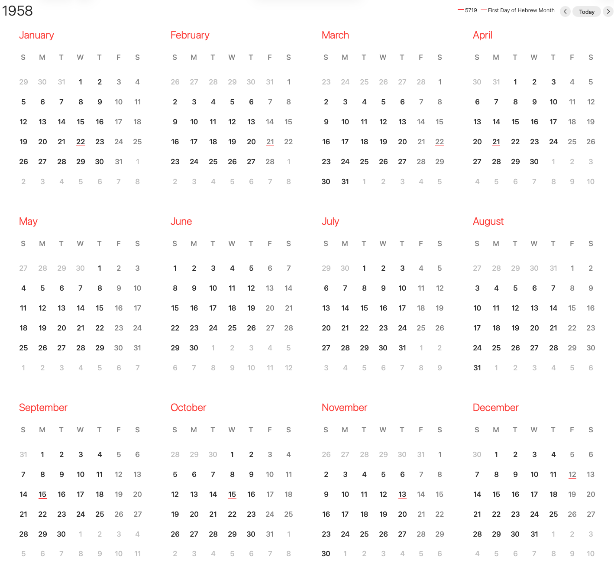

Deserted locations in the south

In 1958, a band leading a mixed-race, dancing crowd through the Deep
South would be viewed by the local establishment not just as a "musical
act," but as a **social contagion.** The "Piper" dynamic—attracting
youth across racial lines—was the ultimate nightmare for segregationist
authorities because it proved that the "color line" could be dissolved
by joy and rhythm.

Here are the deserted locations where such a group might seek refuge,
and the specific dangers they would face:

[<u>Deserted Locations in SE
US</u>](https://www.google.com/maps/d/edit?mid=1d0MFWa0rLD4Th53Qhs0jcMBw-Dl0GL4&usp=sharing)

### **1. The Abandoned Turpentine "Quarters" (South Georgia/North Florida)**

These were labor camps deep in the pine forests where workers once lived
in near-slavery to extract pine resin.

- **The Setting:** Rows of leaning, unpainted shacks along a "corduroy
  road" (logs laid across swampy mud). By 1958, many were empty, leaving
  a ghost street perfect for a nomadic band to set up.

- **The Vibe:** The air is thick with the smell of old pine pitch and
  stagnant water. It feels like a place where the law doesn't reach.

- **The Bad Actors: The "Sundown" Patrol.** Local "vigilance committees"
  or rural deputies would view a mixed-race group in the woods as a
  "moral insurrection." In 1958, any gathering of Black and white youth
  was often prosecuted under **"Inciting a Riot"** or **"Vagrancy"**
  laws. They wouldn't just stop the music; they would aim to "break" the
  followers to ensure they never returned to such a
  gathering.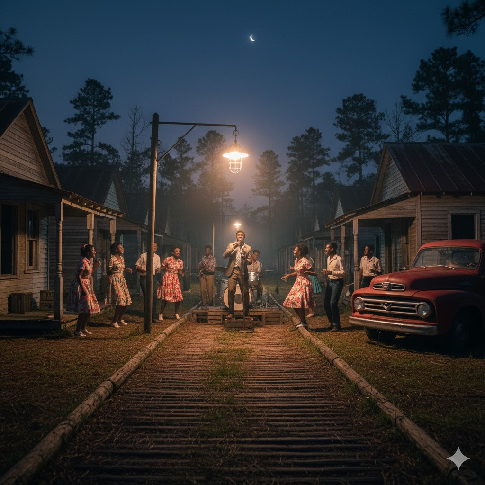

### \

### **2. Rodney, Mississippi (The Abandoned River Port)**

As the Mississippi River shifted its course, this once-wealthy town was
left stranded in a humid, overgrown basin.

- **The Setting:** Massive brick buildings with "ghost signs" fading on
  the walls and the famous **Rodney Presbyterian Church.** It looks like
  a movie set for the end of the world.

- **The Vibe:** High grass growing through the floorboards of porches.
  It provides a natural "stage," but the decay makes every footstep
  sound like a gunshot.

- **The Bad Actors: The Citizens' Council.** In Mississippi in 1958, the
  "White Citizens' Councils" were the "uptown KKK." They were doctors,
  lawyers, and bankers who used economic and physical intimidation to
  maintain the status quo. To them, a Black "Piper" was a political
  threat who had to be "removed" to prevent the local Black population
  from seeing a model of integrated rebellion.

> 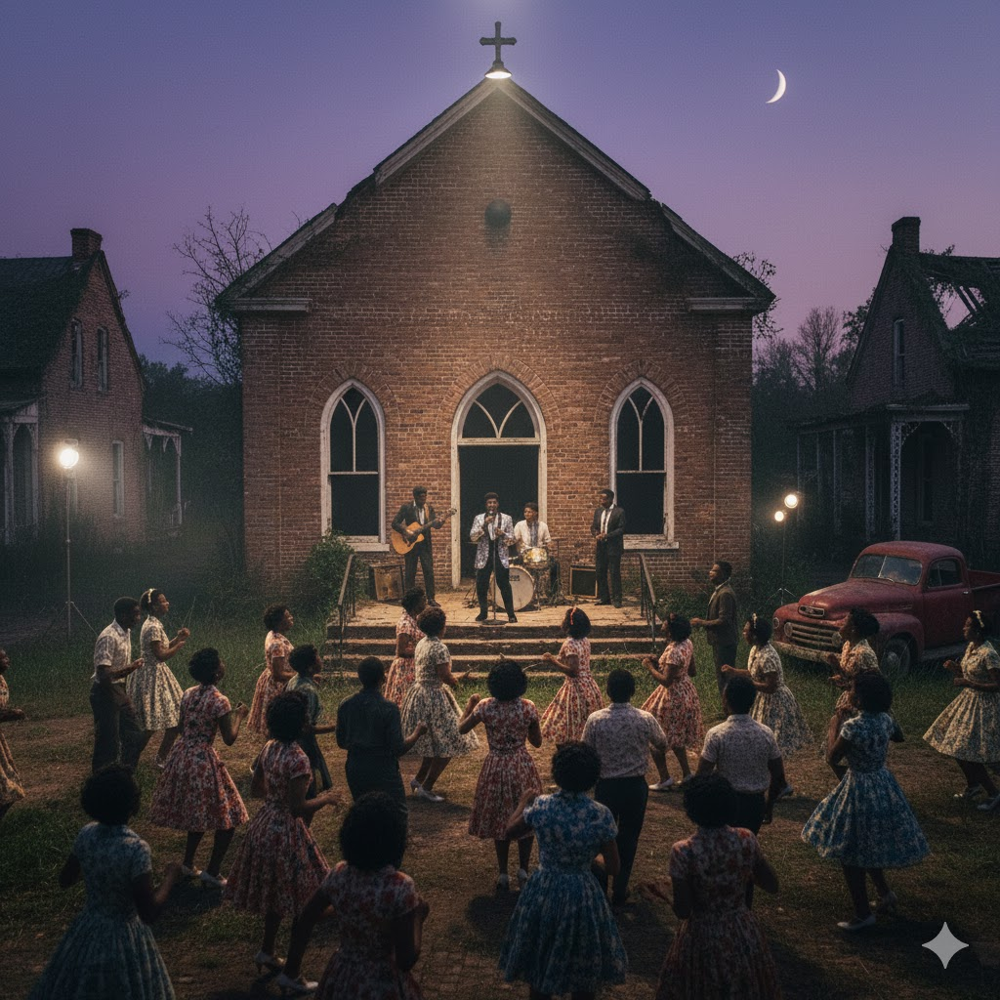 style="width:5.85938in;height:5.85938in" />

### **3. The Drowned Hamlets of Lake Martin (Alabama)**

When the Tallapoosa River was dammed, the rising waters created
"islands" that were once hilltops featuring small Black communities.

- **The Setting:** An island accessible only by boat or a crumbling
  bridge, featuring a single abandoned church or schoolhouse.

- **The Vibe:** Extremely isolated. The sound of the band would travel
  for miles over the water, acting as a literal siren song for the youth
  in nearby towns who would steal boats to get there.

- **The Bad Actors: Religious Extremists.** In 1958, "Rock and Roll" or
  "Race Music" was frequently preached against as literal **Satanism.**
  A band attracting white girls to dance with Black boys on a "sacred"
  island would be seen as a spiritual emergency. Local church-sanctioned
  mobs might arrive to "purify" the site, often with fire or blunt
  force.

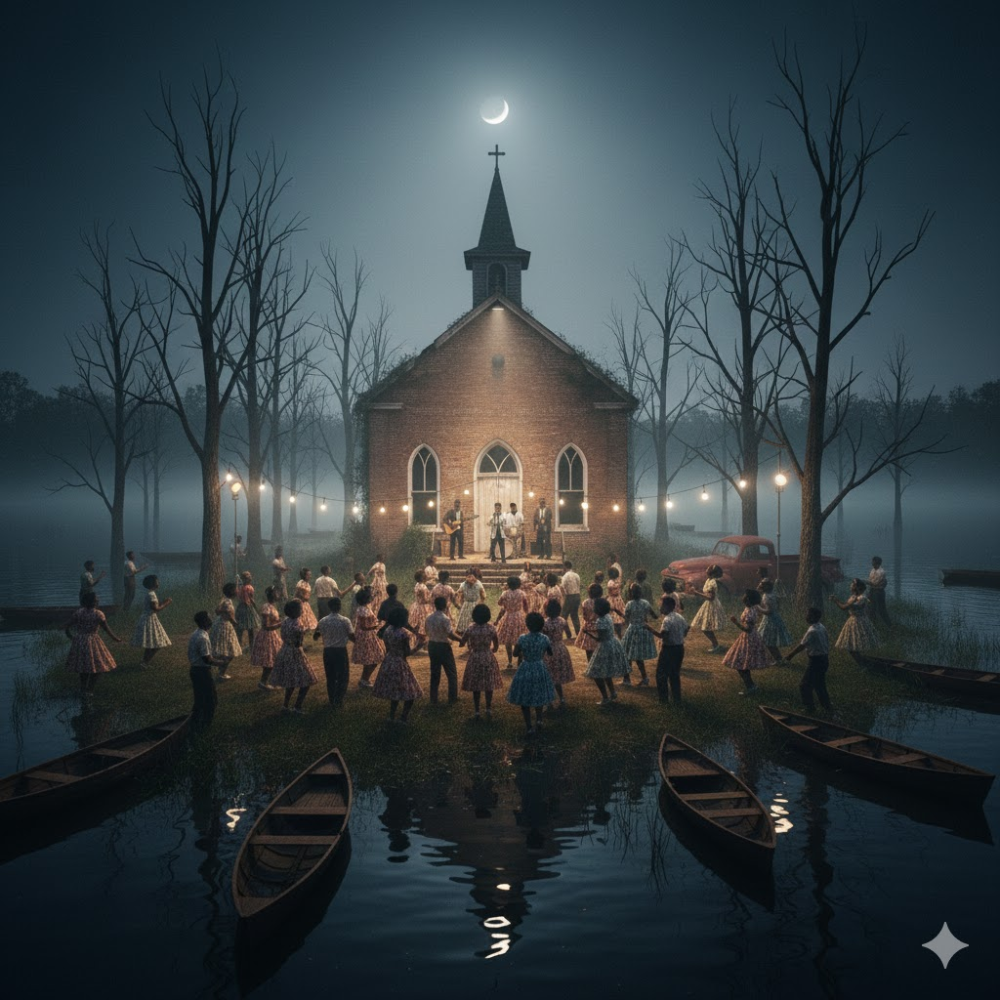

### **The "Pied Piper" Threat Profile (1958)**

| **Factor** | **Why it was "Bad" to the Actors** |
|----|----|
| **The Music** | R&B and early Rock were seen as "breaking down the inhibitions" of white youth. |
| **The Mixed Crowd** | 1958 was the height of **"Massive Resistance"** against integration. A dancing crowd was a visual defeat of the law. |
| **The "Piper"** | A charismatic Black leader with "power" over white minds was the most hunted figure in the Deep South. |

### **The "Grave" Risk**

The most plausible "bad news" for this group in 1958 wouldn't be a fine
or a night in jail—it would be a **disappearance.** In places like
Rodney or the Georgia swamps, a group of 200 people could be surrounded,
and the leaders "taken into the woods" while the followers were
dispersed with fire hoses or dogs.

In 1958, the "deserted" neighborhood was often a fresh wound. These
weren't ancient ruins; they were places where the paint was still
peeling and the gardens were just beginning to go wild. The "decline"
was usually caused by two things: **Urban Renewal** (which targeted
Black neighborhoods for highway construction) or **Economic Collapse**
(the sudden closing of a town's single reason for existing).

Here are three types of neighborhoods in the South that fit your "Piper"
band’s journey:

### **1. The "Bottoms" of Cairo, Illinois (The Gateway to the South)**

While technically in Illinois, Cairo in 1958 was culturally the "Deep
South." Sitting at the confluence of the Ohio and Mississippi Rivers, it
was a town built on river trade that was rapidly dying.

- **The Neighborhood:** The **Pyramid Court** area and the surrounding
  low-lying "Bottoms."

- **The Desertion:** Frequent flooding and the collapse of the steamboat
  industry caused the wealthy to move to higher ground, leaving behind
  grand, rotting Victorian houses and worker cottages.

- **The Vibe:** A labyrinth of foggy, brick-paved streets that ended
  abruptly in river mud.

- **The Danger:** **Roving Police "Special Deputies."** Cairo was a
  powder keg of racial tension in 1958. A mixed crowd dancing in the
  "Bottoms" would be met with immediate, organized police violence under
  the guise of "maintaining order" at the state border.

### **2. The "Ghost Row" of Garysburg, North Carolina**

In the late 50s, the construction of the **I-95 corridor** and the
bypass of older highways began to kill off small-town districts
overnight.

- **The Neighborhood:** The area surrounding the old **Peanut Mills**
  and the railroad tracks.

- **The Desertion:** As the mills mechanized or moved, entire blocks of
  company-owned "shotgun houses" were boarded up. By 1958, these were
  "liminal spaces"—places between life and demolition.

- **The Vibe:** The air smelled of dry dust and old burlap. The band’s
  music would echo off the corrugated metal of the empty silos.

- **The Danger:** **The "Massive Resistance" Militias.** This part of
  North Carolina was a stronghold for politicians who vowed to close
  schools rather than integrate. A "Piper" attracting white teenagers to
  a Black neighborhood would be seen as a "biological threat" to the
  racial purity they were fighting to preserve.

### **3. The Abandoned "Sugar Shacks" of St. James Parish, Louisiana**

Outside of New Orleans, the transition from manual sugar cane harvesting
to machine labor left entire plantation "quarters" (neighborhoods for
workers) completely empty.

- **The Neighborhood:** Small, isolated clusters of wooden shacks set
  back from the **River Road**, hidden behind massive oak trees and
  Spanish moss.

- **The Desertion:** Families were forced to move into "the city" (New
  Orleans) for work, leaving their ancestral cabins to be reclaimed by
  the swamp.

- **The Vibe:** Gothic and heavy. The "Piper" would be playing against a
  backdrop of hanging moss and the sound of cicadas, creating a
  trance-like atmosphere for the dancers.

- **The Danger:** **The "Levee Patrol" / Private Security.** These lands
  were still owned by massive sugar corporations. Any gathering was
  considered "trespassing on corporate property." In the 1950s,
  company-paid guards often had the same power as the Sheriff and used
  it to suppress any gathering that looked like "labor organizing" or
  "social mixing."

### **Demographic Decline vs. The "Piper"**

| **City Size** | **Neighborhood Type** | **1958 Status** |
|----|----|----|
| **Medium** (e.g., Montgomery, AL) | **"The Ravine"** | Targeted for highway clearing; houses being moved or burned. |
| **Small** (e.g., Natchez, MS) | **"Under-the-Hill"** | Former port district; mostly derelict warehouses and brothels. |
| **Rural Hub** (e.g., Mound Bayou, MS) | **The Outskirts** | Declining due to the "Great Migration" North. |

### **The Ultimate Risk: The "Outside Agitator" Label**

In 1958, the most dangerous thing you could call a Black man in the
South was an **"Outside Agitator."** By leading a mixed-race group
through these dying neighborhoods, your Piper is effectively painting a
target on his back. The "Bad Actors" wouldn't see a musician; they would
see a "Communist-backed" operative sent to destabilize the Southern way
of life.

Would you like me to generate a scene of the Piper leading the crowd
through the "Shotgun Houses" of a deserted mill town at night?

In 1958, the "deserted" spaces of the South were often the result of
**planned obsolescence** (Urban Renewal), **industrial flight**, or
**environmental displacement**. These locations provided the isolation
your "Piper" would need to host a mixed-race gathering, but they also
acted as traps where "Bad Actors" could operate without witnesses.

Here is an exhaustive list of declining or deserted neighborhoods and
districts in 1958:

### **1. Urban "Eminent Domain" Zones (The Highway Victims)**

In the late 50s, the Federal Aid Highway Act was in full swing,
deliberately routing interstates through thriving Black "cities within
cities."

- **Hayti District (Durham, NC):** Once the "Black Wall Street," by 1958
  large swaths were boarded up or partially demolished to make way for
  the Durham Freeway.

- **The 4th Ward/Holloway (Houston, TX):** A historic freedmen’s town
  where blocks were being cleared for the Gulf Freeway, leaving a
  "no-man's land" of half-standing Victorian homes.

- **Black Bottom (Nashville, TN):** Low-lying, frequently flooded, and
  targeted for "slum clearance." It was a maze of alleyways and
  crumbling brick warehouses.

### **2. Company "Ghost" Towns (The Industrial Collapse)**

These were neighborhoods built around a single resource that ran dry or
mechanized, leaving the residents to flee to the North.

- **Cahawba, AL (The Old Capital):** Already a ruin by 1958, its
  abandoned "streets" were merely paths through overgrown oaks and
  columns of burnt-out mansions.

- **The "Company Row" (Gantt’s Quarry, AL):** A marble-quarrying town
  where the housing was abandoned as the pits closed, leaving
  white-dusted, eerie cottages.

- **Bibb City (Columbus, GA):** While not fully deserted, the "mill
  village" was beginning to see massive vacancies as textile production
  shifted, creating blocks of identical, empty "saltbox" houses.

### **3. River & Swamp "Peonage" Camps (The Labor Ruins)**

Isolated settlements where workers lived in total isolation from the
law.

- **The Sawmill Quarters (Fargo, GA / Okefenokee Border):** Massive
  timber camps abandoned after the old-growth cypress was tapped out.
  These featured long "street-docks" over swamp water.

- **Rodney, MS (The Stranded Port):** A ghost town by 1958; its grand
  architecture was being swallowed by the kudzu and the Mississippi
  humidity.

- **The Levee Camps (Tunica, MS):** Shifting settlements for
  flood-control workers. When a project ended, they left behind "tent
  cities" or wooden shanties.

### **4. Summary of Locations and Threats**

| **Neighborhood Type** | **Specific Example (1958)** | **Why it was Deserted** | **The "Bad Actor" Threat** |
|----|----|----|----|
| **The Urban Clearing** | **Hayti, Durham, NC** | Federal Highway construction | **Municipal Police:** Would use "vagrancy" and "public nuisance" laws to beat and disperse mixed crowds. |
| **The River Ghost** | **Rodney, MS** | The river changed course | **Citizens' Council:** Local elites who would view a Black "Piper" as a communist agitator. |
| **The "Bottoms"** | **Cairo, IL** | Economic decline/flooding | **White Vigilante "Posse":** Border-town extremists who used violence to stop "racial mixing." |
| **The Mill Row** | **Garysburg, NC** | Mechanization of peanut/cotton mills | **Massive Resistance Militias:** Paramilitary groups formed specifically to fight integration. |
| **The Island Ruins** | **Lake Martin, AL** | Flooded by dam construction | **Religious Zealots:** Local preachers who viewed Rock & Roll as "Satanic" and would burn the site. |
| **The Timber Camp** | **Fargo, GA** | Deforestation | **Moonshiners:** Violent outlaws who protected their territory from "outsiders" and "noise." |
| **The Mining Village** | **Gantt's Quarry, AL** | Economic depletion | **The Klan (KKK):** Used the white-dusted ruins as "ritual grounds" and would ambush the band. |
| **The Sugar Quarters** | **St. James Parish, LA** | Transition to machine labor | **Corporate Guards:** Private security with Sheriff-level power; would use dogs to clear "trespassers." |

### **The Role of the "Piper" in these Spaces**

In these locations, the Piper isn't just playing music; he is
**reclaiming lost territory.** To the white teenagers following him,
these "scary" or "dying" neighborhoods become magical and alive through
the music. To the Bad Actors, this is a **territorial invasion.**

###  **Deserted Neighborhoods & Ghost Towns**

- **Hayti District (Durham, NC):** A premier example of **Urban
  Renewal** and "slum clearance." The Federal Highway Act of 1956
  provided the funds that eventually led to the demolition of this
  thriving Black business district to build Highway 147, displacing over
  4,000 families (Source: *Facing South*, *Hayti Heritage Center*).

- **Rodney, Mississippi:** Once a bustling port that nearly became the
  state capital, it became a "ghost town" after the Mississippi River
  changed course. By the 1950s, it was a decaying shell of brick
  buildings and churches swallowed by the swamp (Source: *Mississippi
  Ghost Towns*, *Southern Lagniappe*).

- **Gantt’s Quarry, Alabama:** A specialized company town for marble
  workers. Its population declined sharply after the Great Depression,
  dropping by over **44%** between 1950 and 1960. The company eventually
  demolished the worker housing in the 1960s (Source: *Alabama
  Historical Commission*, *U.S. Census Bureau*).

Side 2 Tim

\## General Arcs

if the first Side was about a one-car, one-day road trip, the second
side is about a long, multi-car trip: — a caravan — a youthful summer
excursion.

For the band, a different experience: professional life on the road,
from obscurity to success.

For Tim, it’s his arc away from flocking and back into the corporate
life that initially was waiting for Barry.

Tim wants to be appreciated. All of his life he was considered a pretty
boy but a target to mockery and harassment. He wants to show he is
talented, capable. He wants a girl to love him for who he is inside, not
for his face.

For Barry, it’s the opposite: from being a king’s son to being the moses
/ jesus / buddha of the movement.

For Alice, it’s her maturation into a holy example-setter, the spirit of
the flock.

Eleanore is the philosopher, the opposite of Alice who’s the heart.
Their interactions show the beginnings of a religion.

Cindy will probably die, something to do with Barry and the Father, BJ
MacAllister.

For the reader: enjoying wish fulfillment -\> WF becomes an ideological
utopia -\> leaving the utopia at the end makes the user want to return
by implementing the ideology in their lives.

our main goal is to sell the transformation as plausible. earn each
fantasy.

flocking is:

\- mainly described through lessening of ego (initially felt like the
freedom of being on long holiday)

\- ​ causes people to only “lead” when ​they should (know the way there,
for ​ ​example)

\- lessening of fear from society causes more agency and
self-assuredness

\- optimizing for quality (of experience, relationship) over efficiency

\- a reverse prisoner’s dilemma out of a feeling of
תודעת שפע

\- flocking is being able to exist in several social circles (flocks)
and have a separate identity in each

flock behaviors

\- everybody is considered to be 0 days old — there no “greenhorns” and
no gatekeeping

\- A non-attachment approach (esp. with relationships, and to some
extent with everything). This does not mean that you don't care about a
person you have a relationship with, just that the expectations of this
relationship to be bonding are relieved.

\- However, relations are more important than they would be in a non
flock (e.g. a team) Individuals are seen as a node in a network of
relations. In that sense, there is almost no such thing as an
individual, because each person perceives this node through their
specific relationship. Thus, respect is earned and expected based on the
quality of the relationship, and it is something to nourish.

\- Each action a person wishes to take is also considered through this
lens - how will it effect others around me? people in the same flock,
the same caravan?

\- A flock is a loose group of people (maybe later not just people)
engaged in an activity together. Often, that activity has a mean, which
can be long or short term. Example includes performing music, creating
art, working on a project. Unlike a team, a band or a group, the flock
is loose in a few aspects:

\- Members of the flock can join or leave at well. There is an underline
belief that the activity will be completed regardless. This is
manifested by the saying "\*\*Maybe we'll dance together later\*\*"

\- There is less emphasis on completing a task within a given time, it
is completed when the time for it comes, which will be manifested by
flock members putting more attention to it. This is manifested by a
sense of urgency instilled in people when they join.

\- There are less rigid roles: we follow whoever is best fitted in a
given moment to the task at hand, and we play a role based on what we
can contribute best. It may well be that the person who initially formed
the flock will move to a back seat or leave completely, letting someone
else lead.

\- The relationships in the flock are at least as important as achieving
the activity goal.

the music has a psychaedelic effect:

\- during causes mdma like love and closeness with others

\- creates sinestesia

\- deattachment up to out of body experience

\- after, lessenning of ego

\- deprogramming and reprogramming memories and things we think we know
about our relationship with the world

effects appear three times:

\- reflects reality (i saw their sihllouettes on my retina)

\- amplifies reality (babatunde seems to float)

\- distorts reality (i see babatunde as dancing colors)

tim’s voice

\- more lyrical

\- more impressionable

\- hsp

\- reflective

Alice in side b is quickly becoming a holy person, esp. through
love-struck Tim’s pov.

Barry is a leader of men: like moses

Barry (and possibly Cindy) join the conductors

Barry is against hierarchy, he wants to see everyone in face level.
However, we as readers are more interested in Barry

Eleanore is a studious disciple, finding theory in the flock’s behavior

cindy is action.

Ideas that will appear in the side

communications though public washroom graffiti . Haikus by Kimberly.
Flock name written on the wall.

the bear-geneer is a prominent item. at a point we will have to go back
and rescue it from somewhere

Building a barn, call the guys over. some people go to bath in the
stream mid day. some join, some leave.

the flocks learn how to recreate the music performance experience using
singing, stomping and bracelets

The record company is named Calypso and its brand logo is a lyre.
they’re a slick startup, and all the people it sends are well spoken,
friendly, and make you want to shower after you’ve met them. Connection
with buzz — ==uncertain.==

Calypso joins when the phenomenon of steam pillars starts to be well
known… as we learn from the breaks (radio?)

they try to take control of the steam pillars but fail. Luckily they
groomed Tim just for that. They turn their jaws on him, make him a star
and drive him away from Alice.

Tim and the pillars

he starts as someone who changes a string for mucho on chapter 4

he becomes a lowly roady and everybody is a little mean to him, jo
especially.

he learns to play from watching jo

the pillars give him a chance and he goes on stage

the best moment in his life is when he got to play and sing solo

after that, he’s lured away from the pillars to a solo career by
calypso.

we hint he was successful, at least for a while, after the book ends.

\## things we want to see in side 2

\### flock formation

timeline:

1\. group in a car (side A)

2\. car in a caravan (side A - side B)

3\. caravan has a goal, and is made of subgroups (cars)

4\. people can switch between cars

How cars in the caravan communicate

Appearance of fan clubs

fan-clubs extending their definition, starting to embrace more action

Starting to use the term flock

FLockers create means of communicating and identify each other

The Steam Pillars' decision to go to commercial venues, becoming
exposed, leaving the under ground

At this point the audience became too large: the first public appearance
of the steam pillars

\### flock examples

gathering to do a job

someone doesn't want to work

moving between groups

\### cool scenes

bathing in the stream

someone who plants seeds everywhere the pillars had a show

communicating via bathroom graffiti

show around a fire

\### arcs

\*\*tim in love with alice\*\*

\*\*tim and calipso\*\*

\*\*barry becoming moses\*\*

\*\*alice becoming holy\*\*

from holiday freedom fun to a revolution: when the freedom encounters
its limits it does not succumb, it fights to change the world.

Crowds in jefferson square - research

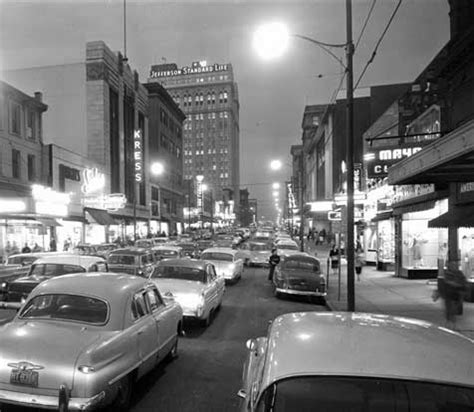

Your premise needs a guardrail: **in 1958 Greensboro, the downtown
Elm/Market core would skew heavily white on an ordinary Sunday**; a
visibly “Black crowd” there usually needs a *specific draw* (or a
confrontation) because East Market was the better-established Black
commercial/social corridor. East Market is documented as a major Black
business district.

A single Sunday that plausibly creates **more foot traffic than
expected**, with **Black crowds on (East) Market** and **white crowds
along Elm**:

## **Black crowds on Market Street (East Market)**

**Reason:** *A “Jubilee Day” tied to Greensboro’s 150th birthday
celebrations*—church groups + A&T/Bennett-linked crowds treat it like a
second service/afternoon program, then spill into the street.

Why it works:

- Greensboro’s 150th (founded 1808) is real, and the city did hold 1958
  sesquicentennial events.
  ([<u>ncpedia.org</u>](https://www.ncpedia.org/greensboro-0?utm_source=chatgpt.com))

- East Market is documented as a center of Black community life with
  restaurants, entertainment, churches, and dense foot traffic.

- So: after Sunday service, people **walk** rather than drive short
  distances, congregate outside a venue, and the street looks “busy”
  even if it’s just a few concentrated blocks.

Concrete street behavior to write:

- “Sunday-best” clustering on corners; kids running errands; groups
  waiting to cross together; informal call-and-response shouting as they
  spot friends.

- A visible “destination magnet”: a theater entrance or church doorway
  on East Market (historically there were entertainment venues along
  East Market).

## **White crowds along Elm Street (downtown core)**

**Reason:** *The official sesquicentennial spectacle is downtown*—a
parade/procession and/or a special program people watch from Elm, then
drift toward theaters.

Why it works:

- A Greensboro **Sesquicentennial parade in 1958** is directly
  documented in archival records/images. ([<u>Digital
  Greensboro</u>](https://www.digitalgreensboro.org/record/37004?ln=en&utm_source=chatgpt.com))

- Downtown Greensboro’s historic commercial core has **Elm Street as the
  central focus**, i.e., it’s the natural corridor for a civic event and
  spectators.

- There was a major movie house right off that corridor (Center Theatre
  at 117 S. Elm), which gives you a believable “line outside” visual
  that amplifies foot traffic.
  ([<u>cinematreasures.org</u>](https://cinematreasures.org/theaters/15707))

Concrete street behavior to write:

- Families staking curb spots; men in short-sleeve dress shirts; women
  with handbags and gloves; teenagers orbiting the crowd edge.

- “After the parade” drift: people walking in slow sheets north/south
  along Elm rather than dispersing instantly.

If you meant **West Market at Elm (your Jefferson Square area)** for the
Black crowd (not East Market), say so—because that’s the less-plausible
version in 1958 without an extra trigger (police incident, protest,
integrated event, or a parade contingent bringing people downtown).

The Greensboro Disruption

\## Location: Jefferson Square - Elm and Market \##

In 1958, \*\*Jefferson Square\*\* was the absolute epicenter of
Greensboro, North Carolina. It wasn't a traditional grassy "park"
square, but rather the city's most vital intersection where \*\*Elm
Street\*\* (the main north-south commercial artery) crossed \*\*Market
Street\*\* (the main east-west thoroughfare)

\### \*\*The "Two Worlds" of Market Street\*\*

The square sat at a racial and social threshold. \*\*West Market
Street\*\* led toward the white-dominated civic and residential areas.
\*\*East Market Street\*\* began just a few blocks away and was the
thriving "Main Street" for Greensboro’s Black community, filled with
Black-owned businesses, hotels, and jazz clubs—the world where the
street musician you asked about would have felt most at home.

\![\[Pasted image 20260102001401.png\]\]

\## How can it happen \##

In Greensboro in 1958, the plausibility of a Black street musician
playing in the city square (specifically Jefferson Square at the
intersection of Elm and Market Streets) is \*\*quite low but not
entirely impossible\*\*, depending on the "vibe" and the musician's
approach.

Here is a breakdown of the social and legal reality of that moment:

\### 🏙️ \*\*The Reality of Greensboro in 1958\*\*

Greensboro in 1958 was a city defined by "civility" but strictly
governed by \*\*Jim Crow laws\*\*. While it wasn't as overtly violent as
some deep-South cities, segregation was the absolute law of the land.

\- \*\*Public Space and Race:\*\* Jefferson Square was the "white"
business heart of the city. While Black residents walked these streets
to shop at stores like Woolworth’s or Meyer's, they were expected to be
"moving through." Loitering—especially for a Black man with an
instrument—would have immediately attracted the attention of the police.

\- \*\*The Law:\*\* If a musician set up a chair or a hat for tips, they
would likely be charged with \*\*vagrancy, loitering, or "disturbing the
peace."\*\* In 1958, these charges were frequently used as "catch-all"
tools to remove Black individuals from white-dominated public spaces.

\- \*\*The Atmosphere:\*\* This was two years \_before\_ the famous 1960
sit-ins. The tension was building; Black leaders like Dr. George Simkins
were already fighting to desegregate city golf courses. The authorities
were on high alert for any "disruption" to the social order.

---

\### 🎸 \*\*When It \_Could\_ Happen\*\*

There are a few specific scenarios where you might have seen this:

\- \*\*The "Traveling" Bluesman:\*\* A musician might play while
standing or walking (mobile busking), making it harder for police to
claim they were loitering. If they were "passing through" and playing
for a few minutes before moving on, they might be tolerated.

\- \*\*The Blind Musician:\*\* Historically, blind street musicians were
often given a "pass" by Southern police and the public. There was a
sense of paternalistic charity toward blind performers that occasionally
overrode the strictness of segregation.

\- \*\*East Market Street vs. Elm Street:\*\* If the musician moved just
a few blocks east to \*\*Market Street\*\* (the heart of the Black
business district near NC A&T), they wouldn't just be plausible—they
would be a staple of the community.

\![\[Pasted image 20260102002035.png\]\]

\## The Underground show \##

In 1958 Greensboro, a truly "underground" show (clandestine, potentially
integrated, or playing "forbidden" music) would need to be held in
places where the noise would be masked by machinery or where the police
were unlikely to patrol.

Here are three industrial, gritty options for 1958:

\![\[Pasted image 20260102110401.png\]\]

\[Map\](https://www.google.com/maps/d/edit?mid=1nohLtkKHN01d53Q-KUTdt7rVqmMATN8&usp=sharing)

\### 1. The Pomona Terra Cotta Pipe Works (West Market St Area)

Located on the western edge of the city, this was a massive industrial
complex that manufactured clay pipes.

\- \*\*The Setting:\*\* By 1958, parts of the older "beehive" kilns were
often cool and empty between firings. These circular brick structures
looked like ancient ruins and provided incredible, cathedral-like
acoustics.

\- \*\*Why it's "Underground":\*\* It sat right next to the Southern
Railway tracks. The sound of a loud blues band or a jazz quartet would
be easily masked by the heavy clanking of passing freight trains. It was
a rugged, dust-covered environment—the ultimate "industrial" stage.

\![\[Pasted image 20260102095126.png\]\]

\### 2. The Mock, Judson, Voehringer Hosiery Mill (The "Mojud" Mill)

Located on Howard Street (now known as the \*\*Westerwood\*\* area),
this was a massive brick complex.

\- \*\*The Setting:\*\* While the main floors were packed with knitting
machines, the \*\*boiler rooms\*\* or the \*\*shipping docks\*\* at
night were cavernous and isolated. These spaces featured high ceilings,
exposed pipes, and thick concrete floors—perfect for a rowdy crowd of
200 people.

\- \*\*The Vibe:\*\* The smell of machine oil and steam hung in the air.
Because it was a "hosiery" mill, it felt slightly more urban and
"modern" than the cotton mills. An after-hours show here would feel like
a secret meeting of the city’s working-class rebels.

\![\[Pasted image 20260102095308.png\]\]

\### 3. The Blue Bell Overall Company (South Elm Street)

Blue Bell (the precursor to \*\*Wrangler\*\*) had a major presence right
downtown, near the railroad tracks.

\- \*\*The Setting:\*\* Their \*\*cutting rooms\*\*—where giant tables
were used to slice through layers of denim—offered wide-open floor
plans.

\- \*\*The Access:\*\* Because it was located so close to the railyards
and the "wrong side of the tracks" south of the downtown business
district, it was easy for a diverse crowd to slip in and out through the
loading bays without being seen by the "respectable" crowds at the
Center Theatre or the Jefferson Standard building.

\- \*\*The Connection:\*\* Since it was a denim factory, the space would
be filled with the very fabric of the era’s rebellion.

\![\[Pasted image 20260102094945.png\]\]

---

The Dan River picnic

The Dan River

### **The Riverbank and the Towhead**

The riverbank is not sand; it is a treacherous, beautiful **red clay
slope** typical of the Piedmont. It’s slick as grease where the water
touches it, transitioning into a wide "beach" of **fine grey silt and
smooth river stones**—granite and quartz washed down from the Blue
Ridge.

The **towhead** sits thirty yards out, a low-slung island of the same
grey silt. It’s anchored by a dense "head" of **black willow and river
birch**, their roots exposed like tangled nerves. The water between the
bank and the towhead is shallow and tea-colored, rippling over a bed of
jagged rocks.

### **The Horizon: Mountains and The Dam**

- **The Mountains:** In the far western background, the **Blue Ridge
  Mountains** are not jagged peaks but hulking, dark-blue silhouettes.
  They look like massive, sleeping animals under the **crescent moon**.
  They provide a sense of total enclosure, as if the river valley is a
  secret room.

- **The Dam:** Half a mile downstream, the **Schoolfield Dam** is a low,
  horizontal line of white thunder. You can’t see the concrete clearly
  in the dark, but you can see the **"ghost-mist"** rising above it—a
  constant spray of water that glows faintly in the moonlight. The sound
  is a persistent, low-frequency hum that vibrates in the teenagers'
  chests.

Since your scene is set in **late morning** during June, the orchard
would feel very "alive." The bees would be thick in the air, and the
smell wouldn't be the dry, dusty scent of fall, but a **sweet, humid,
and slightly sour** smell of rotting fruit and damp clay.

The apples the teenagers are eating would be the **Carolina Red Junes**.
They would be tart enough to make their mouths water, providing a sharp
contrast to the greasy, salty Johnnycakes they are frying on the river
silt.

###  **The "Carolina Red June" apple**

This is the most likely candidate for your orchard.

- **The Appearance:** Small to medium-sized apples with a deep,
  purplish-red skin. The flesh is white, tender, and sometimes stained
  with red streaks near the skin.

- **The Taste:** Brisk, tangy, and juicy. They are "pie apples"—perfect
  for making those Johnnycakes or apple tarts on a riverbank bonfire.

- **The Legend:** In 1958, every old Southern homestead had a "Red June"
  tree specifically because it provided fruit months before the October
  harvest.

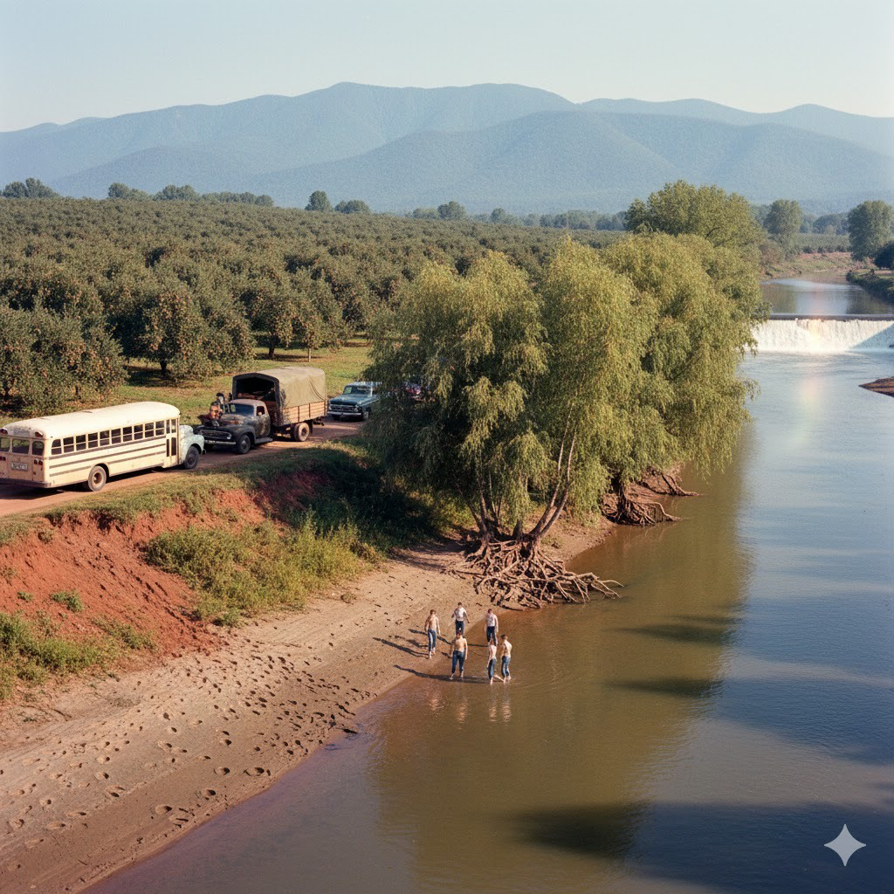

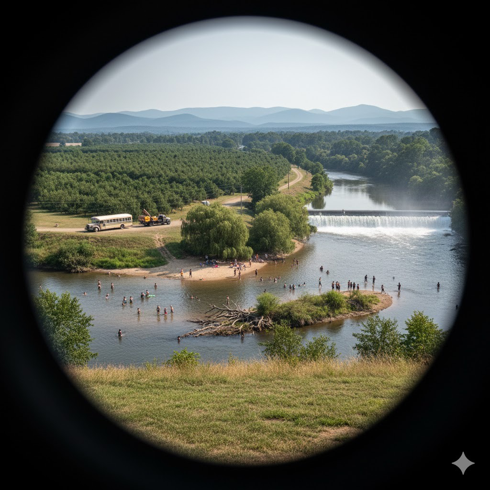

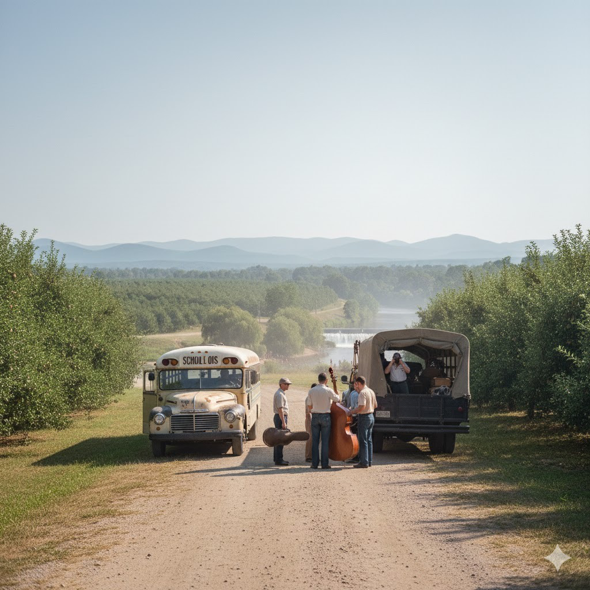

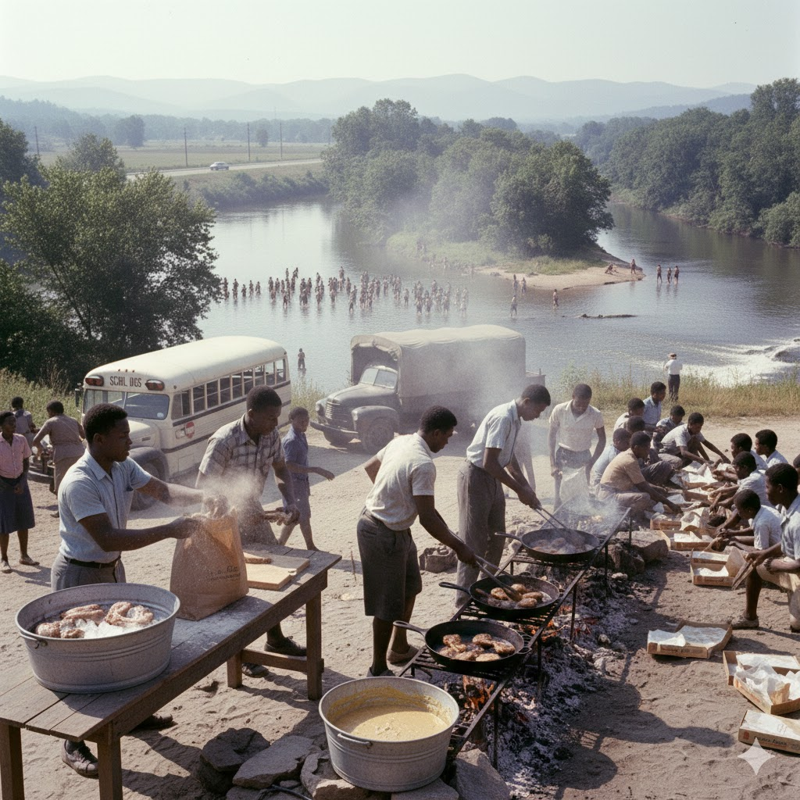

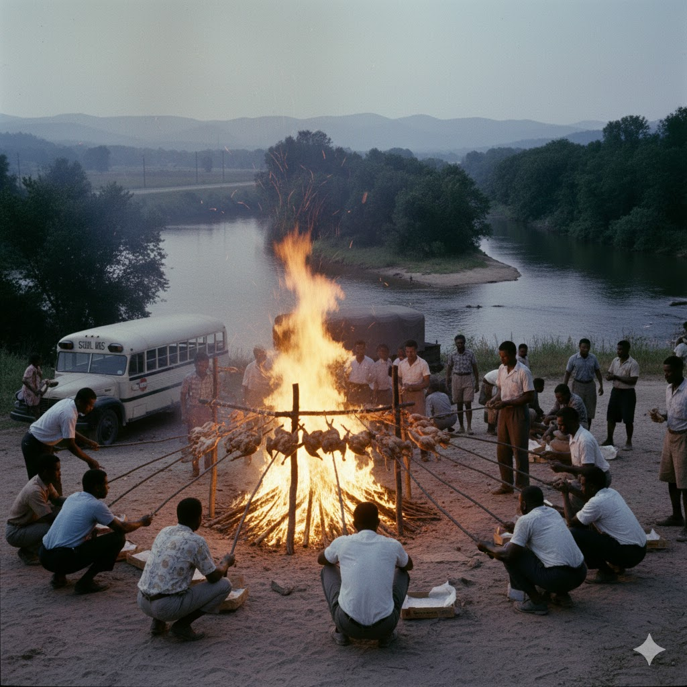

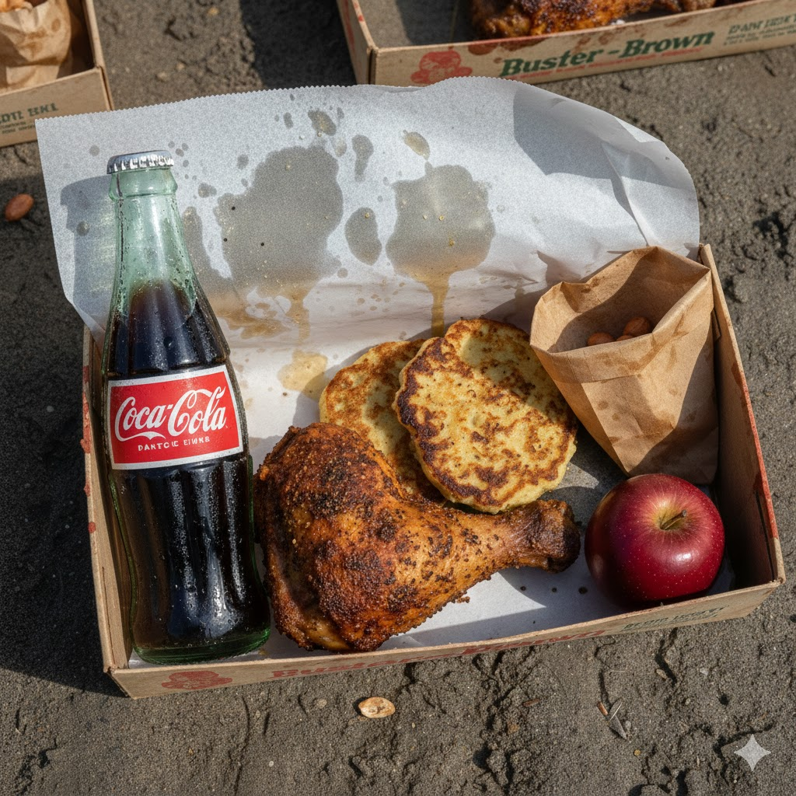

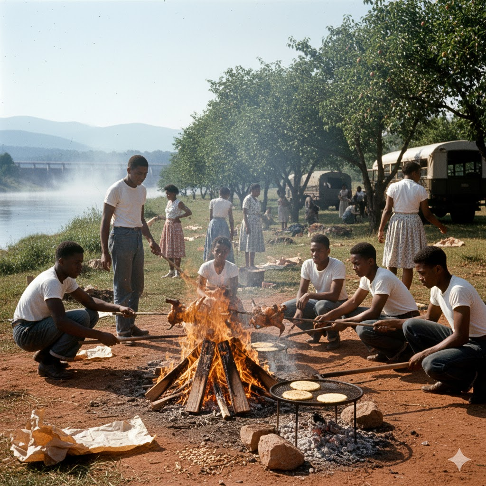

In 1958, for Black families and musicians like the "Piper" traveling the
"Chitlin' Circuit," the **Shoebox Lunch** was a survival tool. Because
Jim Crow laws barred Black travelers from white-owned restaurants and
"sundown towns" made stopping dangerous, they carried their own dining
rooms in their laps.

### **The Containers: More than "Any Box"**

While it's called a shoebox meal, the container had to be sturdy enough
to withstand hours in a hot car and grease-proof enough to keep from
falling apart.

- **The Classic Shoebox:** Cardboard shoeboxes from brands like *Buster
  Brown* or *Thom McAn* were prized. They were the perfect size for a
  single person's meal and fit easily under a car seat.

- **The Lining:** This was the secret. To keep the cardboard from
  getting soggy, the box was lined with **wax paper**, **heavy brown
  butcher paper**, or even **tin foil** (which was becoming more common
  in the late 50s).

- **The "Paper Bag" Alternative:** Paper bags were used for snacks (like
  the Red June apples), but for a full meal, they were too flimsy. A
  "grease spot" on a paper bag was a sign that the bottom was about to
  drop out.

- **Alternative Tins:** Some used empty **lard tins** or **tobacco
  tins** for biscuits, as they were airtight and kept the bread from
  drying out in the humid Virginia heat.

### **The Bonfire "Shoebox" Menu**

If the "Flock" is preparing these meals over a bonfire by the Dan River,
they are making foods that taste good cold but are transformed when
reheated over the flames.

| **Item** | **Why it’s in the Box** | **The Bonfire "Twist"** |
|----|----|----|
| **Fried Chicken** | The "Traveler’s Gold." It doesn't spoil quickly and tastes great at room temp. | They would thread a drumstick onto a sharpened **willow stick** and char the skin over the embers. |
| **Johnnycakes** | The bread that won't crumble. | As we discussed, these would be fried fresh on a **flat river stone** greased with bacon fat. |
| **Hard-Boiled Eggs** | Nature's pre-packaged protein. | Sometimes tucked into the hot ashes for a minute to warm the yolk. |
| **Sweet Potato** | Dense and filling. | These would be buried deep in the **white-hot coals** until the skin charred and the inside turned to syrup. |
| **Salt Pork or Fatback** | For seasoning and longevity. | Fried until "crackling" crisp on the edge of the fire. |

### **The Sensory Scene: Breaking the Seal**

When a traveler opened a shoebox in 1958, the smell was a specific
"perfume": the scent of cold flour-crusted chicken, the vinegary tang of
pickled peppers (often included to keep the palate sharp), and the
yeasty smell of biscuits.

> **A Note on "The Lid":** In your scene, the teenagers might use the
> shoebox lids as makeshift plates while sitting on the grey silt. If
> they see the police car through the binoculars, the first instinct
> would be to **close the lids**. A closed shoebox looks like luggage;
> an open one looks like a "loitering" party.

### **The Cultural Significance**

For the Black members of the band, the shoebox was a symbol of
**autonomy**. They weren't "begging for a seat at a table where they
weren't wanted"; they brought their own table. Sharing a shoebox meal
with the white teenagers on the riverbank would be a radical act of
intimacy in 1958—breaking the "bread of the road" together.

Feeding 70 people "on the fly" at a riverbank in 1958 is a massive
logistical undertaking. It transforms the scene from a casual hangout
into a full-scale **field kitchen**. To pull this off, the "Ghost Bus"
and the band’s truck would need to be loaded with specific bulk
supplies.

Here is the checklist of what the "Piper" and his leaders would need to
offload onto that grey silt beach:

### **1. The "Plating" (Containers & Prep)**

You can't rely on finding 70 shoeboxes in the woods.

- **The Boxes:** A stack of **flat-folded cardboard pastry boxes**
  (purchased from a bakery supplier in Richmond) or a "bale" of **brown
  paper lunch sacks**.

- **The Lining:** 10–12 rolls of **heavy-duty wax paper**. This is
  non-negotiable for 1958; it’s the only way to keep the grease from the
  chicken and Johnnycakes from soaking through the boxes.

- **Cutting Stations:** 3 or 4 large **wooden stumps** (brought in the
  truck) or flat planks of wood to serve as prep surfaces for slicing
  the "Red June" apples and salt pork.

### **2. The Bulk Rations**

Since you're cooking on a bonfire, you need ingredients that are
"stable" in the June heat until they hit the fire.

- **The Protein:** 3 or 4 giant **galvanized wash tubs** filled with ice
  and raw chicken pieces (pre-brined in salt water). You'd need about
  150 pieces of chicken to feed 70 people.

- **The "Batter" Kit:** A 50lb sack of **stone-ground cornmeal**, 10lbs
  of **flour**, and 5lbs of **salt**.

- **The Fat:** Two 10lb **tins of Lard** (brand names like *Armor* or
  *Snowdrift*).

- **The Sides:** Two bushels of **Sweet Potatoes** (to be buried in the
  ashes) and several jars of **pickled peppers or okra** to provide the
  necessary acid to the heavy meal.

### **3. The "Hardware" (Cooking Gear)**

To feed 70 people quickly, a single skillet won't work.

- **The "Spider" Skillets:** At least 4 or 5 **large cast-iron
  skillets** (No. 10 or No. 12).

- **The Griddle:** A long **steel plate** or a "plough disc" that can be
  propped up on river stones over the hottest part of the fire for
  mass-producing Johnnycakes.

- **The Tools:** Long-handled **metal tongs**, a few heavy **cleavers**,
  and several **church-key bottle openers** for the crates of soda or
  water.

### **The Labor Breakdown (How 70 people help)**

The RU would organize the group into "stations" to keep the process
moving before the police on the highway decide to come down.

1.  **The Fire Crew:** 5–10 people gathering **driftwood** and **fallen
    apple branches**. They are responsible for maintaining a "cooking
    side" (hot embers) and a "leisure side" (the big flame).

2.  **The Batter Brigade:** 5 people at the back of the truck, mixing
    the cornmeal and water in buckets to make the Johnnycake dough.

3.  **The Fryers:** 4 of the most experienced cooks (likely the older
    members of the band or the "Flock") standing in the smoke, constanty
    flipping chicken and cakes.

4.  **The Assembly Line:** 10 people sitting on the silt beach, folding
    the boxes, lining them with wax paper, and tucked in an apple, a
    piece of chicken, and two hot Johnnycakes.

### **Logistical Inventory Summary**

| **Category** | **Item** | **Quantity** | **Purpose** |
|----|----|----|----|
| **Main Protein** | **Raw Chicken Pieces** | **140–150 pieces** | Two pieces per box; pre-brined in tubs of ice. |
| **Packaging** | Cardboard boxes / Wax paper | 80 boxes / 12 rolls | Creating the "Shoebox" and grease-proofing it. |
| **Cooking Fat** | **Lard / Bacon Drippings** | **20–25 lbs** | The "fuel" used in the skillets to fry the food. |
| **Grains** | Cornmeal & Flour | 60 lbs total | For the Johnnycakes and dredging the chicken. |
| **Fruit** | "Red June" Apples | 3–4 bushels | The tart, fresh element (picked on-site). |
| **Fire Fuel** | Apple wood & Driftwood | 2 large piles | The source of the heat for the "stoves." |

### **The Tipping Point**

With 70 people working, the smell of frying chicken would be
**overwhelming**. It would drift up the clay bank, through the orchard,
and straight to the highway where the man with the binoculars is parked.
In 1958, a "mass gathering" of 70 integrated people cooking a meal was
seen as a "political assembly"—making the logistics of the meal just as
dangerous as the bathing.

### **The Percussion of the Meal**

- The Slap: Down by the water’s edge, five people stand over galvanized
  buckets. You hear the wet, heavy "thwack-slap" of palms hitting
  cornmeal dough, shaping the Johnnycakes into uniform disks. It sounds
  like a slow, steady heartbeat.

- The Sizzle: When the dough hits the cast-iron skillets, it releases a
  violent, white-noise hiss that sends a plume of blue-grey smoke up
  toward the orchard.

- The Crinkle: Along the silt beach, ten teenagers sit cross-legged. The
  most dominant sound is the high-pitched, metallic "skritch-crinkle" of
  wax paper being torn from rolls and smoothed into the bottom of the
  cardboard boxes. It’s a sharp, frantic sound that cuts through the
  humid air.

### **The Visual Hand-Off**

As the boxes are filled, they are passed hand-to-hand from the fire
toward the shade of the willow trees.

- **The Wax Paper Seal:** A hot, grease-beaded piece of chicken and a
  steaming Johnnycake are dropped onto the wax paper. A "Red June" apple
  is rolled in last—cold and tart against the hot bread.

- **The Closing:** The teenagers tuck the flaps in quickly. From a
  distance, the 70 boxes stacked under the trees look like a pile of
  unremarkable luggage, hiding the "evidence" of their feast.

Tab 25

For a location between Greensboro and Charlotte that carries a "grave
atmosphere," the most historically and visually fitting choice is
\*\*Trading Ford at the Yadkin River\*\* (specifically near the
\*\*Spencer/Salisbury\*\* border).

In 1958, this area felt haunted by both deep history and the literal
weight of the water.

\### \*\*The Atmosphere: Trading Ford / Yadkin River Bridge\*\*

Located along \*\*US-29/70\*\* (the main thoroughfare before I-85 was
fully completed), the crossing of the Yadkin River was a place of
transition and isolation.

\- \*\*The Look:\*\* By 1958, the original "Trading Ford"—a shallow
crossing used for thousands of years by Native Americans and
Revolutionary War armies—had been flooded by the construction of the
\[High Rock
Lake\](https://www.google.com/search?q=google:search%3Fq%3DHigh%2BRock%2BLake%2Bhistory%2B1958)
dam. The result was a landscape of \*\*"drowned trees"\*\* and murky,
stagnant water stretching out from the banks.

\- \*\*The Sound:\*\* The bridge was long and narrow. The sound of tires
humming over the metal expansion joints created a rhythmic, droning
whine that would drown out conversation, forcing a heavy silence inside
the car.

\- \*\*The "Grave" Element:\*\* The area was famous as the site of a
desperate retreat during the Revolutionary War (the "Race to the Dan").
Standing on the banks or parked at a roadside pull-off, one feels the
"ghosts" of people who were fleeing for their lives. The mist off the
river in the early morning or evening creates a shroud-like effect.

\### \*\*The 1958 Setting for "Bad News"\*\*

If someone were driving from Greensboro to Charlotte and needed to pull
over to deliver life-altering news, they would likely stop at a
\*\*roadside "Picnic Area" or scenic pull-off\*\* overlooking the Yadkin
River.

\- \*\*The Setting:\*\* These 1950s rest stops were often just a single
concrete table and a trash can, tucked under weeping willow trees or
scrub pines.

\- \*\*The Vibe:\*\* Isolated from the city lights, the only sound would
be the occasional truck roaring past and the wind whistling through the
girders of the old bridge. It’s a place where the world feels
"in-between"—not yet home, but no longer where you started.

\![\[Pasted image 20260102120334.png\]\]

❌ effect bible - NO

\## 1) What the phenomenon is called

\*\*“Love.”\*\* That’s what the fans call the whole thing:

\- they \*\*love\*\* the band

\- they describe the music as the band’s \*\*love given to the crowd\*\*

\- they describe the post-show softness—with each other and with the
world—as \*\*love\*\*

\> \*\*Writer rule:\*\* characters don’t say “high,” “drug,”
“psychedelic,” “MDMA,” “trance,” etc. They say \*\*Love\*\*.

\## side effect

A good mild physical side effect for Love is jaw warmth + a faint
“chewing” urge.

• During/after the show, people notice their jaw muscles feel pleasantly
tired, like they’ve been smiling for hours.

• Some unconsciously work their mouth (not sexy, not gross) — a little
chew, tongue against teeth, like they’re savoring a taste that isn’t
there.

• It reads as tender and communal: you glance around and half the crowd
has that same soft-jawed, slightly dazed smile.

---

\## 2) Hard rules (never explained in-text, but must stay consistent)

\### 2.1 Live-only

The effect \*\*only happens at a live show\*\*. Any recording is
\*\*dead\*\*.

\### 2.2 Participation is required (and chosen)

To feel Love, you must be a \*\*participator\*\*:

\- you must be \*\*in the crowd, dancing\*\*

\- touch is \*\*implied\*\* as part of dancing in that crowd (hands,
shoulders, bodies in proximity), but \*\*hands-only\*\* becomes
formalized later by Babatunde’s teachings

\- it is \*\*always a choice\*\*: anyone can sit it out, watch, or leave

\> \*\*Writer rule:\*\* spectators can observe the crowd; they don’t
feel Love. Participators do.

\### 2.3 Universality (baseline effects)

\- \*\*Everyone who participates\*\* experiences:

\- automatic / compelled dancing

\- post-show softness + alertness

\- \*\*Only some\*\* participants experience visions.

\### 2.4 No cumulative effects

No tolerance, no craving arc, no “each show changes you chemically.”

\*\*Each show stands alone\*\* (even if the social consequences
accumulate).

\### 2.5 The crowd is gentle

Movements are \*\*non-violent\*\*. The field feels \*\*amazing\*\*,
inviting, hard to step away from once you’re in—but never framed as
coercion. It’s seduction by belonging.

---

\## 3) The three phases of Love (the repeatable pattern)

\### Phase A: During the show — “the body takes the wheel”

\*\*Core output:\*\* compelled dancing + (for some) brief communal
vision-symbols.

\#### A1) Onset cues (pick 1–2 per show)

\- flutter (signature tell)

\- breath shifts (a sudden need to inhale)

\- skin wakes up (fabric becomes loud, sweat arrives early)

\- the air thickens (heat, pressure)

\- time dilation (a beat becomes a corridor)

\- micro-sway begins before intention

\#### A2) Compelled dancing (automatic movement)

Write it as \*\*agency sliding\*\*:

\- “I” → “my knees / feet / hips” as the subject

\- movement feels \*corrective\*, like rhythm is aligning the body

\- spectators become participators by stepping in and joining the dance

\*\*Crowd metaphors (1958-safe):\*\*

\- congregation rising

\- an engine finding timing (pistons, dynamos)

\- a cornfield under wind

\- a school of fish turning as one

\#### A3) Visions (only for some; communal symbols)

\*\*Vision rules:\*\*

\- visions are \*\*communal\*\* (same symbolic vocabulary for everyone
who gets them)

\- interpretation is \*\*personal\*\* (lens of personality)

\- they occur during \*\*intense musical passages\*\*:

\- intricate rhythms

\- very loud sections

\- heat

\- high crowd density

\*\*Symbol image bank (always the same family):\*\*

\- \*\*birds\*\* (especially in coordinated motion)

\- \*\*flocks of birds\*\*

\- \*\*railroad engines\*\* (weight, momentum, iron breath)

\- \*\*cloud pillars\*\*

\- \*\*pillars of steam\*\* (vertical force, beckoning)

\*\*How to render visions (no lore dumps):\*\*

\- brief, vivid flashes

\- more “meaningful pattern” than fantasy

\- often followed by social confirmation (“Did you see it?” / “What did
you see?”)

\> \*\*Writer rule:\*\* no encyclopedic prophecy. One symbol. One
emotional punch.

\#### A4) Emotional tone at peak

\- awe + surrender

\- tenderness toward strangers

\- a clean, frightening sense of \*bigness\* (something larger than the
self)

---

\### Phase B: Night after — “warmth that won’t sleep”

\*\*Core output:\*\* prosocial closeness + wakefulness.

\#### B1) Prosocial tenderness (“Love” as social glue)

Shows up as:

\- easy honesty (confessions without melodrama)

\- permissioned touch (hands, shoulders, leaning, hugging)

\- laughter as relief

\- tears without shame

\*\*Sexuality note (guardrail):\*\*

There can be sex, but it stems from \*\*intimacy and closeness\*\*, not
a cartoon libido spike. It reads as \*tender, human, situational\*, not
druggy.

\#### B2) Wakefulness

\- people stay awake late, talking like the night is a room they can’t
leave

\- bodies are tired but minds are bright

\- an inner “hum” (metaphorical) persists after the music ends

\#### B3) Costs (keep it believable)

Include \*\*one small consequence beat per show-night\*\*:

\- sore feet, dehydration, headaches

\- oversharing aftermath

\- occasional irritability or sudden sadness in a minority

---

\### Phase C: Day after — “soft world, clean energy”

\*\*Core output:\*\* energized softness, cooperative readiness (flocking
becomes plausible).

Shows up as:

\- early, clean energy (not frantic)

\- the world feels less hostile; edges softened

\- chores and logistics feel meaningful

\- moral clarity that is beautiful \*and\* slightly dangerous (certainty
spreads)

\*\*Keep one grain of sand\*\* (to avoid wellness vibes):

\- a bruise (literal/emotional)

\- a doubt about what was real

\- an echo-craving for belonging (social, not chemical)

---

\## 4) The recording rupture (“the single kills the magic”)

When the Steam Pillars record a single, the flock experiences it as
\*\*the Love disappearing\*\*. Keep the in-world explanation
\*\*ambiguous\*\*:

\*\*What characters say:\*\*

\- Babatunde: recording \*\*“steals the soul out of the music.”\*\*

\- Fans: the band \*\*commercialized\*\* / “sold out.”

\*\*What’s true behind the scenes (writer-only):\*\*

\- the band and the crowd \*\*fell out of Love\*\* with each other.

\> \*\*Writer rule:\*\* the single isn’t a “science reason.” It’s a
relational/spiritual rupture expressed through the Love framework.

---

\## 5) Babatunde’s “enough” protocol (keeping flocking alive)

Babatunde teaches \*one aspect\* of Love—\*\*enough\*\* to keep flocking
going even when the band’s Love falters.

\### 5.1 The protocol (simple, repeatable, portable)

\- dance to \*\*any live music\*\*

\- keep \*\*hands touching\*\*—and \*\*only the hands\*\*

(hands become the approved conduit; the discipline matters)

\### 5.2 Requirements

\- you need \*\*someone making live music\*\*

\- you need \*\*someone dancing to it\*\* (a participating crowd is
ideal)

\### 5.3 What it preserves

\- synchrony (the flock feeling)

\- tenderness/softness

\- cooperative energy

\### 5.4 What it does \*not\* promise

\- it is not “the Steam Pillars show, anywhere, anytime”

\- no visions

\- it’s “enough” — a sustaining ritual, not the original miracle

\> \*\*Writer rule:\*\* Babatunde frames it as \*practice\*, not magic.
The flock can keep Love alive by doing Love.

---

\## 6) Scene checklist (for drafting any show sequence)

Every Steam Pillars show you write should include:

\- 1 onset cue (flutter/breath/heat/time shift)

\- 1 compelled-dancing beat (agency sliding to the body)

\- 1 crowd-as-organism image

\- if visions occur: 1 symbol from the image bank + 1 social
confirmation line

\- 1 night-after or day-after echo beat somewhere in the chapter
(wakefulness / softness)

This is how you teach the rules without exposition.
